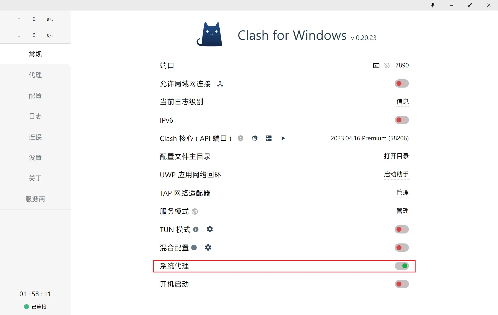
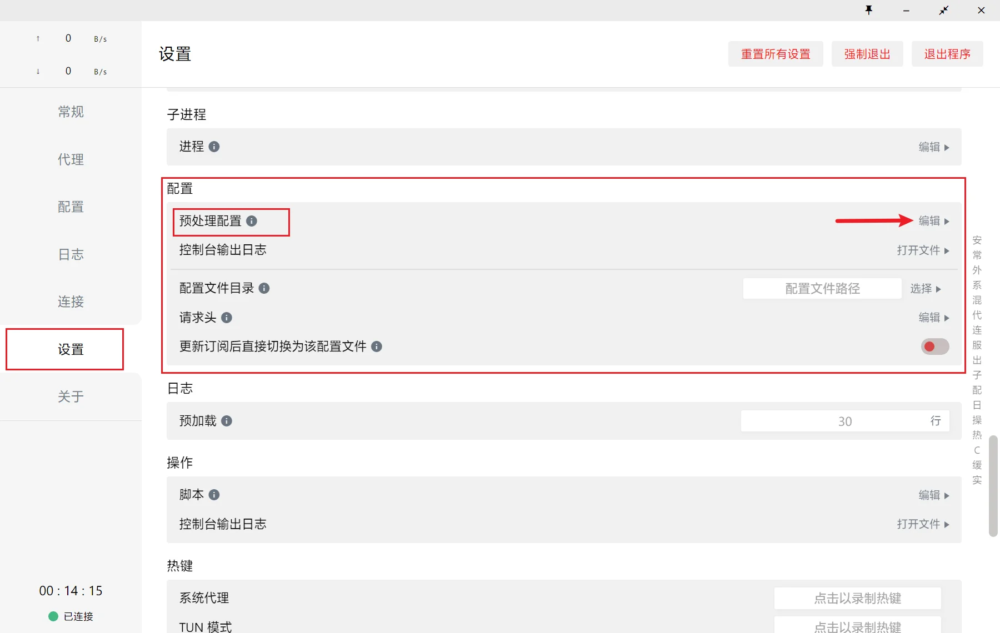
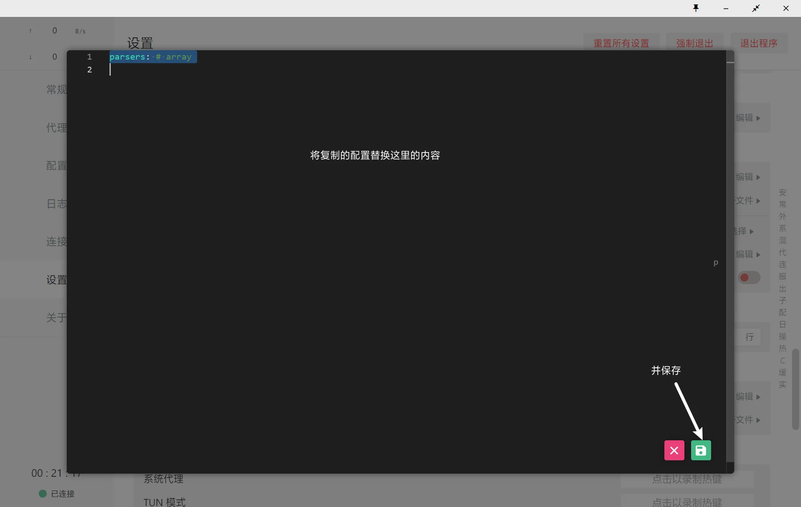
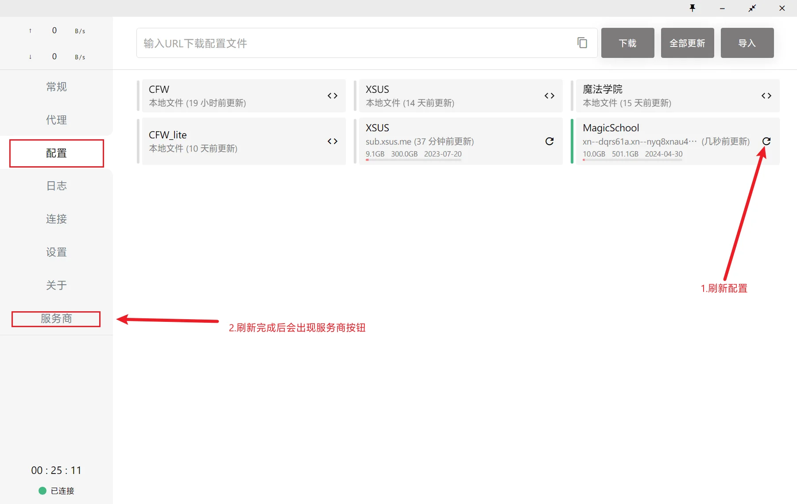

# Clash for Windows 预处理配置使用方法

<!-- prettier-ignore -->
!!! 注意
    由于 CFW 所使用的 Clash Premium 内核并不支持解析Base64格式的订阅，因此此处仅展示在本地直接覆盖机场配置的预处理；

    CFW 本地配置请自行在仓库中自行寻找并参考上文所述方法修改对应的参数。

1.导入订阅后，确保正常链接外网，启动系统代理



2.打开CFW 设置——配置——点击预处理右侧的编辑，会弹出一个编辑器



3.点击下面按钮，复制里面的配置，在 CFW 弹出的编辑器里，替换原有内容，并保存

??? note "点击展开,复制配置"
    ```yaml
    # 参考：https://github.com/Fndroid/clash_for_windows_pkg/issues/2193
    # Author:https://github.com/Repcz
    # TG:https://t.me/QVQ_Channel
    # 以 '#' 或 '//' 开头的配置文件行为注释行
    #
    # 此配置仅适用于Clash for Windows,其他Clash客户端未经测试
    #
    # 最后更新时间: 2024-4-15 18:15
    #
    # ================

    parsers: # array
    - reg: ^.*$                 # ^.*$ 匹配所有订阅，或  - url: https://example.com/profile.list 指定订阅
        code: |                   # 删除服务商提供的策略组和规则
        module.exports.parse = (raw, { yaml }) => {
            const rawObj = yaml.parse(raw)
            const groups = []
            const rules = []
            return yaml.stringify({ ...rawObj, 'proxy-groups': groups, rules })
        } 
        yaml:                     # 建立自己的配置
        mix-object:             # 对象合并至原配置最外层中
            mixed-port: 7893      # 混合端口 HTTP和SOCKS5用一个端口
            allow-lan: true       # 允许局域网的连接（可用来共享代理）
            bind-address: "*"     # 仅在将allow-lan设置为true时适用
                                # #"*": 绑定所有IP地址
            ipv6: false           # 开启 IPv6 总开关，关闭阻断所有 IPv6 链接和屏蔽 DNS 请求 AAAA 记录
            mode: rule            # 规则模式：rule（规则） / global（全局代理）/ direct（全局直连）/ script (脚本)
            log-level: info       # 设置日志输出级别 (5 个级别：silent / error / warning / info / debug）
            external-controller: 127.0.0.1:9090   #外部控制器,可以使用 RESTful API 来控制你的 clash 内核

            dns:
            enable: true             # 关闭将使用系统 DNS
            ipv6: false              # IPV6解析开关；如果为false，将返回ipv6结果为空
            enhanced-mode: fake-ip   # 模式：redir-host或fake-ip
            listen: 0.0.0.0:53       # DNS监听地址
            fake-ip-range: 198.18.0.1/16    # Fake-IP解析地址池
            fake-ip-filter: ['*.lan', 'cable.auth.com', '*.msftconnecttest.com', '*.msftncsi.com', 'network-test.debian.org', 'detectportal.firefox.com', 'resolver1.opendns.com', '*.srv.nintendo.net', '*.stun.playstation.net', 'xbox.*.microsoft.com', '*.xboxlive.com', 'stun.*', 'global.turn.twilio.com', 'global.stun.twilio.com', 'localhost.*.qq.com', 'localhost.*.weixin.qq.com', '*.logon.battlenet.com.cn', '*.logon.battle.net', '*.blzstatic.cn', 'music.163.com', '*.music.163.com', '*.126.net', 'musicapi.taihe.com', 'music.taihe.com', 'songsearch.kugou.com', 'trackercdn.kugou.com', '*.kuwo.cn', 'api-jooxtt.sanook.com', 'api.joox.com', 'joox.com', 'y.qq.com', '*.y.qq.com', 'streamoc.music.tc.qq.com', 'mobileoc.music.tc.qq.com', 'isure.stream.qqmusic.qq.com', 'dl.stream.qqmusic.qq.com', 'aqqmusic.tc.qq.com', 'amobile.music.tc.qq.com', '*.xiami.com', '*.music.migu.cn', 'music.migu.cn', 'proxy.golang.org', '*.mcdn.bilivideo.cn', '*.cmpassport.com', 'id6.me', 'open.e.189.cn', 'mdn.open.wo.cn', 'opencloud.wostore.cn', 'auth.wosms.cn', '*.jegotrip.com.cn', '*.icitymobile.mobi', '*.pingan.com.cn', '*.cmbchina.com', 'pool.ntp.org', '*.pool.ntp.org', 'ntp.*.com', 'time.*.com', 'ntp?.*.com', 'time?.*.com', 'time.*.gov', 'time.*.edu.cn', '*.ntp.org.cn', 'PDC._msDCS.*.*', 'DC._msDCS.*.*', 'GC._msDCS.*.*']
                                    # fake ip 白名单列表'以下地址不会下发fakeip映射用于连接
            nameserver: [https://doh.pub/dns-query, https://dns.alidns.com/dns-query]
                                    # 默认DNS服务器，支持udp/tcp/dot/doh/doq
            
            # cfw-bypass: ['localhost', '*.local', 'captive.apple.com', 'e.crashlytics.com', 'sequoia.apple.com', 'seed-sequoia.siri.apple.com', 'www.baidu.com', 'passenger.t3go.cn', 'yunbusiness.ccb.com', 'wxh.wo.cn', 'gate.lagou.com', 'www.abchina.com.cn', 'login-service.mobile-bank.psbc.com', 'mobile-bank.psbc.com', '10.0.0.0/8', '100.64.0.0/10', '127.0.0.1/32', '169.254.0.0/16', '172.16.0.0/12', '192.168.0.0/16', '192.168.122.1/32', '193.168.0.1/32', '224.0.0.0/4', '240.0.0.0/4', '255.255.255.255/32', '::1/128', 'fc00::/7', 'fd00::/8', 'fe80::/10', 'ff00::/8', '2001::/32', '2001:db8::/32', '2002::/16', '::ffff:0:0:0:0/1', '::ffff:128:0:0:0/1' ]
                                    # 系统代理跳过列表

        prepend-proxy-groups: # 建立策略组

            - name: 🌏 国外网站
            type: select
            proxies: [🇭🇰 香港节点, 🇺🇸 美国节点, 🇸🇬 狮城节点, 🇯🇵 日本节点, 🇨🇳 台湾节点, DIRECT, 🚀 手动切换, ⚠ 故障转移]

            - name: 📽️ 国际媒体
            type: select
            proxies: [🇭🇰 香港节点, 🇺🇸 美国节点, 🇸🇬 狮城节点, 🇯🇵 日本节点, 🇨🇳 台湾节点, DIRECT, 🚀 手动切换, ⚠ 故障转移]

            - name: 🍎 苹果服务
            type: select
            proxies: [DIRECT, 🇭🇰 香港节点, 🇺🇸 美国节点, 🇸🇬 狮城节点, 🇯🇵 日本节点, 🇨🇳 台湾节点, 🚀 手动切换, ⚠ 故障转移]

            - name: 🖥️ 微软服务
            type: select
            proxies: [🇭🇰 香港节点, 🇺🇸 美国节点, 🇸🇬 狮城节点, 🇯🇵 日本节点, 🇨🇳 台湾节点, DIRECT, 🚀 手动切换, ⚠ 故障转移]

            - name: 🌌 谷歌服务
            type: select
            proxies: [🇭🇰 香港节点, 🇺🇸 美国节点, 🇸🇬 狮城节点, 🇯🇵 日本节点, 🇨🇳 台湾节点, DIRECT, 🚀 手动切换, ⚠ 故障转移]

            - name: 📟 电报消息
            type: select
            proxies: [🇭🇰 香港节点, 🇺🇸 美国节点, 🇸🇬 狮城节点, 🇯🇵 日本节点, 🇨🇳 台湾节点, DIRECT, 🚀 手动切换, ⚠ 故障转移]

            - name: 🐦 推特消息
            type: select
            proxies: [🇭🇰 香港节点, 🇺🇸 美国节点, 🇸🇬 狮城节点, 🇯🇵 日本节点, 🇨🇳 台湾节点, DIRECT, 🚀 手动切换, ⚠ 故障转移]

            - name: 🤖 OpenAI
            type: select
            proxies: [🇭🇰 香港节点, 🇺🇸 美国节点, 🇸🇬 狮城节点, 🇯🇵 日本节点, 🇨🇳 台湾节点, DIRECT, 🚀 手动切换, ⚠ 故障转移]

            - name: 🎮 游戏平台
            type: select
            proxies: [🇭🇰 香港节点, 🇺🇸 美国节点, 🇸🇬 狮城节点, 🇯🇵 日本节点, 🇨🇳 台湾节点, DIRECT, 🚀 手动切换, ⚠ 故障转移]

            - name: 📽️ Emby
            type: select
            proxies: [🇭🇰 香港节点, 🇺🇸 美国节点, 🇸🇬 狮城节点, 🇯🇵 日本节点, 🇨🇳 台湾节点, DIRECT, 🚀 手动切换, ⚠ 故障转移]

            - name: 📺 哔哩哔哩
            type: select
            proxies: [DIRECT, 🇭🇰 香港节点, 🇨🇳 台湾节点]

            - name: 🌏 国内网站
            type: select
            proxies: [DIRECT, 🚀 手动切换]

            - name: 🛑 广告拦截
            type: select
            proxies: [REJECT, DIRECT]

            - name: 🐟 兜底分流
            type: select
            proxies: [🇭🇰 香港节点, 🇺🇸 美国节点, 🇸🇬 狮城节点, 🇯🇵 日本节点, 🇨🇳 台湾节点, DIRECT, 🚀 手动切换, ⚠ 故障转移]

            - name: 🚀 手动切换
            type: select

            - name: 🇭🇰 香港节点
            type: url-test # select/url-test/fallback/laod-balance
            url: http://www.gstatic.com/generate_204 
            interval: 300
            tolerance: 100 
            proxies:
                - DIRECT

            - name: 🇺🇸 美国节点
            type: url-test # select/url-test/fallback/laod-balance
            url: http://www.gstatic.com/generate_204 
            interval: 300
            tolerance: 100 
            proxies:
                - DIRECT

            - name: 🇸🇬 狮城节点
            type: url-test # select/url-test/fallback/laod-balance
            url: http://www.gstatic.com/generate_204 
            interval: 300
            tolerance: 100 
            proxies:
                - DIRECT

            - name: 🇯🇵 日本节点
            type: url-test # select/url-test/fallback/laod-balance
            url: http://www.gstatic.com/generate_204 
            interval: 300
            tolerance: 100 
            proxies:
                - DIRECT

            - name: 🇨🇳 台湾节点
            type: url-test # select/url-test/fallback/laod-balance
            url: http://www.gstatic.com/generate_204 
            interval: 300
            tolerance: 100 
            proxies:
                - DIRECT

            - name: ⚠ 故障转移
            type: fallback # select/url-test/fallback/laod-balance
            url: http://www.gstatic.com/generate_204 
            interval: 300
            tolerance: 100 
            proxies:
                - DIRECT

        commands:
            - proxy-groups.🚀 手动切换.proxies=[]proxyNames
            - proxy-groups.⚠ 故障转移.proxies=[]proxyNames
            - proxy-groups.🇭🇰 香港节点.proxies=[]proxyNames|^(?!.*游戏).*(香港|HK|🇭🇰)+(.*)$
            - proxy-groups.🇺🇸 美国节点.proxies=[]proxyNames|^(?!.*游戏).*(美国|US|🇺🇸|American)+(.*)$
            - proxy-groups.🇸🇬 狮城节点.proxies=[]proxyNames|^(?!.*游戏).*(新加坡|狮城|🇸🇬|SG|Singapore)+(.*)$
            - proxy-groups.🇯🇵 日本节点.proxies=[]proxyNames|^(?!.*游戏).*(日本|东京|🇯🇵|JP|Japan)+(.*)$
            - proxy-groups.🇨🇳 台湾节点.proxies=[]proxyNames|^(?!.*游戏).*(台湾|TW|🇨🇳|Taiwan)+(.*)$

        mix-rule-providers: # 添加规则集

            Lan:              # 局域网
            type: http
            behavior: classical
            format: text
            url:  https://git.988896.xyz/https://github.com/Repcz/Tool/raw/X/Clash/Rules/Lan.list
            path: ./rule-providers/Lan.list
            interval: 86400

            Download:         # 下载服务
            type: http
            behavior: classical
            format: text
            url:  https://git.988896.xyz/https://github.com/Repcz/Tool/raw/X/Clash/Rules/Download.list
            path: ./rule-providers/Download.list
            interval: 86400

            AD:          # 广告拦截
            type: http
            behavior: domain
            format: text
            url: https://git.988896.xyz/https://github.com/Repcz/Tool/raw/X/Clash/Rules/Anti-ad.list
            path: ./rule-providers/anti-ad.list
            interval: 86400

            Apple:            # 苹果服务
            type: http
            behavior: classical
            format: text
            url:  https://git.988896.xyz/https://github.com/Repcz/Tool/raw/X/Clash/Rules/Apple.list
            path: ./rule-providers/Apple.list
            interval: 86400

            Microsoft:        # 微软服务
            type: http
            behavior: classical
            format: text
            url:  https://git.988896.xyz/https://github.com/Repcz/Tool/raw/X/Clash/Rules/Microsoft.list
            path: ./rule-providers/Microsoft.list
            interval: 86400

            Github:        # 微软服务
            type: http
            behavior: classical
            format: text
            url:  https://git.988896.xyz/https://github.com/Repcz/Tool/raw/X/Clash/Rules/Github.list
            path: ./rule-providers/Github.list
            interval: 86400

            OneDrive:        # 微软服务
            type: http
            behavior: classical
            format: text
            url:  https://git.988896.xyz/https://github.com/Repcz/Tool/raw/X/Clash/Rules/OneDrive.list
            path: ./rule-providers/OneDrive.list
            interval: 86400

            YouTube:          # 油管视频
            type: http
            behavior: classical
            format: text
            url:  https://git.988896.xyz/https://github.com/Repcz/Tool/raw/X/Clash/Rules/YouTube.list
            path: ./rule-providers/YouTube.list
            interval: 86400

            Google:           # 谷歌服务
            type: http
            behavior: classical
            format: text
            url:  https://git.988896.xyz/https://github.com/Repcz/Tool/raw/X/Clash/Rules/Google.list
            path: ./rule-providers/Google.list
            interval: 86400

            Telegram:         # 电报消息
            type: http
            behavior: classical
            format: text
            url:  https://git.988896.xyz/https://github.com/Repcz/Tool/raw/X/Clash/Rules/Telegram.list
            path: ./rule-providers/Telegram.list
            interval: 86400

            Twitter:          # 推特消息
            type: http
            behavior: classical
            format: text
            url:  https://git.988896.xyz/https://github.com/Repcz/Tool/raw/X/Clash/Rules/Twitter.list
            path: ./rule-providers/Twitter.list
            interval: 86400

            Game:             # 游戏平台
            type: http
            behavior: classical
            format: text
            url:  https://git.988896.xyz/https://github.com/Repcz/Tool/raw/X/Clash/Rules/Game.list
            path: ./rule-providers/Game.list
            interval: 86400

            OpenAI:           # ChatGPT
            type: http
            behavior: classical
            format: text
            url:  https://git.988896.xyz/https://github.com/Repcz/Tool/raw/X/Clash/Rules/OpenAI.list
            path: ./rule-providers/OpenAI.list
            interval: 86400

            BiliBili:         # 哔哩哔哩
            type: http
            behavior: classical
            format: text
            url:  https://git.988896.xyz/https://github.com/Repcz/Tool/raw/X/Clash/Rules/Bilibili.list
            path: ./rule-providers/BiliBili.list
            interval: 86400

            ChinaDomain:          # 中国大陆
            type: http
            behavior: classical
            format: text
            url: https://git.988896.xyz/https://github.com/Repcz/Tool/raw/X/Clash/Rules/ChinaDomain.list
            path: ./rule-providers/ChinaDomain.list
            interval: 86400

            Emby:      # 国际媒体
            type: http
            behavior: classical
            format: text
            url:  https://git.988896.xyz/https://github.com/Repcz/Tool/raw/X/Clash/Rules/Emby.list
            path: ./rule-providers/Emby.list
            interval: 86400

            ProxyMedia:      # 国际媒体
            type: http
            behavior: classical
            format: text
            url:  https://git.988896.xyz/https://github.com/Repcz/Tool/raw/X/Clash/Rules/ProxyMedia.list
            path: ./rule-providers/ProxyMedia.list
            interval: 86400

            ProxyGFW:        # 代理网站
            type: http
            behavior: classical
            format: text
            url:  https://git.988896.xyz/https://github.com/Repcz/Tool/raw/X/Clash/Rules/ProxyGFW.list
            path: ./rule-providers/ProxyGFW.list
            interval: 86400

        prepend-rules: # 添加规则
            #- RULE-SET,Download,DIRECT
            - RULE-SET,AD,🛑 广告拦截
            - RULE-SET,OpenAI,🤖 OpenAI
            - RULE-SET,Apple,🍎 苹果服务
            - RULE-SET,OneDrive,🖥️ 微软服务
            - RULE-SET,Github,🖥️ 微软服务
            - RULE-SET,Microsoft,🖥️ 微软服务
            - RULE-SET,YouTube,🌌 谷歌服务
            - RULE-SET,Google,🌌 谷歌服务
            - RULE-SET,Telegram,📟 电报消息
            - RULE-SET,Twitter,🐦 推特消息
            - RULE-SET,BiliBili,📺 哔哩哔哩
            - RULE-SET,Game,🎮 游戏平台
            - RULE-SET,Emby,📽️ Emby
            - RULE-SET,ProxyMedia,📽️ 国际媒体
            - RULE-SET,ProxyGFW,🌏 国外网站
            - RULE-SET,ChinaDomain,🌏 国内网站
            - RULE-SET,Lan,DIRECT
            - GEOIP,CN,🌏 国内网站
            - MATCH,🐟 兜底分流
    ```




4.打开CFW 配置，刷新配置，等待下载外部文件

<!-- prettier-ignore -->
!!! 注意
    CFW无法通过代理拉取资源，如果出现下载失败的错误，多试几次就好



