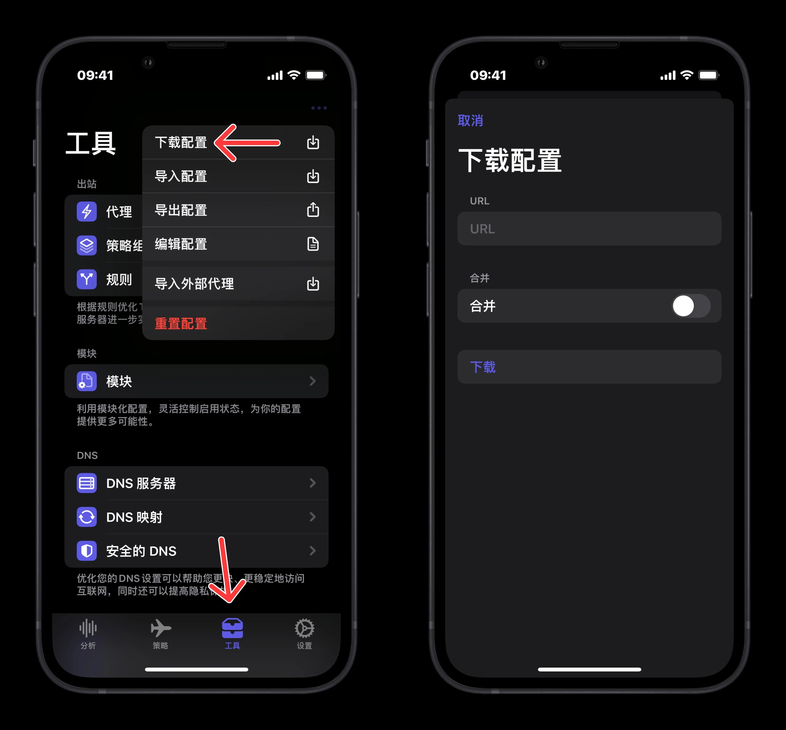
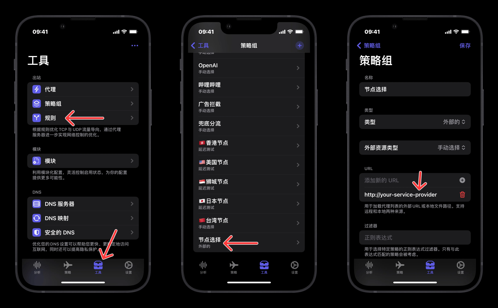
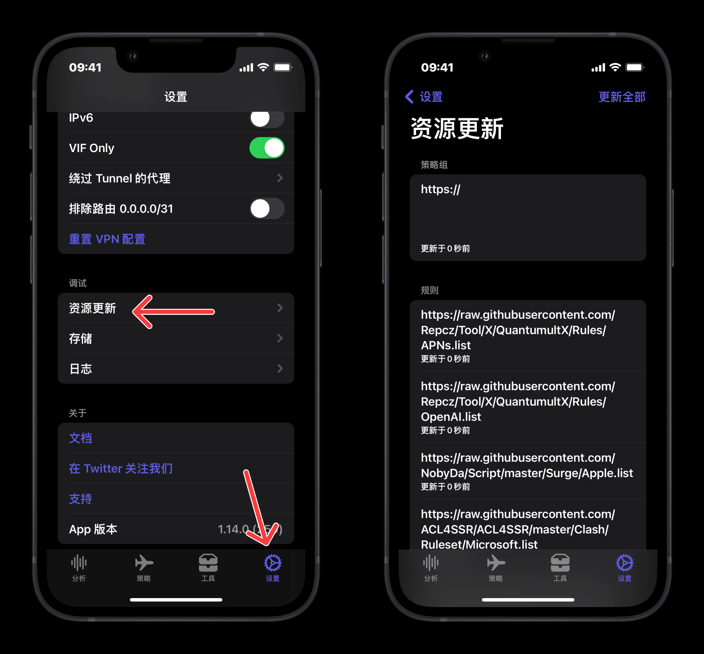

# Egern

## Egern 下载地址

<a href="https://apps.apple.com/us/app/egern/id1616105820"></a>

## 导入配置

### 1.添加以下 **配置文件** 

> 配置参数解释见：_[Egern官方文档](https://doc.egernapp.com/zh-CN/docs/intro)_

```
https://raw.githubusercontent.com/Repcz/Tool/X/Egern/Egern.yaml
```

* 运行 **Egern** ，点击下方的 **工具** 图标
* 点击 **工具** 页面右上角菜单，弹出的菜单中，点击 **下载配置**
* 将配置文件链接填入并下载

{: width=600}

### 2.添加机场订阅

> 机场订阅本地转换可参考[Sub-Store 教程](https://getupnote.com/share/notes/8SiMnOcwXxZ3xEtK4k2v9Gr3pv32/7522F394-6D73-414E-BE04-1455EDB15B9F)

* 运行 **Egern** ，点击下方的 **工具** 图标
* 点击 **工具** 页面的 **策略组** 点击 **手动选择**策略组
* 将 **URL区域** 的 `http://your-service-provider`替换为 **机场订阅**
* 如果有多个机场，可以在 URL 下方的输入框中继续填入并 <b>回车确认</b> 

{: width=900}

### 3.检查资源

* 运行 **Egern** ，点击下方的 **设置** 图标
* 点击 **设置** 页面 **调试** 区域的 **资源更新**，确保所有资源均下载完成

{: width=600}

## 修改配置

### DNS 设置

Egern 的 [DNS 模块](https://doc.egernapp.com/zh-CN/docs/configuration/dns)功能强大，可以根据需要对DNS规则进行转发

同样的，Egern 的解析规则接近 Surge，即已经匹配到走节点的规则交由节点 dns 查询，dns 设置仅对需要本地解析的域名进行查询

<!-- prettier-ignore -->
!!! 提示
    以下为配置文件中的 dns 设置，如果你什么也不懂，建议不要修改

```yaml linenums="20"
dns:
  bootstrap: #  默认 DNS 服务器，用来解析 upstreams
  - system
  upstreams: # 用来查询 DNS 的服务器
    Domestic-DNS:
    - 223.5.5.5
    - 119.29.29.29
    Domestic-Encrypted-DNS:
    - https://dns.alidns.com/dns-query
    - https://doh.pub/dns-query
    Foreign-Encrypted-DNS:
    - https://cloudflare-dns.com/dns-query
    - https://dns.google/dns-query
  forward: # DNS 转发规则
  - proxy_rule_set:
      match: https://github.com/Repcz/Tool/raw/X/Egern/Rules/Reject.yaml
      value: REJECT
      disabled: false
  - proxy_rule_set:
      match: https://github.com/Repcz/Tool/raw/X/Egern/Rules/ChinaDomain.yaml
      value: Domestic-DNS
      disabled: false
  - domain_wildcard:
      match: '*'
      value: Domestic-Encrypted-DNS
      disabled: false
  hosts: # 主机映射
    dns.google:
    - 8.8.8.8, 8.8.4.4, 2001:4860:4860::8888, 2001:4860:4860::8844
    cloudflare-dns.com:
    - 104.16.249.249, 104.16.248.249, 2606:4700::6810:f8f9, 2606:4700::6810:f9f9
    dns.alidns.com:
    - 223.5.5.5, 223.6.6.6, 2400:3200:baba::1, 2400:3200::1
    doh.pub:
    - 1.12.12.12, 120.53.53.53
    dot.pub:
    - 1.12.12.12, 120.53.53.53
  proxy_nameservers: # 解析代理节点的服务器
  - 119.29.29.29
  - 223.5.5.5
```

处于某些没必要的`防 DNS 泄露`需求，可以将 `forward` 中最后一条规则改为 `Foreign-Encrypted-DNS`;

并且由于 `Upstreams` DNS 是遵从出站设置的，可以将 `Foreign-Encrypted-DNS` 中的域名手动指定代理节点以减少延迟

eg:

=== "DNS"
    ```yaml
    dns:
      forward:
      - proxy_rule_set:
          match: https://github.com/Repcz/Tool/raw/X/Egern/Rules/Reject.yaml
          value: REJECT
          disabled: false
      - proxy_rule_set:
          match: https://github.com/Repcz/Tool/raw/X/Egern/Rules/ChinaDomain.yaml
          value: Domestic-DNS
          disabled: false
      - domain_wildcard:
          match: '*'
          value: Foreign-Encrypted-DNS
          disabled: false
    ```

=== "Rules"
    ```yaml
    rules:
    - or:
        name: DNS Proxy
        match:
        - domain:
            match: cloudflare-dns.com
        - domain:
            match: dns.google
        policy: Policy
        disabled: false
    ```
