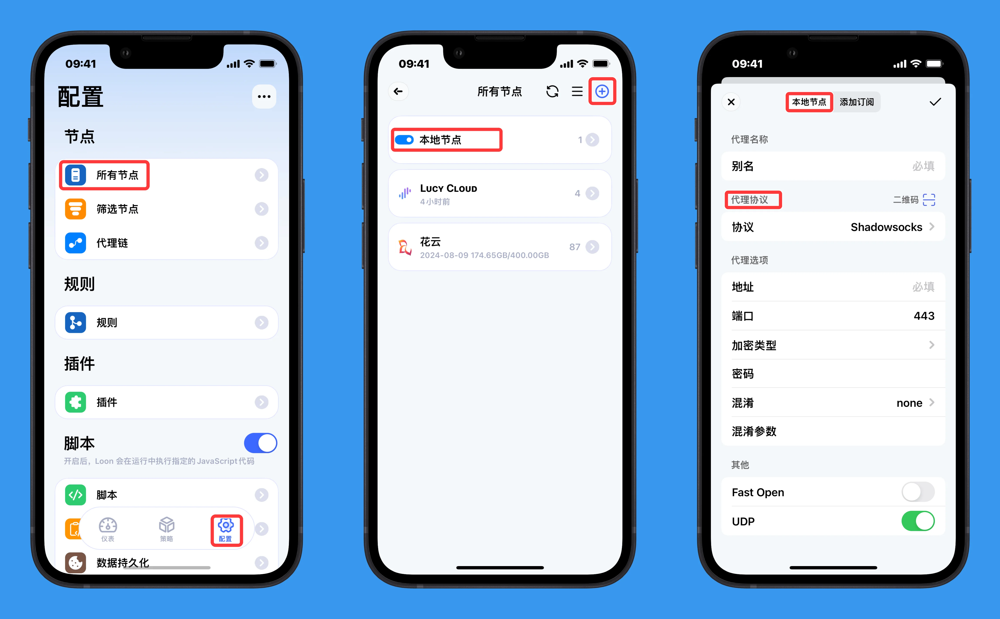
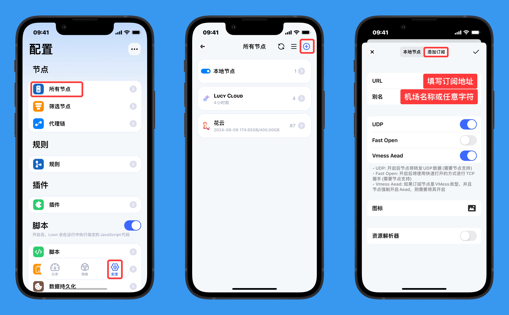
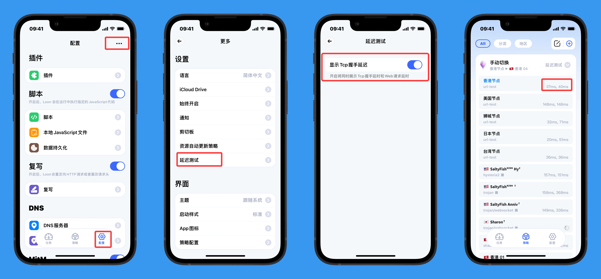
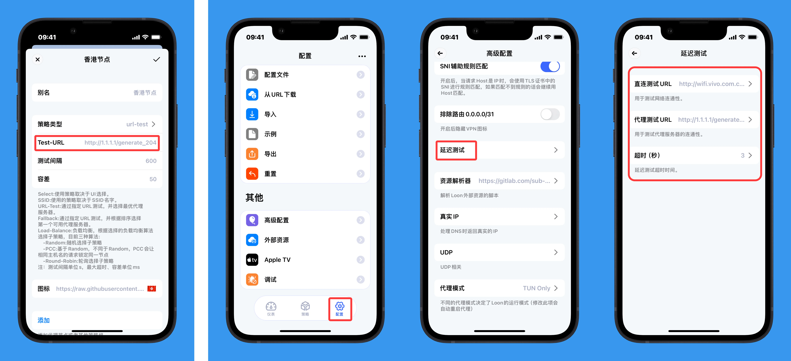
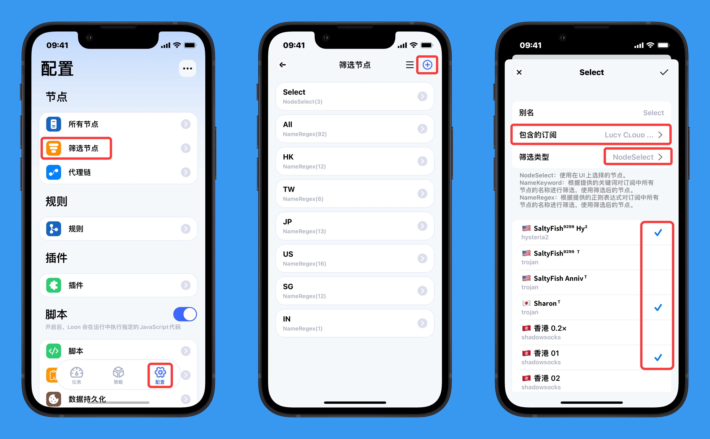

# 2.节点

一个节点表示一个代理服务器，你可以手动添加单个节点，也可以通过链接下载订阅节点。**Loon 本身不提供任何的节点**

### 2.1 代理服务协议

代理服务协议指的是在进行网络传输的过程中客户端和服务端需要遵循的一种数据组装格式，只有服务端和客户端使用相同的协议，两者才能进行正常的数据交互，我们每天在网络中接触到的协议有HTTP，HTTPS等

#### Loon协议

- ShadowSocks (stream/aead/2022)
    - ShadowSocks + shadow-tls2/3
    - ShadowSocks + simpleObfs
    - ShadowSocks + simpleObfs + shadow-tls2/3
- ShadowSocksR
    - ShadowSocksR + shadow-tls2/3
- VMESS
    - VMESS + TLS
    - VMESS + WebSocket
    - VMESS + WebSocket + TLS
    - VMESS + HTTP
    - VMESS + HTTP + TLS
- VLESS
    - VLESS + WebSocket
    - VLESS + HTTP
    - VLESS + xtls-rprx-vision + reality
- Trojan
    - Trojan + WebSocket
    - Trojan + HTTP
- HTTP
- HTTPS
- Wireguard
- Hysteria2
- Custom by JS

同时，Loon也支持使用JavaScript进行自定义代理协议，可参考[使用JS自定义HTTP代理](https://github.com/Loon0x00/LoonExampleConfig/blob/master/Script/http.js)

### 2.2 添加本地节点


#### 内置 PROXY 

指向本地节点或者订阅节点中的任何一个（有本地节点默认指向第一个本地节点，当没有本地节点但有订阅节点时，指向第一个订阅的第一个节点，本地节点和订阅节点都不存在时指向DIRECT）

#### 2.2.1 配置文件添加

<!-- prettier-ignore -->
!!! 注意
    以下主要讲的是 `[Proxy]` 区块下的内容，所以示例都以 `[Proxy]` 开头表明在其之下，并不是让你每个参数字段前都加上 `[Proxy]`。

    Loon 3.2.6(811) 版本支持节点添加新参数 ip-mode，表示节点使用的 IP栈，支持ipv4-only,dual,ipv4-preferred,ipv6-preferred,ipv6-only

如果要在配置文件中手动添加、修改单个节点，请遵从下面的格式


##### ss 类型

- SS

```
[Proxy]
# 节点名称 = 协议，服务器地址，端口，加密方式，密码，fast-open=是否开启fast open（需要节点支持），udp=是否在UDP中使用（需要节点支持）
ss1 = Shadowsocks,example.com,443,aes-128-gcm,"password",fast-open=false,udp=true
ss2 = Shadowsocks,example2.com,443,chacha20,"password",fast-open=true,udp=true
```


- ss+simple obfs


```
[Proxy]
# 节点名称 = 协议，服务器地址，端口，加密方式，密码，混淆方式=http|tls，obfs-host=混淆host，obfs-uri=混淆路径，fast-open=是否开启fast open（需要节点支持），udp=是否在UDP中使用（需要节点支持）
ssObfs1 = Shadowsocks,example.com,80,aes-128-gcm,"password",obfs-name=http,obfs-host=www.micsoft.com,obfs-uri=/,fast-open=true,udp=true
ssObfs2 = Shadowsocks,example.com,443,aes-128-gcm,"password",obfs-name=tls,obfs-host=www.micsoft.com,obfs-uri=/,fast-open=true,udp=true
```


##### ssr

```
[Proxy]
# 节点名称 = 协议，服务器地址，端口，加密方式，密码，protocol = 协议，protocol-param = 协议参数，obfs=混淆，obfs-param=混淆参数，fast-open=是否开启fast open（需要节点支持），udp=是否在UDP中使用（需要节点支持）
ssr1 = ShadowsocksR,example.com,443,aes-256-cfb,"password",protocol=origin,obfs=http_simple,obfs-param=download.windows.com,fast-open=false,udp=true
ssr2 = ShadowsocksR,example.com,10076,aes-128-cfb,"password",protocol=auth_chain_a,protocol-param=9555:loon,obfs=http_post,obfs-param=download.windows.com,fast-open=false,udp=true
ssr3 = ShadowsocksR,example.com,10076,chacha20,"password",protocol=auth_aes128_md5,protocol-param=9555:loon,obfs=tls1.2_ticket_auth,obfs-param=download.windows.com,fast-open=false,udp=true
ssr4 = ShadowsocksR,example.com,10076,chacha20-ietf,"password",protocol=auth_aes128_sha1,protocol-param=9555:loon,obfs=plain,fast-open=false,udp=true
```


##### http

```
[Proxy]
# 节点名称 = 协议，服务器地址，端口，加密方式，密码
http1 = http,example.com,80
http2 = http,example.com,80,username,"password"
```


##### https

```
[Proxy]
# 节点名称 = 协议，服务器地址，端口，加密方式，密码，skip-cert-verify=是否跳过证书校验（默认否），tls-name=SNI
https1 = https,example.com,443
https2 = https,example.com,443,username,"password"
https3 = https,example.com,443,username,"password",skip-cert-verify=true,tls-name=example.com
```

##### vmess 类型

- vmess+tcp

```
[Proxy]
# 节点名称 = 协议，服务器地址，端口，加密方式，UUID，transport(传输方式)=tcp，alterId=alterId（默认0，表示开启aead）
vmess1 = vmess,example.com,10086,aes-128-gcm,"52396e06-041a-4cc2-be5c-8525eb457809",transport=tcp,alterId=0,over-tls=false
```


- vmess+tcp+tls

```
[Proxy]
# 节点名称 = 协议，服务器地址，端口，加密方式，UUID，transport(传输方式)=tcp，alterId=alterId（默认0，表示开启aead），over-tls=是否启用TLS，tls-name=SNI，skip-cert-verify=是否跳过证书校验（默认否）
vmess2 = vmess,example.com,10086,aes-128-gcm,"52396e06-041a-4cc2-be5c-8525eb457809",transport=tcp,alterId=0,path=/,host=v3-dy-y.ixigua.com,over-tls=true,tls-name=example.com,skip-cert-verify=true
```

- vmess+ws

```
[Proxy]
# 节点名称 = 协议，服务器地址，端口，加密方式，UUID，transport(传输方式)=ws，alterId=alterId（默认0，表示开启aead），path=websocket握手header中的path，host=websocket握手header中的host
vmess3 = vmess,example.com,10086,aes-128-gcm,"52396e06-041a-4cc2-be5c-8525eb457809",transport=ws,alterId=0,path=/,host=v3-dy-y.ixigua.com,over-tls=false
```


- vmess+wss

```
[Proxy]
v# 节点名称 = 协议，服务器地址，端口，加密方式，UUID，transport(传输方式)=ws，alterId=alterId（默认0，表示开启aead），path=websocket握手header中的path，host=websocket握手header中的host，over-tls=是否启用TLS，tls-name=SNI，skip-cert-verify=是否跳过证书校验（默认否）
vmess4 = vmess,example.com,10086,aes-128-gcm,"52396e06-041a-4cc2-be5c-8525eb457809",transport=ws,alterId=0,path=/,host=v3-dy-y.ixigua.com,over-tls=true,tls-name=example.com,skip-cert-verify=true
```


- vmess+http

```
[Proxy]
# 节点名称 = 协议，服务器地址，端口，加密方式，UUID，transport(传输方式)=http，alterId=alterId（默认0，表示开启aead），path=httpheader中的path，host=httpheader的host
vmess5 = vmess,example.com,10086,aes-128-gcm,"52396e06-041a-4cc2-be5c-8525eb457809",transport=http,alterId=0,path=/,host=v3-dy-y.ixigua.com,over-tls=false
```

- vmess+http+tls

```
[Proxy]
# 节点名称 = 协议，服务器地址，端口，加密方式，UUID，transport(传输方式)=http，alterId=alterId（默认0，表示开启aead），path=httpheader中的path，host=httpheader的host，over-tls=是否启用TLS，tls-name=SNI，skip-cert-verify=是否跳过证书校验（默认否）
vmess6 = vmess,example.com,10086,aes-128-gcm,"52396e06-041a-4cc2-be5c-8525eb457809",transport=http,alterId=0,path=/,host=v3-dy-y.ixigua.com,over-tls=true,tls-name=example.com,skip-cert-verify=true
```

##### VLESS 类型


- VLESS+tcp

```
[Proxy]
# 节点名称 = 协议，服务器地址，端口，UUID，transport(传输方式)=tcp
VLESS1 = VLESS,example.com,10086,"52396e06-041a-4cc2-be5c-8525eb457809",transport=tcp,over-tls=false
```

- VLESS+tcp+tls

```
[Proxy]
# 节点名称 = 协议，服务器地址，端口，UUID，transport(传输方式)=tcp，over-tls=是否启用TLS，tls-name=SNI，skip-cert-verify=是否跳过证书校验（默认否）
VLESS2 = VLESS,example.com,10086,"52396e06-041a-4cc2-be5c-8525eb457809",transport=tcp,path=/,host=v3-dy-y.ixigua.com,over-tls=true,tls-name=example.com,skip-cert-verify=true
```


- VLESS+ws

```
[Proxy]
# 节点名称 = 协议，服务器地址，端口，UUID，transport(传输方式)=ws，path=websocket握手header中的path，host=websocket握手header中的host
VLESS3 = VLESS,example.com,10086,"52396e06-041a-4cc2-be5c-8525eb457809",transport=ws,path=/,host=v3-dy-y.ixigua.com,over-tls=false
```

- VLESS+wss

```
[Proxy]
# 节点名称 = 协议，服务器地址，端口，UUID，transport(传输方式)=ws，path=websocket握手header中的path，host=websocket握手header中的host，over-tls=是否启用TLS，tls-name=SNI，skip-cert-verify=是否跳过证书校验（默认否）
VLESS4 = VLESS,example.com,10086,"52396e06-041a-4cc2-be5c-8525eb457809",transport=ws,path=/,host=v3-dy-y.ixigua.com,over-tls=true,tls-name=example.com,skip-cert-verify=true
```

- VLESS+http

```
[Proxy]
# 节点名称 = 协议，服务器地址，端口，UUID，transport(传输方式)=http，path=httpheader中的path，host=httpheader的host
VLESS5 = VLESS,example.com,10086,"52396e06-041a-4cc2-be5c-8525eb457809",transport=http,path=/,host=v3-dy-y.ixigua.com,over-tls=false
```

- VLESS+http+tls

```
[Proxy]
# 节点名称 = 协议，服务器地址，端口，UUID，transport(传输方式)=http，path=httpheader中的path，host=httpheader的host，over-tls=是否启用TLS，tls-name=SNI，skip-cert-verify=是否跳过证书校验（默认否）
VLESS6 = VLESS,example.com,10086,"52396e06-041a-4cc2-be5c-8525eb457809",transport=http,path=/,host=v3-dy-y.ixigua.com,over-tls=true,tls-name=example.com,skip-cert-verify=true
```

##### trojan 类型

- trojan

```
[Proxy]
# 节点名称 = 协议，服务器地址，端口，alpn=tls扩展，skip-cert-verify=是否跳过证书校验（默认否），tls-name=SNI，udp=是否在UDP中使用（需要节点支持）
trojan1 = trojan,example.com,443,"password",alpn=http1.1,skip-cert-verify=false,tls-name=example.com,udp=true
```

- trojan+ws

```
[Proxy]
# 节点名称 = 协议，服务器地址，端口，alpn=tls扩展，transport(传输方式)=ws，path=websocket握手header中的path，host=websocket握手header中的host，skip-cert-verify=是否跳过证书校验（默认否），tls-name=SNI，udp=是否在UDP中使用（需要节点支持）
trojan2 = trojan,example.com,443,"password",transport=ws,path=/,host=micsoft.com,alpn=http1.1,skip-cert-verify=true,tls-name=example.com,udp=true
```

- trojan+http

```
[Proxy]
# 节点名称 = 协议，服务器地址，端口，alpn=tls扩展，transport(传输方式)=http，path=httpheader中的path，host=httpheader的host，skip-cert-verify=是否跳过证书校验（默认否），tls-name=SNI，udp=是否在UDP中使用（需要节点支持）
trojan2 = trojan,example.com,443,"password",transport=ws,path=/,host=micsoft.com,alpn=http1.1,skip-cert-verify=true,tls-name=example.com,udp=true
```

##### Wireguard

```
[Proxy]
wireguardNode = wireguard,interface-ip=192.168.2.2,interface-ipV6=2402:4e00:1200:ed00:0:9089:6dac:96b6,private-key="qF22B3ezOhWGJA4SHwQSsgMa9d6mPGHyFdZMaDTae2E=",mtu=1280,dns=192.168.2.1,dnsV6=2402:4e00:1200:ed00:0:9089:6dac:96b6,keeyalive=45,peers=[{public-key="JFuTIJEcFnt8R04UnAE5o2WfIPJUsumSxsD2ayXzoWY=",preshared-key="yVNv5K05AwVnWaR4OB8BlMX3jJlkS74aKlYC3PD95IE=",reserved=[1,2,3],allowed-ips="0.0.0.0/0",endpoint=192.168.3.17:51820}]
```


##### Hysteria2

```
[Proxy]
# 节点名称 = 协议，服务器地址，端口，密码，skip-cert-verify=是否跳过证书校验（默认否），tls-name=SNI，udp=是否在UDP中使用（需要节点支持），fast-open=是否开启fast open
hysteria2Node = Hysteria2,example.com,9898,"password",skip-cert-verify=true,tls-name=example.com,udp=true,fast-open=true
```

##### js custom

```
[Proxy]
# 节点名称 = 协议，服务器地址，端口，script-path=脚本路径（本地脚本直接为文件名，远端脚本为url）
jsHTTP = custom,192.168.1.139,6152,script-path=http.js
```


#### 2.2.2 UI 添加

1. 「仪表标签页」-「节点」 → 点击右上角`＋` → 选择`本地节点`，选择对应协议后填写参数

2. 「配置标签页」-「节点」区域 - `节点` → 点击右上角`＋` → 选择`本地节点`，选择对应协议后填写参数

在添加节点页面也可通过扫码添加

{: width=900}


### 2.3 添加远程订阅

除了可以解析官方定义的节点格式，Loon也可以解析大部分服务提供商所提供的订阅节点，如遇到不支持的情况可以使用节点订阅解析脚本进行解析，目前常用的解析脚本由[SubStore](https://github.com/sub-store-org)提供，可在配置文件的[general]模块下进行如下配置，在之后的添加订阅节点页面开启解析器即可。


```
[General]
resource-parser = https://gitlab.com/sub-store/Sub-Store/-/releases/permalink/latest/downloads/sub-store-parser.loon.min.js
```


#### 2.3.1 配置文件添加

<!-- prettier-ignore -->
!!! 注意
    以下主要讲的是 `[Remote Proxy]` 区块下的内容，所以示例都以 `[Remote Proxy]` 开头表明在其之下，并不是让你每个参数字段前都加上 `[Remote Proxy]`。


`<别名> = <资源路径>,<是否开启解析器>,<UDP开关>,<Fast Open 开关>,<Vmess Aead 开关>,<是否启用>,<图标>`

- 别名：可以填写机场名称
- 是否开启解析器：`parser-enabled = true`，当不使用解析器时，可省略该字段
- UDP开关：`udp=true`
- Fast Open 开关：`fast-open=false`
- Vmess Aead 开关：`vmess-aead=true`
- 是否启用：`enabled=true`
- 图标：`img-url=`


```
[Remote Proxy]

别名 = 订阅URL,parser-enabled = true,udp=true,fast-open=false,vmess-aead=true,enabled=true,img-url=图标地址
```

#### 2.3.2 UI 添加


<!-- prettier-ignore -->
!!! 注意
    Loon 3.2.6(811) 版本支持节点添加新参数 ip-mode，表示节点使用的 IP栈，支持ipv4-only,dual,ipv4-preferred,ipv6-preferred,ipv6-only


1. 「仪表标签页」-「节点」 → 点击右上角`＋` → 选择`添加订阅`

2. 「配置标签页」-「节点」区域 - `节点` → 点击右上角`＋` → 选择`添加订阅`


{: width=900}


### 2.4 节点延迟

<!-- prettier-ignore -->
!!! 提示
    需在 Loon 开启时，才可对节点进行延迟测试

{: width=1200}

由于Loon采用了自己的时延统计方法，所以可能与其他同类工具的测得的时延有所差异：

前面的时延是建立 **TCP** 连接时的三次握手时间总和。

后面的时延是发出 **HTTP HEADER** 请求后第一次获得响应的时间，它的响应成功与否决定了服务器是否可用。

默认情况下，只显示 HTTP HEADER 时延（即第二个数字），可在配置页面「更多设置」-「延迟测试」- 显示 TCP 握手延迟

<!-- prettier-ignore -->
!!! 注意
    自动策略组是对其策略组里配置的`url = `地址做测试(在UI里显示为`Test-URL`)。
    
    其他节点的延迟 则是针对`[General]`里的`proxy-test-url = `地址做测试
    
    互联网连通性 和 `DIRECT`策略 则是针对`[General]`里的`internet-test-url = `地址做测试 [Loon Version ≥ 3.1.9(695)]

```
[General]
# 测速所用的测试链接，如果策略组没有自定义测试链接就会使用这里配置的
proxy-test-url = http://cp.cloudflare.com/generate_204

# 用于判断网络连通性
internet-test-url = http://wifi.vivo.com.cn/generate_204

# 节点测速时的超时秒数
test-timeout = 3
```


{: width=1500}


### 2.5 筛选节点

<!-- prettier-ignore -->
!!! 提示
    功能上类似于其他代理软件的策略组正则筛选，但是更加灵活

在App中添加了多个节点或者多个订阅节点后，如果需要将所有的节点进行分类时（比如需要将所有香港区域的节点进行分类，或者手动选择一些节点作为一个组），那么可以使用筛选节点功能。


#### 参数

<!-- prettier-ignore -->
!!! 注意
    以下主要讲的是 `[Remote Filter]` 区块下的内容，所以示例都以 `[Remote Filter]` 开头表明在其之下，并不是让你每个参数字段前都加上 `[Remote Filter]`。


- NodeSelect：手动选择需要组合的节点
    - 远程订阅为可选参数,可省略
    - 此参数建议使用 UI 添加


```
[Remote Filter]
<别名> = NodeSelect,<远程订阅1>,<远程订阅2>
```

eg:

```
[Remote Filter]
Select = NodeSelect,Lᴜᴄʏ Cʟᴏᴜᴅ,花云
```

当 `包含的订阅` 有内容时，只会从这些订阅中筛选；没有内容时显示 `All`，并从所有节点中筛选。

当 筛选类型 为 `NodeSelect`，必须使用 UI 勾选节点。

{: width=900}


- NameKeyword：根据节点名字中是否包含相关关键词进行筛选


```
[Remote Filter]
🇺🇸 = NameKeyword, FilterKey = "🇺🇸"
```


- NameRegex：使用正则表达式对节点的名字进行筛选


```
[Remote Filter]
HK = NameRegex, FilterKey = "^(?=.*((?i)🇭🇰|香港|(\b(HK|Hong)\b)))(?!.*((?i)回国|校园|游戏|(\b(GAME)\b))).*$"
```

<details>
  <summary> 点击查看常用正则筛选表达式</summary>


游戏节点
```
^(?=.*((?i)游戏|🎮|(\b(GAME)\b)))(?!.*((?i)回国|校园)).*$
```

回国节点
```
^(?=.*(回国))(?!.*((?i)校园|游戏|🎮|(\b(GAME)\b))).*$
```

全球节点
```
^(?=.*(.))(?!.*((?i)群|邀请|返利|循环|官网|客服|网站|网址|获取|订阅|流量|到期|机场|下次|版本|官址|备用|过期|已用|联系|邮箱|工单|贩卖|通知|倒卖|防止|国内|地址|频道|无法|说明|使用|提示|特别|访问|支持|教程|关注|更新|作者|加入|(\b(USE|USED|TOTAL|EXPIRE|EMAIL|Panel|Channel|Author)\b|(\d{4}-\d{2}-\d{2}|\dG)))).*$
```

不含港台日韩新美的节点
```
^(?=.*(.))(?!.*((?i)🇭🇰|🇹🇼|🇯🇵|🇰🇷|🇸🇬|🇺🇸|香港|台湾|日本|川日|东京|大阪|泉日|埼玉|韩国|韓|首尔|新加坡|狮|美国|波特兰|达拉斯|俄勒冈|凤凰城|费利蒙|硅谷|拉斯维加斯|洛杉矶|圣何塞|圣克拉拉|西雅图|芝加哥|群|邀请|返利|循环|官网|客服|网站|网址|获取|订阅|流量|到期|机场|下次|版本|官址|备用|过期|已用|联系|邮箱|工单|贩卖|通知|倒卖|防止|国内|地址|频道|无法|说明|使用|提示|特别|访问|支持|教程|关注|更新|作者|加入|(\b(HK|Hong|TW|Tai|Taiwan|JP|Japan|KR|Korea|SG|Singapore|US|United States|GAME|USE|USED|TOTAL|EXPIRE|EMAIL|Panel|Channel|Author)\b|(\d{4}-\d{2}-\d{2}|\dG)))).*$
```

香港节点
```
^(?=.*((?i)🇭🇰|香港|(\b(HK|Hong)\b)))(?!.*((?i)回国|校园|游戏|🎮|(\b(GAME)\b))).*$
```

澳门节点
```
^(?=.*((?i)🇲🇴|澳门|(\b(MO|Oman)\b)))(?!.*((?i)回国|校园|游戏|🎮|(\b(GAME)\b))).*$
```

台湾节点
```
^(?=.*((?i)🇹🇼|台湾|(\b(TW|Tai|Taiwan)\b)))(?!.*((?i)回国|校园|游戏|🎮|(\b(GAME)\b))).*$
```

日本节点
```
^(?=.*((?i)🇯🇵|日本|川日|东京|大阪|泉日|埼玉|(\b(JP|Japan)\b)))(?!.*((?i)回国|校园|游戏|🎮|(\b(GAME)\b))).*$
```

韩国节点

```
^(?=.*((?i)🇰🇷|韩国|韓|首尔|(\b(KR|Korea)\b)))(?!.*((?i)回国|校园|游戏|🎮|(\b(GAME)\b))).*$
```

新加坡节点
```
^(?=.*((?i)🇸🇬|新加坡|狮|(\b(SG|Singapore)\b)))(?!.*((?i)回国|校园|游戏|🎮|(\b(GAME)\b))).*$
```

美国节点
```
^(?=.*((?i)🇺🇸|美国|波特兰|达拉斯|俄勒冈|凤凰城|费利蒙|硅谷|拉斯维加斯|洛杉矶|圣何塞|圣克拉拉|西雅图|芝加哥|(\b(US|United States)\b)))(?!.*((?i)回国|校园|游戏|🎮|(\b(GAME)\b))).*$
```

英国节点
```
^(?=.*((?i)🇬🇧|英国|伦敦|(\b(UK|United Kingdom)\b)))(?!.*((?i)回国|校园|游戏|🎮|(\b(GAME)\b))).*$
```

法国节点
```
^(?=.*((?i)🇫🇷|法国|(\b(FR|France)\b)))(?!.*((?i)回国|校园|游戏|🎮|(\b(GAME)\b))).*$
```

德国节点
```
^(?=.*((?i)🇩🇪|德国|(\b(DE|Germany)\b)))(?!.*((?i)回国|校园|游戏|🎮|(\b(GAME)\b))).*$
```

加拿大节点
```
^(?=.*((?i)🇨🇦|加拿大|(\b(CA|Canada)\b)))(?!.*((?i)回国|校园|游戏|🎮|(\b(GAME)\b))).*$
```

俄罗斯节点
```
^(?=.*((?i)🇷🇺|俄罗斯|莫斯科|新西伯利亚|(\b(Новосиби́рская|Moscow|RU|Russia)\b)))(?!.*((?i)回国|校园|游戏|🎮|(\b(GAME)\b))).*$
```

印度节点
```
^(?=.*((?i)🇮🇳|印度|班加罗尔|孟买|(\b(Mumbai|IN|India)\b)))(?!.*((?i)回国|校园|游戏|🎮|(\b(GAME)\b))).*$
```

阿根廷节点
```
^(?=.*((?i)🇦🇷|阿根廷|(\b(AR|Argentinaia)\b)))(?!.*((?i)回国|校园|游戏|🎮|(\b(GAME)\b))).*$
```

土耳其节点
```
^(?=.*((?i)🇹🇷|土耳其|(\b(TR|TUR|Turkey)\b)))(?!.*((?i)回国|校园|游戏|🎮|(\b(GAME)\b))).*$
```

荷兰节点
```
^(?=.*((?i)🇳🇱|荷兰|(\b(NL|Holland|Netherlands)\b)))(?!.*((?i)回国|校园|游戏|🎮|(\b(GAME)\b))).*$
```

澳大利亚节点
```
^(?=.*((?i)🇦🇺|澳大利亚|(\b(AU|Australia)\b)))(?!.*((?i)回国|校园|游戏|🎮|(\b(GAME)\b))).*$
```

南非节点
```
^(?=.*((?i)🇿🇦|南非|(\b(ZA|South Africa)\b)))(?!.*((?i)回国|校园|游戏|🎮|(\b(GAME)\b))).*$
```

</details>