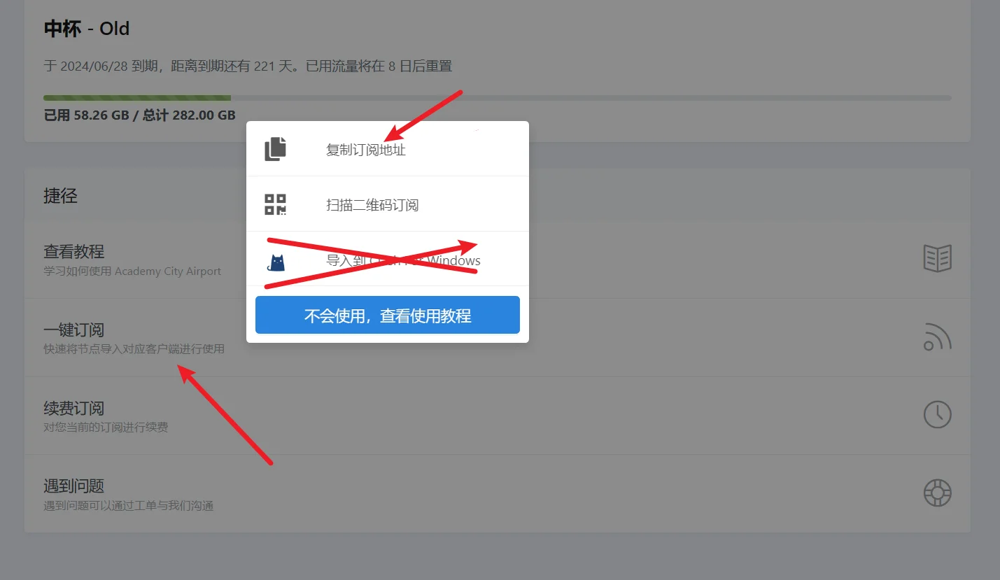
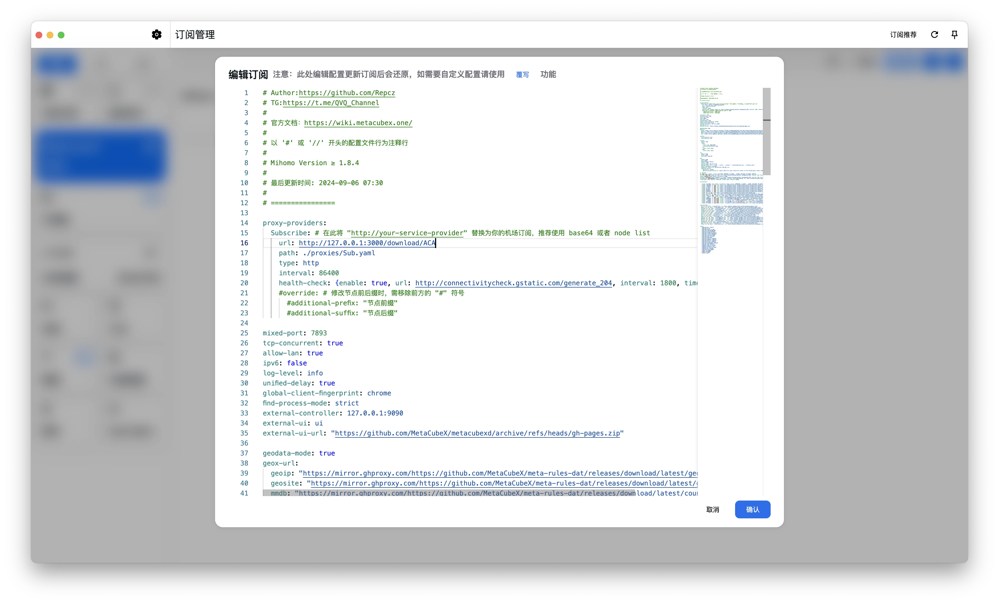
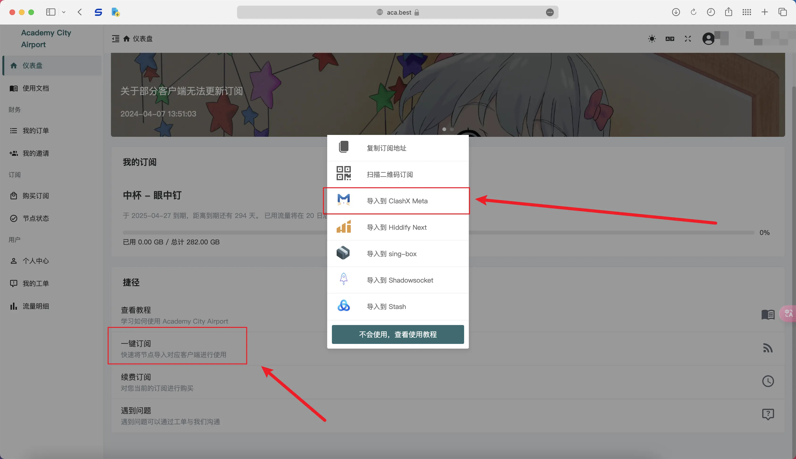
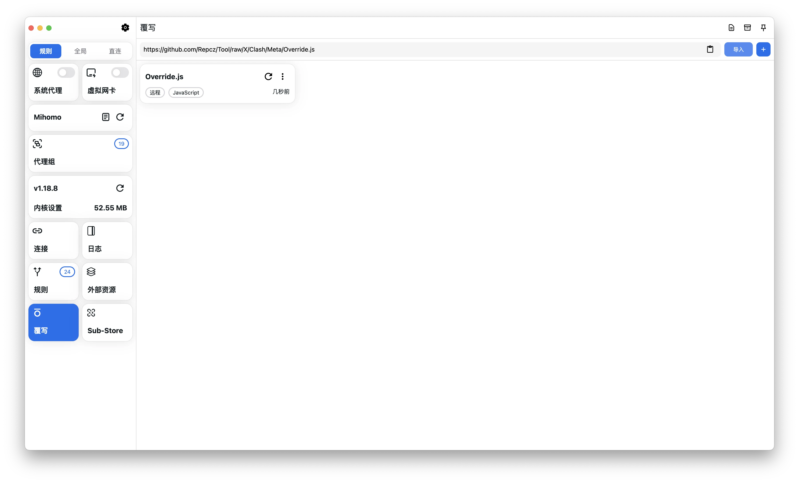
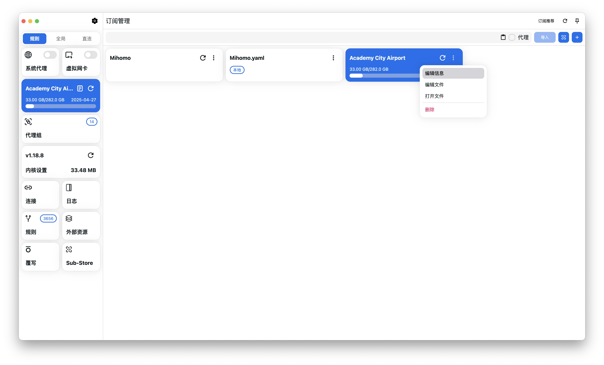
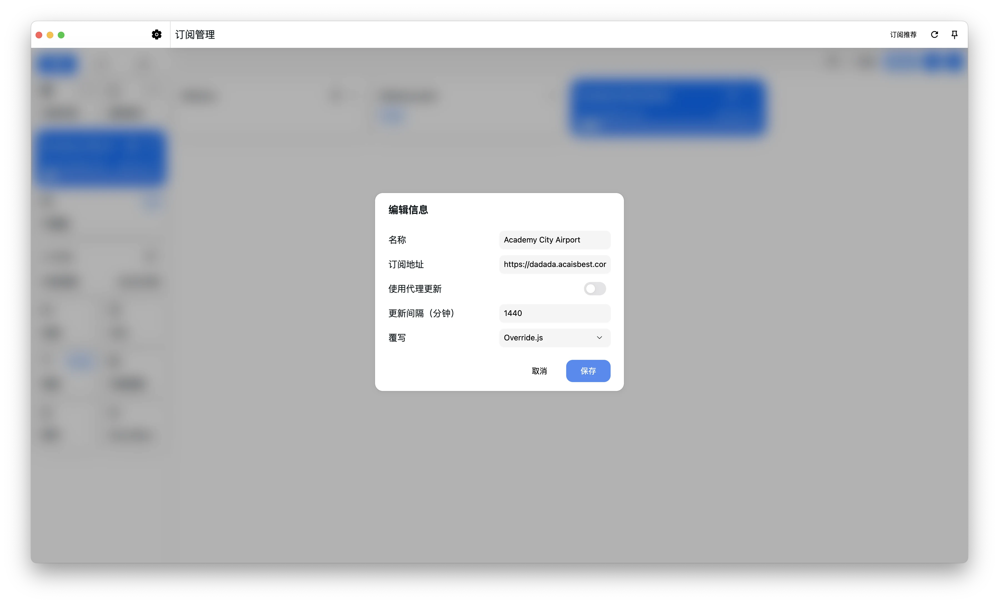
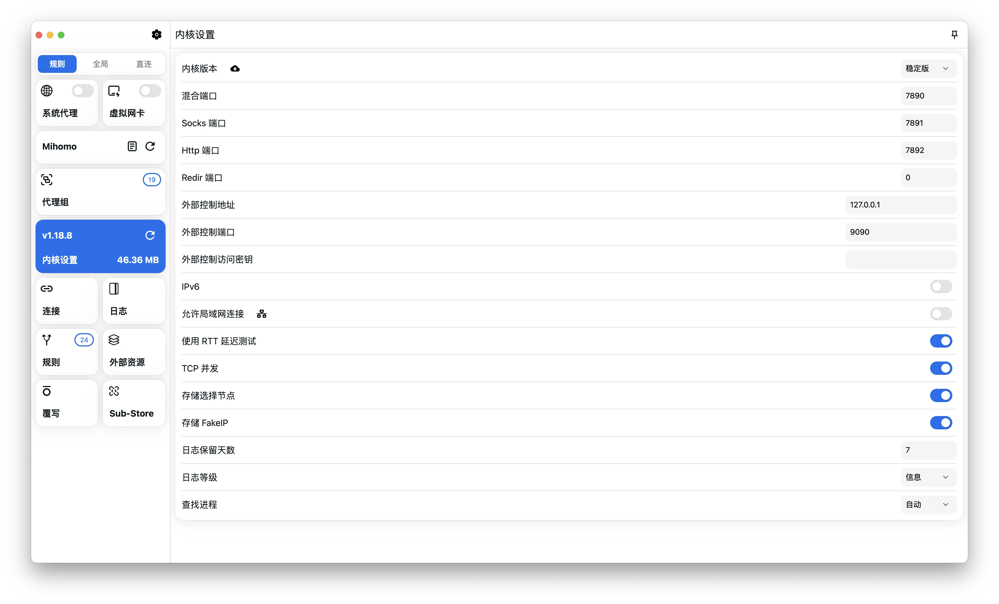
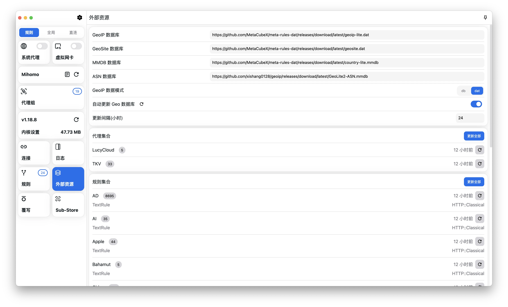
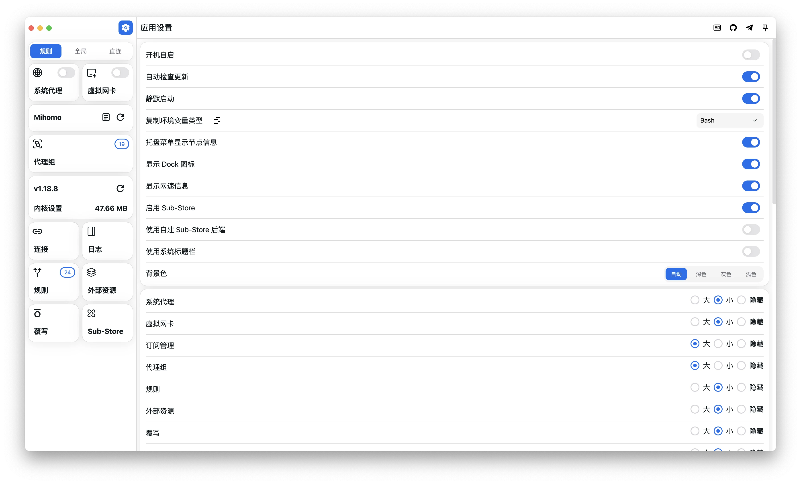
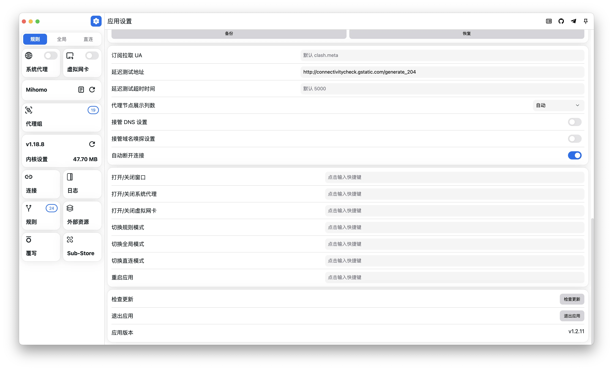

## 下载

[mihomo-party/releases](https://github.com/pompurin404/mihomo-party/releases)

## 本地配置使用方法

<!-- prettier-ignore -->
!!! 提示
    此配置的意义在于：自定义配置，无需使用订阅转换，且不会被机场下发的配置覆盖。

    由于下载规则集文件需要使用代理，建议使用该配置前先导入机场配置。

<!-- prettier-ignore -->
!!! 注意
    部分分支对UI进行修改，存在一定差异，以下内容仅在 mihomo Party 中进行测试

### 1.下载配置文件到本地

`config.yaml` 
<a id="downloadLink" href="https://github.com/Repcz/Tool/raw/X/mihomo/Client/config.yaml">点击下载文件</a>
<script>
  document.addEventListener('DOMContentLoaded', function () {
    const link = document.getElementById('downloadLink');
    link.addEventListener('click', function (event) {
      event.preventDefault();
      const url = this.href;
      const filename = url.substring(url.lastIndexOf('/') + 1);
      fetch(url)
        .then(response => response.blob())
        .then(blob => {
          const downloadUrl = URL.createObjectURL(blob);
          const a = document.createElement('a');
          a.href = downloadUrl;
          a.download = filename;
          document.body.appendChild(a);
          a.click();
          document.body.removeChild(a);
          URL.revokeObjectURL(downloadUrl);
        })
        .catch(console.error);
    });
  });
</script>

```
https://github.com/Repcz/Tool/raw/X/mihomo/Client/config.yaml
```

将下载的文件拖入 mihomo Party 中

### 2.修改配置 `proxy-providers` 为机场订阅地址

<!-- prettier-ignore -->
!!! 提示
    在第 `17` 行修改

```{.yaml linenums="15"}
proxy-providers:
  Subscribe: # 在此将 "http://your-service-provider" 替换为你的机场订阅，推荐使用 base64 或者 node list
    url: http://your-service-provider
    path: ./proxies/Sub.yaml
    type: http
    interval: 86400
    health-check: {enable: true, url: http://connectivitycheck.gstatic.com/generate_204, interval: 1800, timeout: 5000}
    #override: # 修改节点前后缀时，需移除前方的 "#" 符号
      #additional-prefix: "节点前缀"
      #additional-suffix: "节点后缀"    
```

mihomo(ClashMeta) 内核支持解析 base64 格式的订阅，可按照下图提示复制机场订阅







## 脚本配置使用方法

<!-- prettier-ignore -->
!!! 提示
    此配置的意义在于：自定义配置，无需使用订阅转换，且不会被机场下发的配置覆盖。

    由于此配置只能在远程订阅配置的基础上修改，且下载规则集文件需要使用代理，需使用该配置前先导入机场配置。

<!-- prettier-ignore -->
!!! 注意
    以下内容仅在 mihomo Party 中进行测试

### 1.导入机场配置

建议使用一键导入，避免出现不必要的问题



### 2.导入脚本配置

复制脚本链接,添加至覆写中

```
https://github.com/Repcz/Tool/raw/X/mihomo/Client/Override/Override.js
```



### 3.更新并启用配置

选择需要使用脚本覆写的配置，编辑信息，启用该覆写




覆写选择刚才导入的，并保存




导入之后需更新配置，并确保启用该配置！

## 自用 Party 设置

<!-- prettier-ignore -->
!!! 提示
    mihomo Party 等 mihomo GUI 软件，会默认接管 DNS 、嗅探、通用配置等设置，即被 GUI 接管时不会遵从配置文件中的设置。

    DNS、嗅探等可以在 GUI 中关闭接管，但通用配置是强制接管且无法取消！


### 内核设置

开启 「RTT延迟」、「TCP并发」、「存储FakeIP」、「存储选择节点」




### 外部资源

GeoIP 数据模式修改为 `dat`




### GUI 设置

关闭 「接管DNS」、「接管嗅探」





