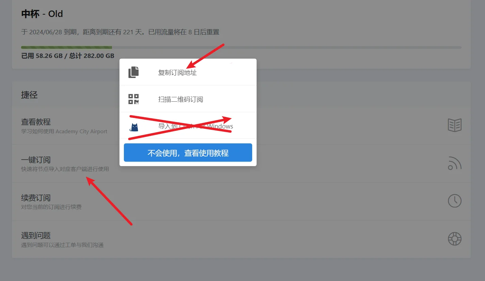
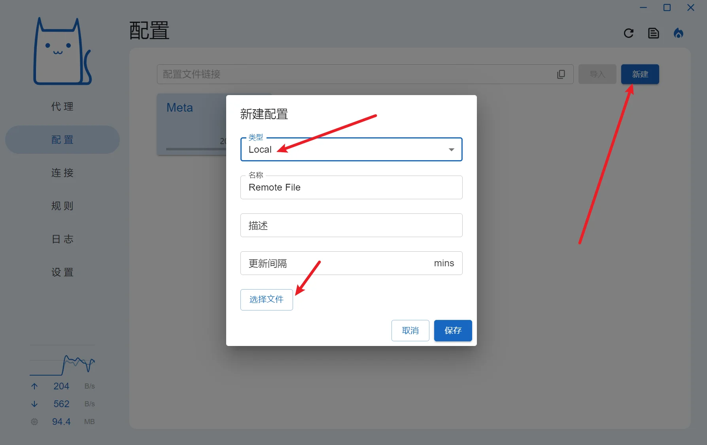
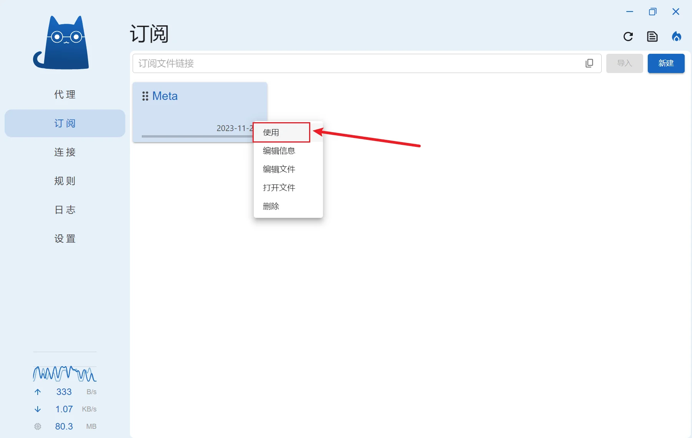
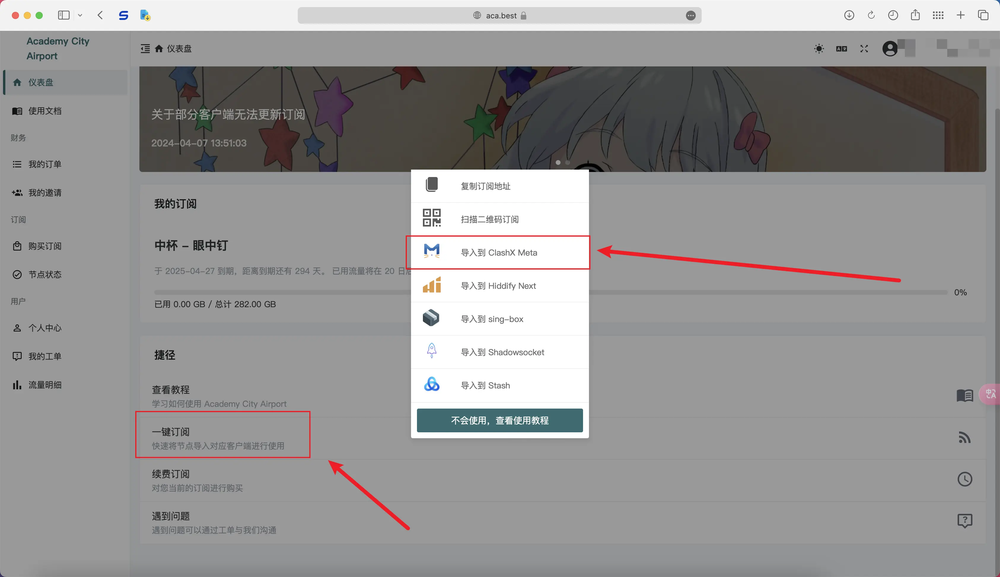
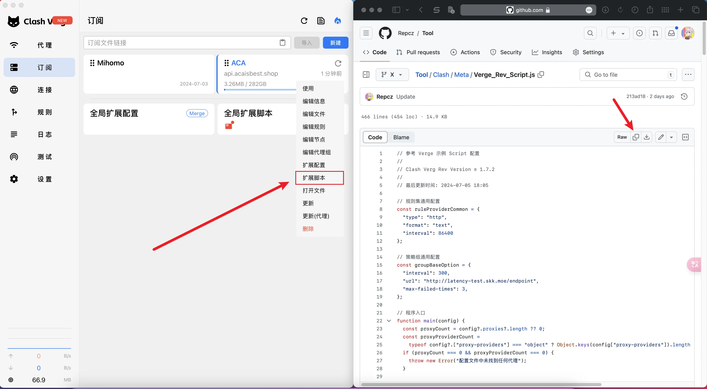
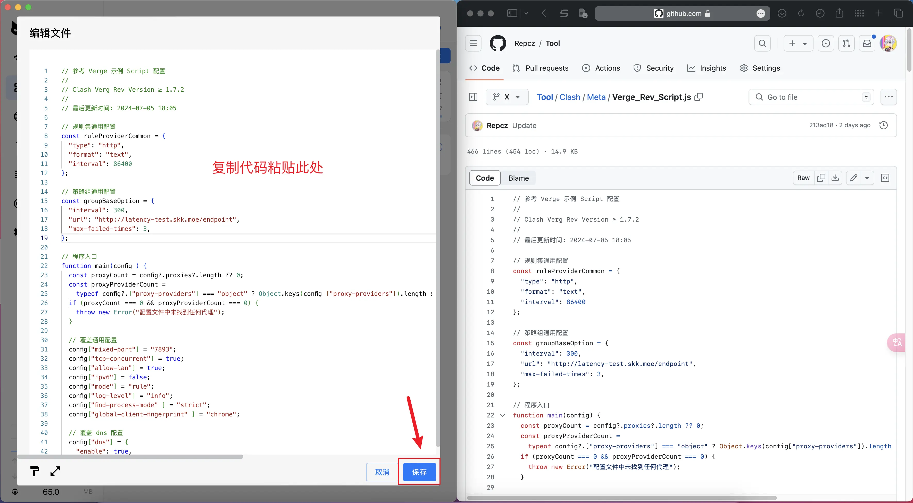
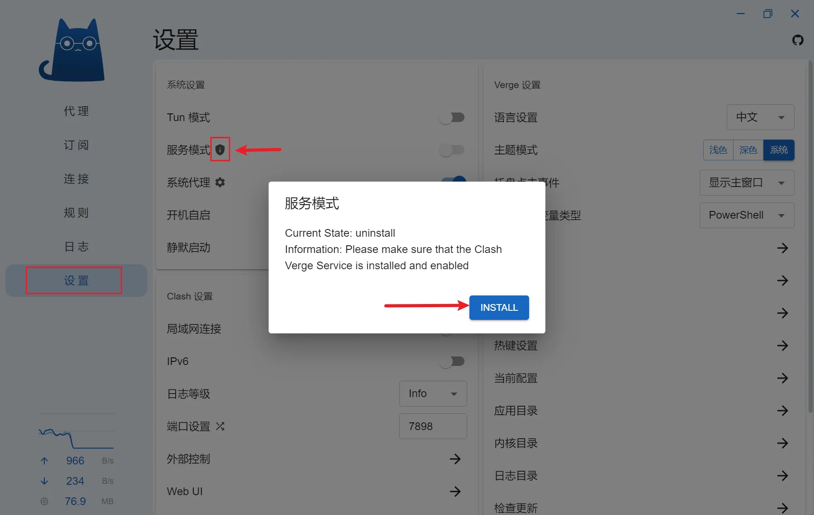
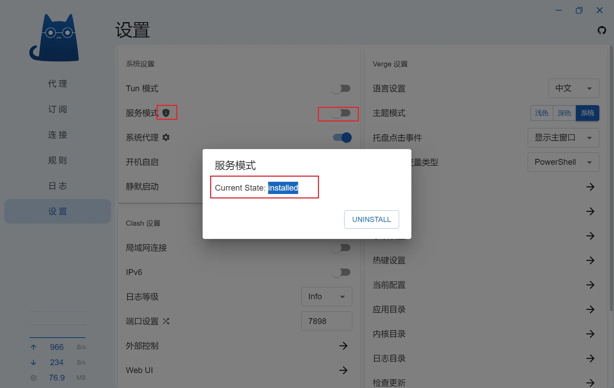

## 下载

### Clash Verge 有哪些版本？

* [clash-verge](https://github.com/zzzgydi/clash-verge/releases)：原版，受Clash事件影响，已停止更新，仓库归档

* [clash-verge-rev](https://github.com/clash-verge-rev/clash-verge-rev/releases)：分支版本，优化UI，跟进Mihomo(ClashMeta)内核更新，目前开发者活跃，图标比较丑

* [clash-nyanpasu](https://github.com/keiko233/clash-nyanpasu/releases)：分支版本，优化UI，跟进Mihomo(ClashMeta)内核更新，图标好看

* [clash-verge](https://github.com/MetaCubeX/clash-verge/releases)：分支版本，由MetaCubeX维护，跟进Mihomo(ClashMeta)内核更新

<!-- prettier-ignore -->
!!! 注意
    以下内容基于**Clash Verge Rev**

### 该下载什么版本？

- Windows

Clash Verge Rev 支持 x64、x86、arm64 三种架构的 Windows 系统。 如果你不知道你的 CPU 架构，下载 x64 版本即可。

- 便携版

带有 `portable` 字样的 zip 压缩包是便携版，下载后解压即可使用。

注意，便携版无法使用应用内更新功能，需要手动下载新版本的便携版并解压覆盖旧版本。

便携版通过检测目录下的 `.config/PORTABLE` 文件来判断是否为便携版，如果你想要和安装版使用相同的配置文件路径，删除 `.config/PORTABLE` 文件即可。

如果 Windows 系统电脑无法运行安装程序，需要安装 [Microsoft Edge WebView2](https://developer.microsoft.com/en-us/microsoft-edge/webview2/?form=MA13LH#download-section)

- MacOS

Clash Verge Rev 支持 x64、ARM64 两种架构的 MacOS 系统。

如果你使用的是 Intel 芯片的 Mac，下载 x64 版本即可。

如果你使用的是 M1 芯片的 Mac，下载 ARM64 版本即可。

- Linux

Clash Verge Rev 支持 x64、x86、arm64 三种架构的 Linux 系统。

仅提供 deb 和 AppImage 两种安装包。

Ubuntu/Debian 用户请下载 deb 安装包。

ArchLinux/Manjaro 用户可以通过 AUR 安装

其他发行版用户可以通过解压 deb 包得到可执行文件重新打包，也可以直接使用 AppImage。


## 本地配置使用方法

<!-- prettier-ignore -->
!!! 提示
    此配置的意义在于：自定义配置，无需使用订阅转换，且不会被机场下发的配置覆盖。

    由于下载规则集文件需要使用代理，建议使用该配置前先导入机场配置。

<!-- prettier-ignore -->
!!! 注意
    部分分支对UI进行修改，存在一定差异，以下内容仅在 Clash Verge Rev 中进行测试

### 1.下载配置文件到本地

`config.yaml`  
<a id="downloadLink" href="https://github.com/Repcz/Tool/raw/X/mihomo/Client/config.yaml">点击下载文件</a>
<script>
  document.addEventListener('DOMContentLoaded', function () {
    const link = document.getElementById('downloadLink');
    link.addEventListener('click', function (event) {
      event.preventDefault();
      const url = this.href;
      const filename = url.substring(url.lastIndexOf('/') + 1);
      fetch(url)
        .then(response => response.blob())
        .then(blob => {
          const downloadUrl = URL.createObjectURL(blob);
          const a = document.createElement('a');
          a.href = downloadUrl;
          a.download = filename;
          document.body.appendChild(a);
          a.click();
          document.body.removeChild(a);
          URL.revokeObjectURL(downloadUrl);
        })
        .catch(console.error);
    });
  });
</script>

```
https://github.com/Repcz/Tool/raw/X/mihomo/Client/config.yaml
```


### 2.修改配置 `proxy-providers` 机场订阅地址

将 `http://your-service-provider` 替换为你的机场订阅地址，如果要添加多个机场，可以参考 [添加机场订阅](../clash/verge.md?#_1)

<!-- prettier-ignore -->
!!! 提示
    在第 `17` 行修改

```{.yaml linenums="15"}
proxy-providers:
  Subscribe: # 在此将 "http://your-service-provider" 替换为你的机场订阅，推荐使用 base64 或者 node list
    url: http://your-service-provider
    path: ./proxies/Sub.yaml
    type: http
    interval: 86400
    health-check: {enable: true, url: http://connectivitycheck.gstatic.com/generate_204, interval: 1800, timeout: 5000}
    #override: # 修改节点前后缀时，需移除前方的 "#" 符号
      #additional-prefix: "节点前缀"
      #additional-suffix: "节点后缀"    
```

Mihomo(ClashMeta) 内核支持解析 base64 格式的订阅，可按照下图提示复制机场订阅




### 3.Clash Verge 中导入 **配置/订阅**

<!-- prettier-ignore -->
!!! 提示
    WIN 系统第一次启动会要求允许防火墙权限，允许即可；部分客户端第一次启动显示英文，可进入设置修改；

* 打开Clash Verge，点击左侧 **配置/订阅**，点击右上角**新建**
* 类型选择**Local**，点击下方 **选择文件**，选择修改好的文件
* 对导入的配置选中，并点击右键 → **启用/使用**
* 等待右上角提示 **Refresh clash config** 后, 点击左侧 **设置** → 勾选 **系统代理** （右下角托盘里右键图标亦可更改）
* 点击左侧 **代理** ，按需设置对应的分流







## 脚本配置使用方法

<!-- prettier-ignore -->
!!! 提示
    此配置的意义在于：自定义配置，无需使用订阅转换，且不会被机场下发的配置覆盖。

    由于此配置只能在远程订阅配置的基础上修改，且下载规则集文件需要使用代理，需使用该配置前先导入机场配置。

<!-- prettier-ignore -->
!!! 注意
    以下内容仅在 Clash Verge Rev 中进行测试

### 1.导入机场配置

建议使用一键导入，避免出现不必要的问题



### 2.导入脚本配置

[点击链接](mihomo/Photohttps://github.com/Repcz/Tool/raw/X/mihomo/Client/Override/Override.js)，复制文件内容



右键需要修改的机场订阅配置，选择 **拓展脚本**



### 3.更新并启用配置

导入之后需更新配置，并确保启用该配置！


## 设置 TUN 模式

<!-- prettier-ignore -->
!!! 提示
    由于部分软件并不使用系统代理，因此需要设置 TUN 模式强制接管这些流量，比如 `Emby客户端`

* 点击左侧 **设置** ，点击 **服务模式** 右边的盾牌🛡 → 点击 **INSTALL**，

* 安装完成后，勾选 **服务模式** 右侧的选项，勾选 **TUN 模式** ，并取消勾选 **系统代理**

* 如果此前其他ClashVerge安装过 **服务模式**，需要在应用目录的`resources文件夹`下双击运行 `uninstall-service.exe` 后，再进行上方的安装步骤






## 解除UWP应用回环限制

* 应用目录的`resources文件夹`下双击运行 `enableLoopback.exe`
* 全选软件(Ctrl+A)，勾选前方任意选项框，点击工具栏的 **Save Changes**
