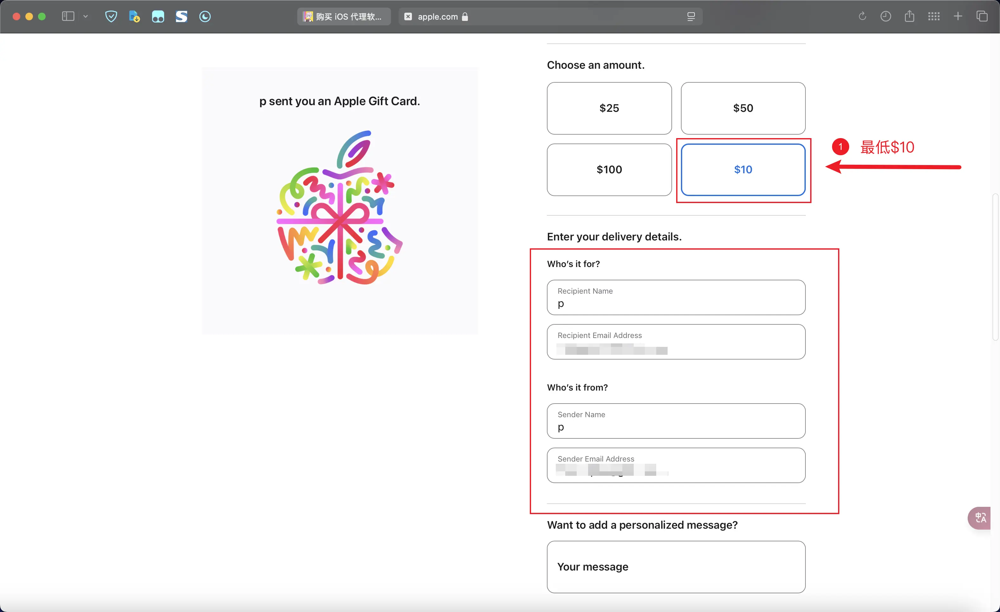
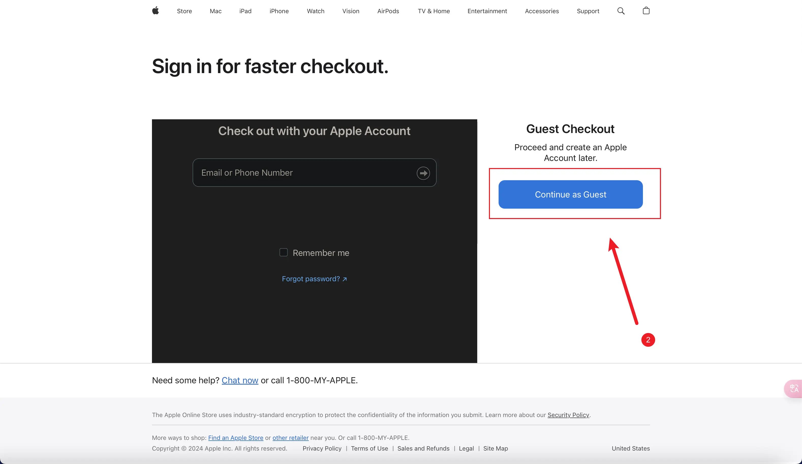
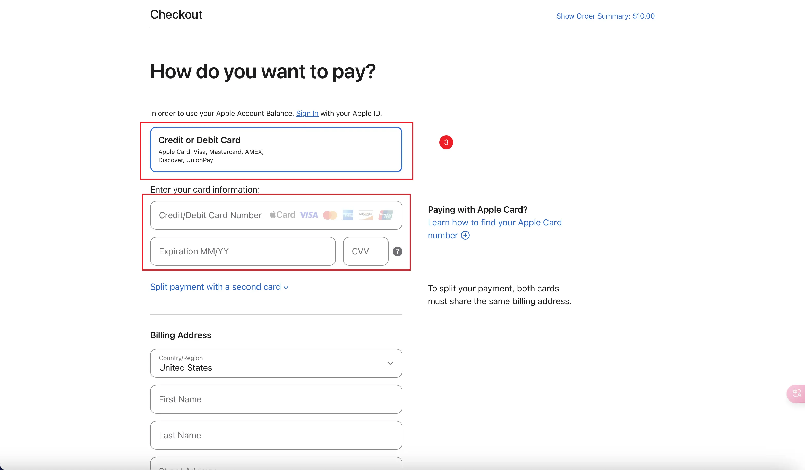
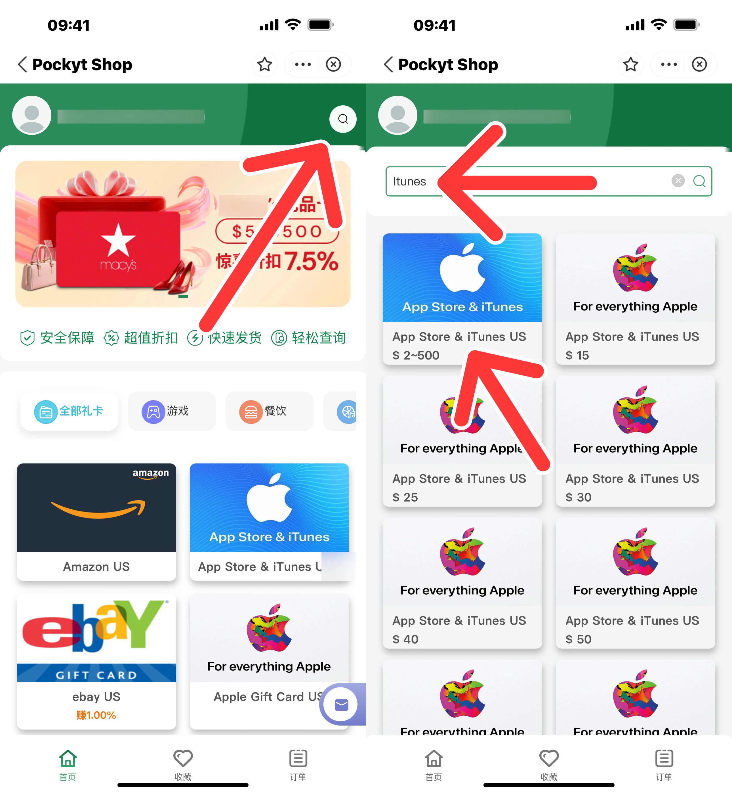

# 购买 iOS 代理软件

## 准备一个外区 Apple ID

自行[谷歌](https://www.google.com/search?q=美国Apple+id注册教程)，可以参考[可莉的教程](https://getupnote.com/share/notes/zSn1ShBmzNYISKcTgjXE5oHMrNf2/8eefb202-a766-4e5f-9253-822036c2fe1e)

注意美国 ID 的地址记得写[免税区](https://www.meiguodizhi.com/usa-address/oregon)

## 购买礼品卡

### 官网购买

可以参考[可莉的教程](https://getupnote.com/share/notes/zSn1ShBmzNYISKcTgjXE5oHMrNf2/2a3512b3-ba6b-4a6e-8e9c-973fe337430b)

!!! info ""
    当你已经拥有一个美区Apple ID时，可以继续后面的步骤

1. 点击[苹果官网的礼品卡购买链接](https://www.apple.com/shop/buy-giftcard/giftcard) 

2. 点击右侧的`[Continue as Guest]`按钮以游客身份购买

3. 点击`[Credit or Debit Card]`按钮添加你的银联借记卡（储蓄卡）信息，并点击`[Continue to Review]`按钮即可

4. 购买到的礼品卡将以邮件的方式发送到接收邮箱处，所以在填写的时候，务必保证接收邮箱的地址填写正确

   

   

   

!!! 注意
    看不懂英文页面建议使用浏览器的网页翻译功能，避免弄错！

    美区礼品卡只能兑换到美区的应用商店

    银联借记卡仅支持16位卡号。

### 支付宝 PockytShop 购买

!!! warning ""
    非官方渠道购买，风险自负！！！

[点击链接](alipays://platformapi/startapp?appId=2021003191605547)自动跳转

进入小程序后搜索 iTunes ，点击带有`$ 2~500`的选项，最低充值 `$ 2`

   

## 充值并购买代理软件

### 充值

### 购买代理软件

!!! info ""
    按需购买，量力而行

| 客户端  | 平台  | 购买方式   | 售价  |
| ------ | ----------- | --------------------------------------------------------------- | ------- |
| [Shadowrocket](https://apps.apple.com/us/app/shadowrocket/id932747118)     |              | 付费下载，买断制 需要非国区 Apple ID        | `$ 2.99` |
| [Surge 5](https://apps.apple.com/us/app/surge-5/id1442620678)              |                  | 应用内购，订阅制 需要非国区 Apple ID        | `$ 49.9`（包含未来1年付费功能订阅）  功能订阅 `$ 15/year` |
| [Loon](https://apps.apple.com/us/app/loon/id1373567447)                    |                     | 付费下载，买断制 需要非国区 Apple ID        | `$ 7.99` |
| [Quantumult X](https://apps.apple.com/us/app/quantumult-x/id1443988620)    |             | 付费下载，买断制 需要非国区 Apple ID        | `$ 7.99` | 
| [Stash](https://apps.apple.com/us/app/stash-rule-based-proxy/id1596063349) |   | 付费下载，买断制 需要非国区 Apple ID        | `$ 3.99` | 