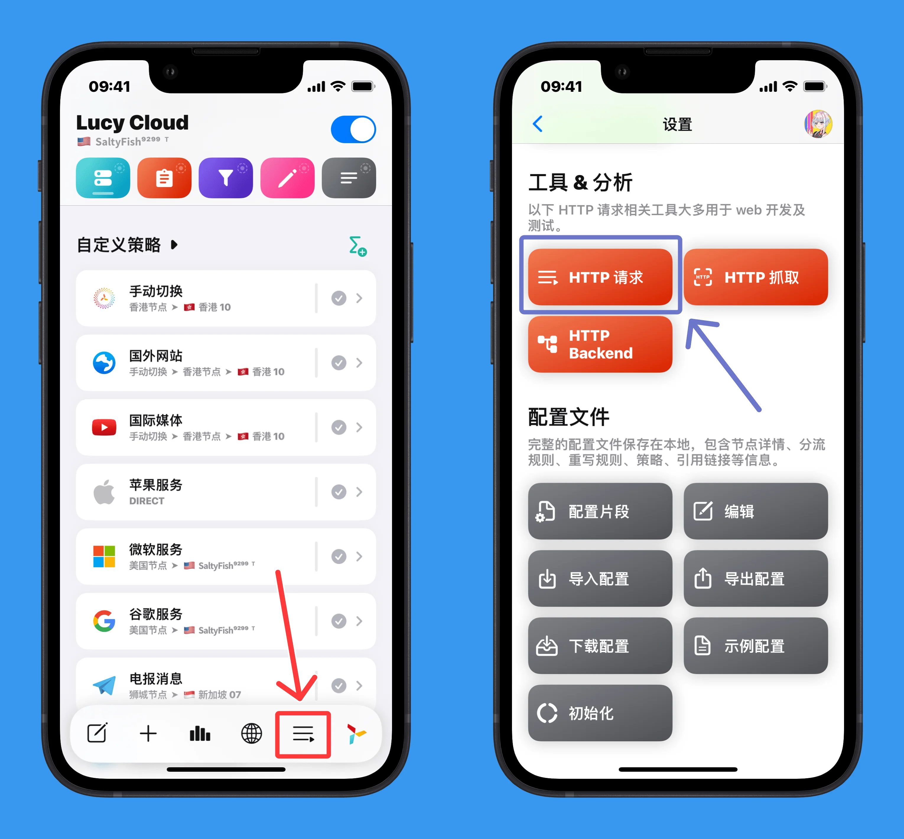
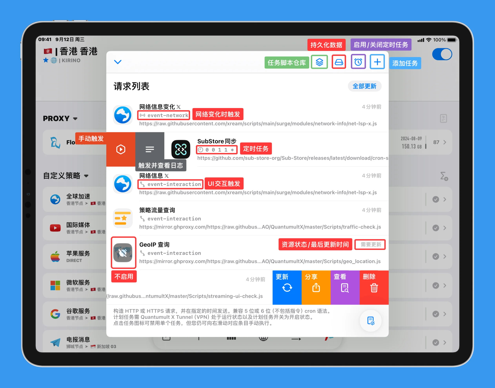
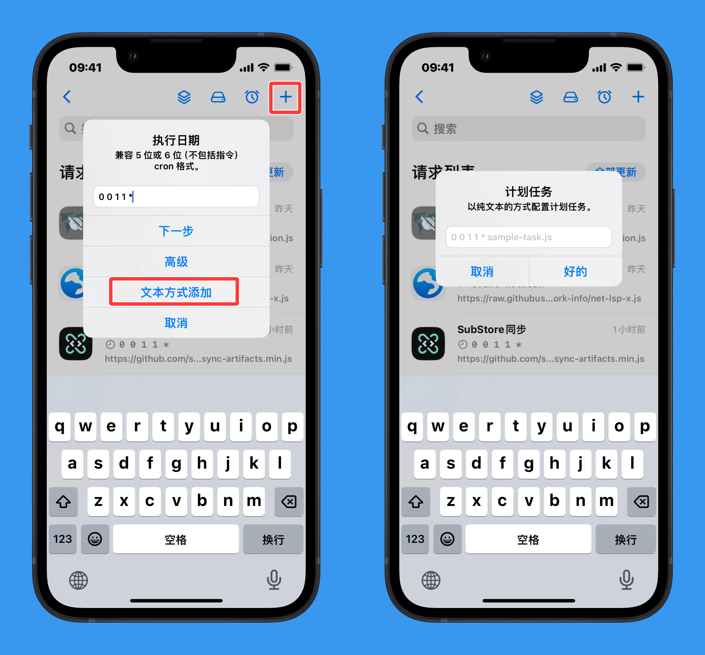
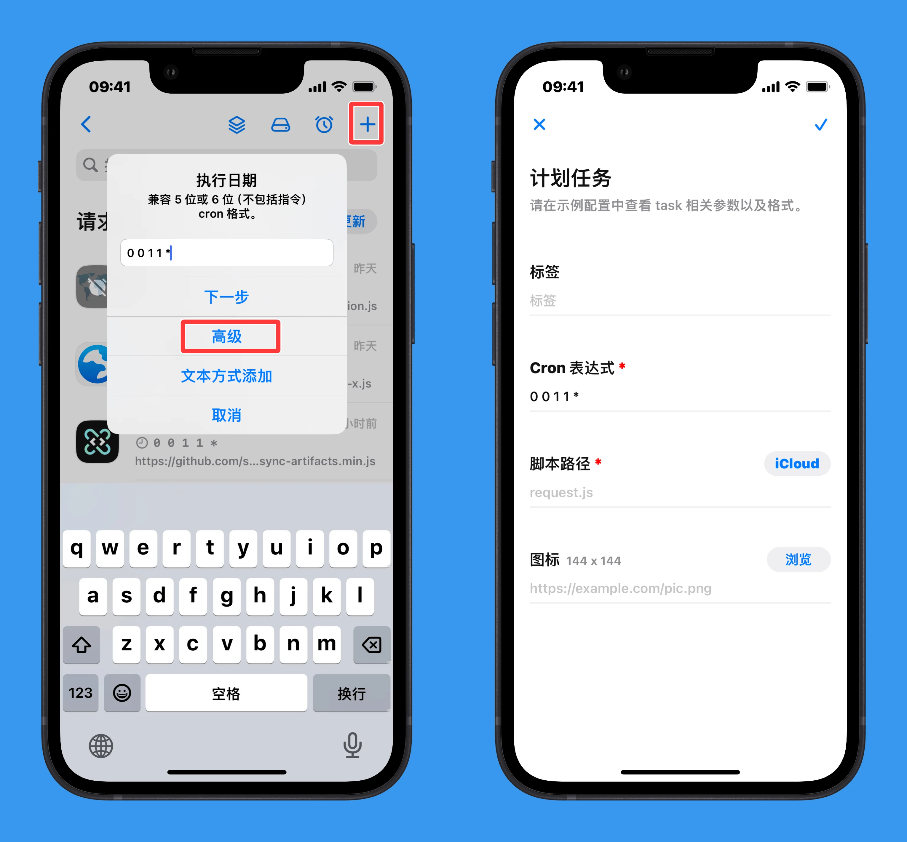
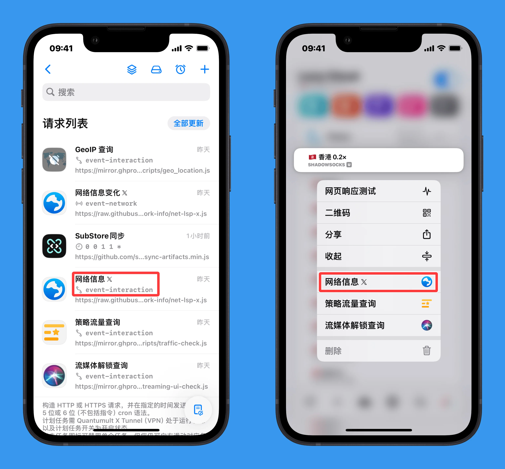
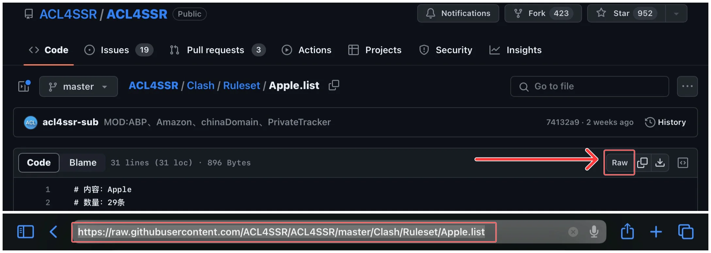
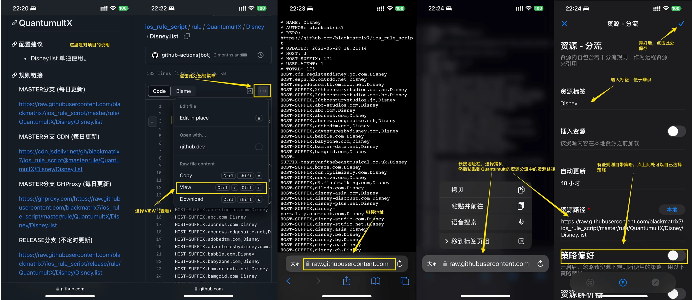
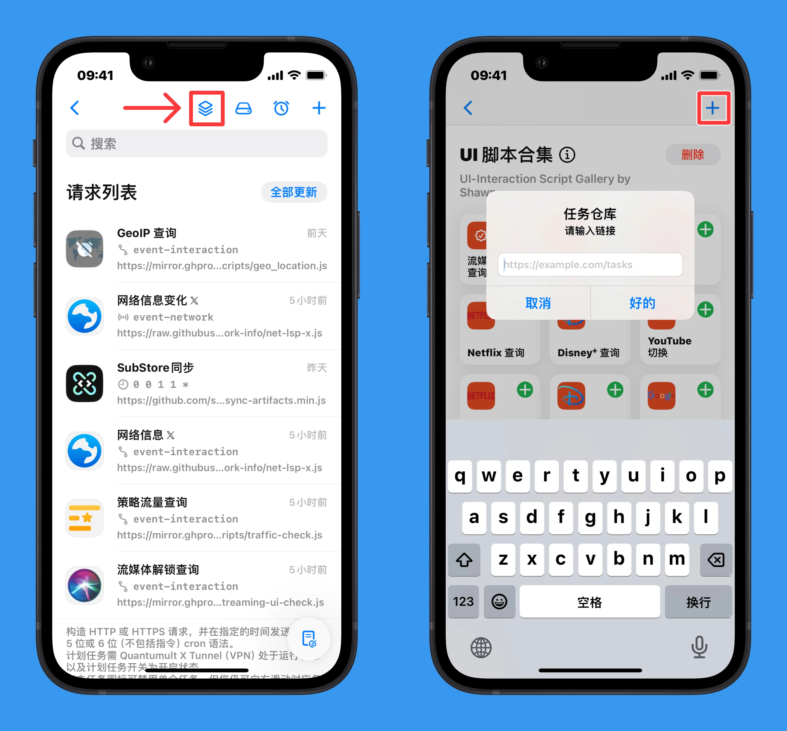
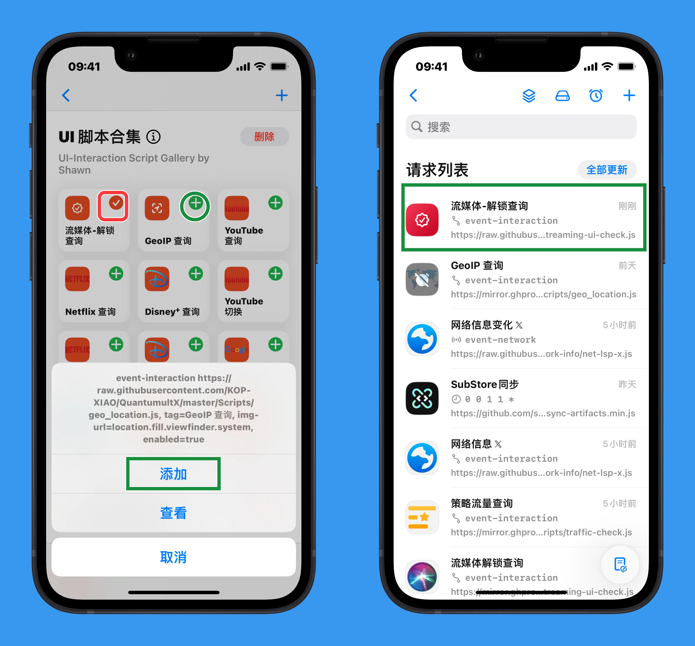

# 8. HTTP 请求


「HTTP 请求」所执行的功能，可简单的理解为执行脚本

脚本分为 「CRON 定时脚本任务」、「UI交互脚本」、「网络切换脚本」

其对应的配置文件位置为 `[task_local]`

可通过首页下方工具栏进入（默认UI），或　点击右下角「风车」进入设置 → 下方「工具 & 分析」- 「HTTP 请求」

{: width=600}

### 8.1 添加 HTTP 请求

<!-- prettier-ignore -->
!!! 注意
    以下主要讲的是 `[task_local]` 区块下的内容，所以示例都以 `[task_local]` 开头表明在其之下，并不是让你每个参数字段前都加上 `[task_local]`。


#### 8.1.1 配置文本添加

```
[task_local]
event-network https://raw.githubusercontent.com/xream/scripts/main/surge/modules/network-info/net-lsp-x.js, tag=网络信息变化 𝕏, img-url=https://raw.githubusercontent.com/Koolson/Qure/master/IconSet/Color/Global.webp, enabled=true
```

```
[task_local]
0 0 1 1 * https://github.com/sub-store-org/Sub-Store/releases/latest/download/cron-sync-artifacts.min.js, tag=SubStore同步, img-url=https://raw.githubusercontent.com/fmz200/wool_scripts/main/icons/apps/SubStore.webp, enabled=true
```

```
[task_local]
event-interaction https://raw.githubusercontent.com/xream/scripts/main/surge/modules/network-info/net-lsp-x.js, tag=网络信息 𝕏, img-url=https://raw.githubusercontent.com/Koolson/Qure/master/IconSet/Color/Global.webp, enabled=true
```

<!-- prettier-ignore -->
!!! 提示
    就像任何浏览器一样，脚本 URL 字符串中 `#` 之后的内容永远不会发送到服务器。可以在脚本 URL 后添加 `#` 来附加自定义参数，并在脚本中使用 API `$environment.sourcePath` 获取完整路径并提取自定义参数。例如：
    ```
    * * * * * https://example.com/sample.js#this-is-not-sent-to-server&key1=value1&key2=value2, tag=Sample, enabled=true
    ```

其基本格式为

```
<脚本参数>, <资源链接>, <资源标签>, <资源图标>, <设备限制>, <是否启用>
```

脚本参数:

  - `event-network`：对应「网络切换脚本」，当网络发生变化时自动执行（相关任务仅在 Quantumult X Tunnel 运行时触发）

  - `event-interaction`：对应「UI交互脚本」，须与UI交互执行（相关任务仅在 Quantumult X Tunnel 运行时触发）

  - `5或6位CRON表达式`：对应「CRON 定时脚本任务」，5位表达式从分开始，支持 5 或 6 位 CRON（不含 command 字段），具体请自行谷歌

资源链接：脚本资源位置，可为远程脚本，也可为本地脚本（保存在「我的 iPhone - Quantumult X - Scripts」或「iCloud Drive - Quantumult X - Scripts」）

`tag`：资源标签，可选

`img-url`：资源图标，可选

`require-devices`：可选参数，指定仅在特定设备ID上加载此任务，多个设备用逗号分隔（设备ID可在「设置 - 其他设置 - 关于」中查找）

`enabled`：是否启用该 HTTP 请求，若不使用可改为 `false`；

<!-- prettier-ignore -->
!!! 注意
    脚本任务需 Quantumult X Tunnel （VPN） 处于运行状态，以及计划任务开关(右上角⏰)为开启状态
    
    `$task.fetch()` 可组装 HTTP 请求并处理响应，仅支持文本正文。一个 `$task.fetch()` 可嵌入另一个 `$task.fetch()` 的完成处理器中（用于实现串行请求而非并发请求）。
    
    默认 HTTP 请求超时时间为 10 秒。

#### 8.1.2 UI 添加



- 如果给的是「完整的任务格式」，如：
  
```
event-network https://raw.githubusercontent.com/xream/scripts/main/surge/modules/network-info/net-lsp-x.js, tag=网络信息变化 𝕏, img-url=https://raw.githubusercontent.com/Koolson/Qure/master/IconSet/Color/Global.webp, enabled=true
```

  可通过右上角 `＋`→ `文本方式添加`，直接粘贴即可 

{: width=600}

- 如果给的是「定时任务类型」，且为单独的脚本链接(或本地脚本文件)，请阅读脚本内容，根据其需要，设置 CRON表达式

  可通过右上角 `＋`→ `高级`，填写参数即可 

{: width=600}

#### 8.2 执行脚本

<!-- prettier-ignore -->
!!! 注意
    脚本任务需 Quantumult X Tunnel （VPN） 处于运行状态，以及计划任务开关(右上角⏰)为开启状态

- `event-network`：对应「网络切换脚本」，当网络发生变化时自动执行


- `event-interaction`：对应「UI交互脚本」，须与UI交互执行

  启动 VPN 后，长按节点，即可执行

{: width=600}


- `5或6位CRON表达式`：对应「CRON 定时脚本任务」，5位表达式从分开始，具体请自行谷歌。也可左滑点击按钮执行或查看执行时的日志

#### 8.3 任务仓库

- 添加任务仓库

<details>
  <summary> 路径需要填写资源的raw格式链接，点此查看教程</summary>

以下方的链接举例(这是个网页，不是真正能使用的资源链接)：

```
https://github.com/blackmatrix7/ios_rule_script/blob/master/rule/QuantumultX/12306/12306.list
```

例如在末尾添加`?raw=true`：

```
https://github.com/blackmatrix7/ios_rule_script/blob/master/rule/QuantumultX/12306/12306.list?raw=true
```

或者直接点击`raw`或者`view`，⁠使用跳转后的链接：

```
https://raw.githubusercontent.com/blackmatrix7/ios_rule_script/master/rule/QuantumultX/12306/12306.list
```






或者将链接里的`blob`⁠修改为`raw`：

```
https://github.com/blackmatrix7/ios_rule_script/raw/master/rule/QuantumultX/12306/12306.list
```


</details>


{: width=600}

- 从仓库中添加任务

{: width=600}

### 8.4 本地 HTTP 后端 `[http_backend]`

<!-- prettier-ignore -->
!!! 提示
    Quantumult X 支持部署本地 HTTP 服务器并使用 JavaScript 进行数据处理。部署后应通过 `http://127.0.0.1:9999/your-path/your-api/` 访问。

```
[http_backend]
;https://raw.githubusercontent.com/crossutility/Quantumult-X/master/sample-backend.js, tag=fileConverter, path=^/example/v1/
;preference.js, tag=userPreference, path=^/preference/v1/, img-url=https://example.com, enabled=true
;sample.js, tag=sample, path=^/sample/v1/, require-devices=ID1, ID2, enabled=true
```

其基本格式为：

```
<脚本路径>, <资源标签>, <匹配路径>, <资源图标>, <设备限制>, <是否启用>
```

- 脚本路径：JavaScript 脚本的远程 URL 或本地文件路径
- `tag`：资源标签，必填，用于标识此后端服务
- `path`：匹配路径，使用正则表达式匹配请求路径，如 `^/example/v1/`
- `img-url`：资源图标，可选
- `require-devices`：可选参数，指定仅在特定设备ID上加载此后端
- `enabled`：是否启用

在脚本中可用的输入变量：`$request.url`、`$request.path`、`$request.headers`、`$request.body`

输出使用 `$done`，如：`$done({status:"HTTP/1.1 200 OK", headers:{}, body:"here is a string"})` 来发送响应。

还可以使用签名或其他验证方法来校验请求的合法性。
