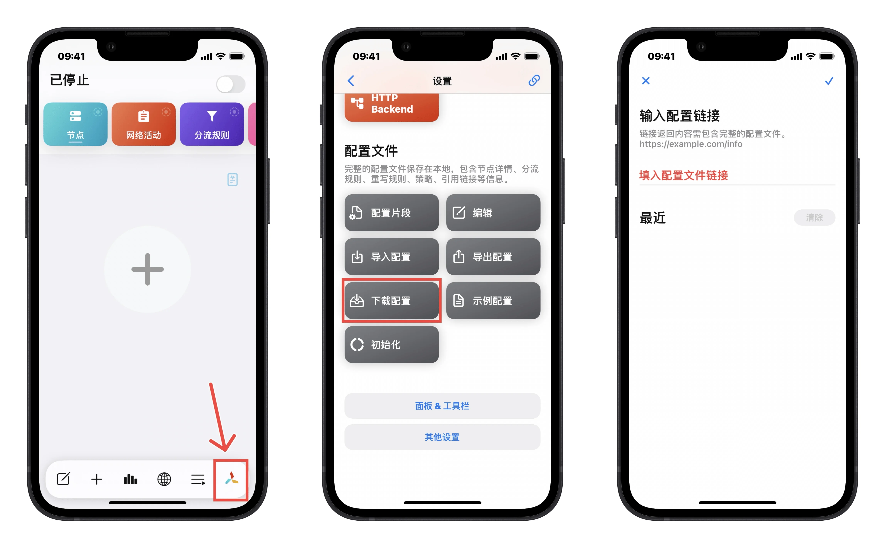
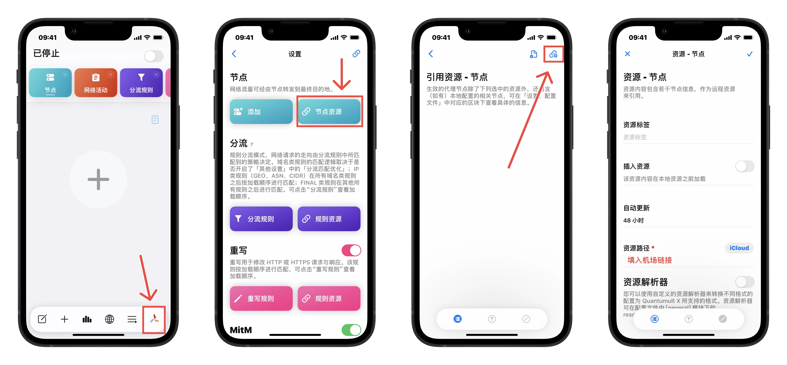
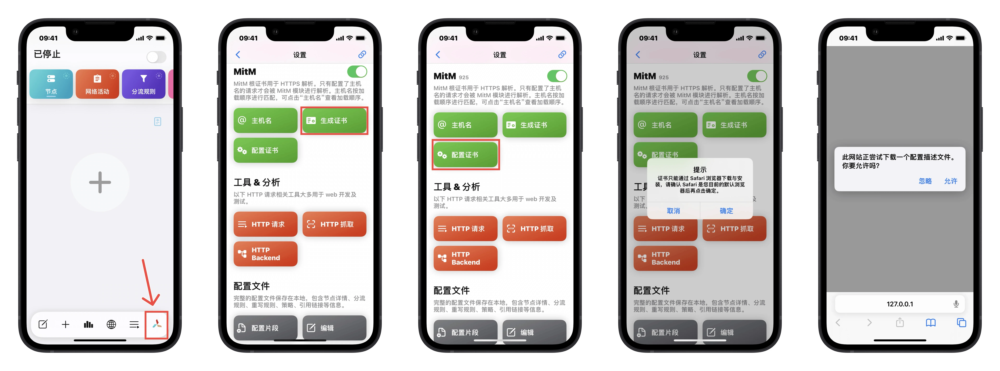
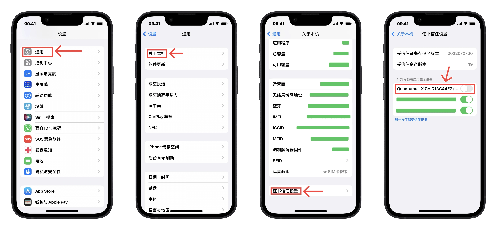
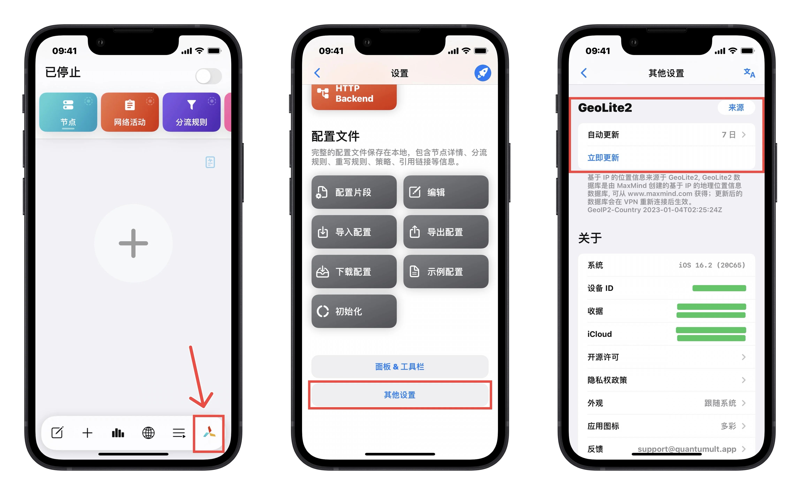
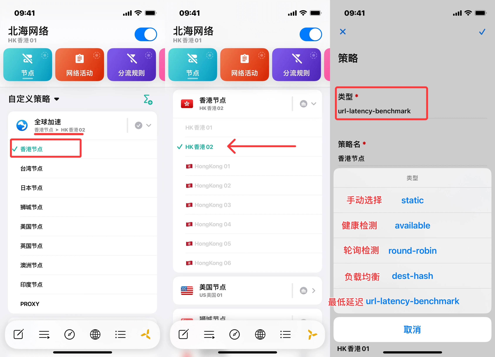

# 新手入门

## Quantumult X 下载地址

<a href="https://apps.apple.com/app/id1443988620"></a>  

## 导入配置

### 1.添加以下 **配置文件** 
> 配置参数解释见：_[KOP-XIAO/QuantumultX](https://github.com/KOP-XIAO/QuantumultX/blob/master/QuantumultX_Profiles.conf)_


QuantumultX

- [x] 地区分流（香港、美国、日本、台湾、新加坡）
- [x] 苹果、谷歌、微软、电报、推特分流
- [x] 流媒体（不支持单独分流）
- [x] 自动选择最低延迟
- [ ] 负载均衡
- [ ] 故障转移
- [x] 广告屏蔽重写
- [ ] 适用于软路由环境

```
https://raw.githubusercontent.com/Repcz/Tool/X/QuantumultX/QuantumultX.conf
```


QuantumultX_tvOS

- [x] 地区分流（香港、美国、日本、台湾、新加坡）
- [x] 苹果、谷歌、微软、电报、推特分流
- [x] 流媒体（支持单独分流）
- [x] 自动选择最低延迟
- [ ] 负载均衡
- [ ] 故障转移
- [ ] 广告屏蔽重写
- [ ] 适用于软路由环境
- [x] 适用于tvOS

```
https://raw.githubusercontent.com/Repcz/Tool/X/QuantumultX/QuantumultX_tvOS.conf
```


* 运行 **Quantumult X** ，点击右下角的 **风车** 图标
* 弹出的 **设置** 菜单中，在最下方 **配置文件** 区域，点击 **下载配置**
* 将配置文件链接填入并保存




### 2.添加机场订阅

> 机场订阅本地转换可参考[Sub-Store 教程](https://getupnote.com/share/notes/8SiMnOcwXxZ3xEtK4k2v9Gr3pv32/7522F394-6D73-414E-BE04-1455EDB15B9F)

* 运行 **Quantumult X**，点击右下角的 **风车** 图标
* 弹出的 **设置** 菜单中，在最上方 **节点** 区域，点击 **节点资源**
* 点击右上角 **🔗** 按钮
* 添加机场订阅并保存

 

### 3.为配置文件生成证书

* 运行 **Quantumult X**，点击右下角的 **风车** 图标
* 弹出的 **设置** 菜单中，在下方 **MitM** 区域，点击 **生成证书**
* 点击 **配置证书** ，**确定** 提示后，在Safari中 **允许** 下载配置文件

 

### 4.设置中安装描述文件

* 在 **系统设置** 中，点击 **已下载描述文件** ，并 **安装**


### 5.设置中信任描述文件

* 在 **系统设置** - **通用** - **关于本机** - **证书信任设置** 中，勾选已安装的描述文件
* 安装完成后，返回QuantumultX，勾选以启用 **MitM** 和 **重写**




### 6.添加**GeoLite2**订阅

> 项目地址：[Hackl0us/GeoIP2-CN](https://github.com/Hackl0us/GeoIP2-CN)

* 运行 **Quantumult X**，点击右下角的 **风车** 图标
* 弹出的 **设置** 菜单中，拉至最下，点击 **其他设置**
* 在 **其他设置** 中找到 **GeoLite2** 区域，点击右侧的 **来源** 按钮
* 在弹出的窗口中粘贴项目提供的 `Country.mmdb` 链接(仅包含ipv4地址)：

```
https://cdn.jsdelivr.net/gh/Hackl0us/GeoIP2-CN@release/Country.mmdb
```

* 建议启用 **自动更新** 功能以保持地址库信息最新
* 点击 **立即更新** 即可



### 7.设置分流模式

* 首页长按右下角风车，设置为彩色风车，及为按配置文件中的规则进行分流


### 策略组 修改为手动选择节点

> 默认为自动选择延迟最低节点，**按需** 修改为手动选择

* 在自定义策略下的分流策略组中选择需要的地区节点，此处以 **全球加速** 举例，选择 **香港节点**
* 下拉到下方的 **香港节点** 策略组，此时该策略组以 `url-latency-benchmark` 运行，即按最低延迟选择节点
* 如果要修改为手动选择节点，则长按 **香港节点** 策略组， **类型** 选择 `static`，并保存
* 在 **香港节点** 策略组中选择需要的节点，则 **全球加速** 策略组走 **香港节点** 中选择的节点

```
static                 # 手动选择想要的节点/策略组。
available              # 将按顺序选择你列表中第一个可用的节点。
round-robin            # 将按列表的顺序轮流使用其中的节点。
url-latency-benchmark  # 自动选取延迟最优节点。
dest-hash              # 随机负载均衡，但相同域名走固定节点。
```


