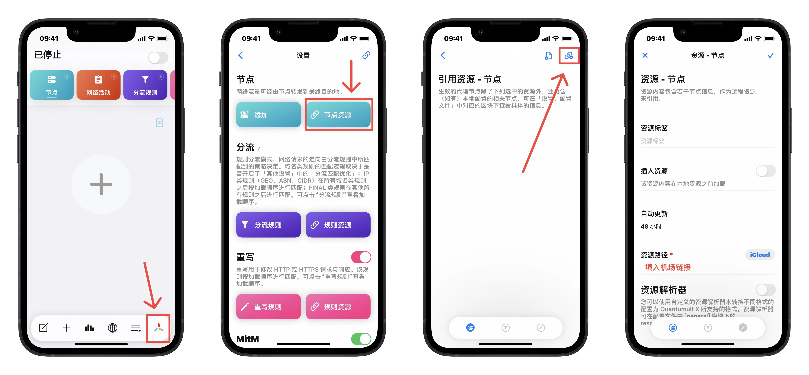
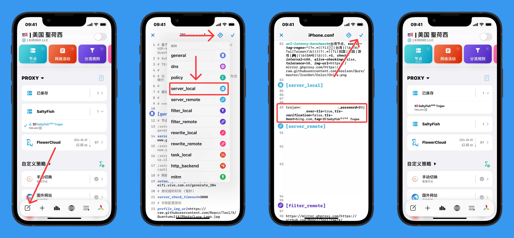
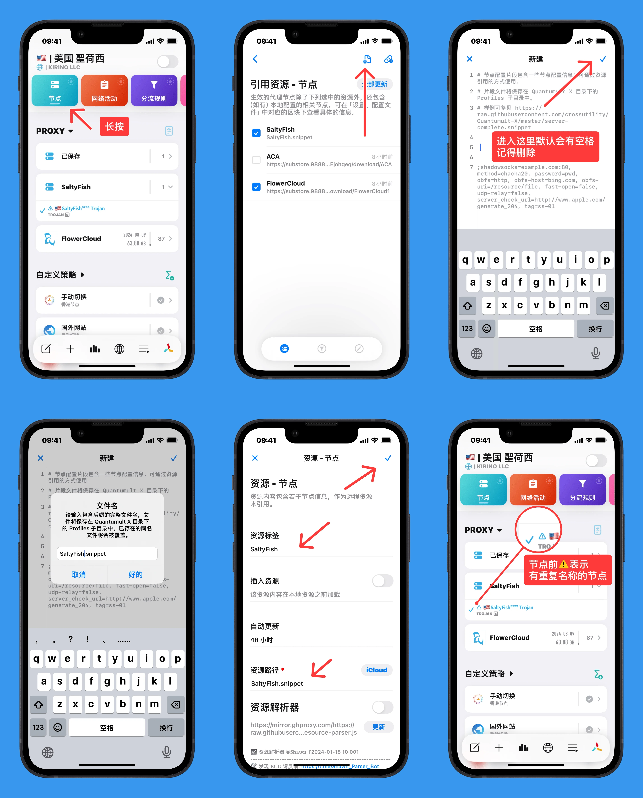
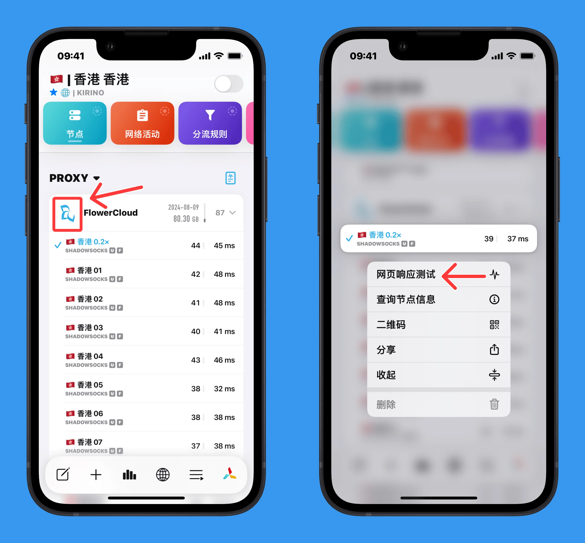
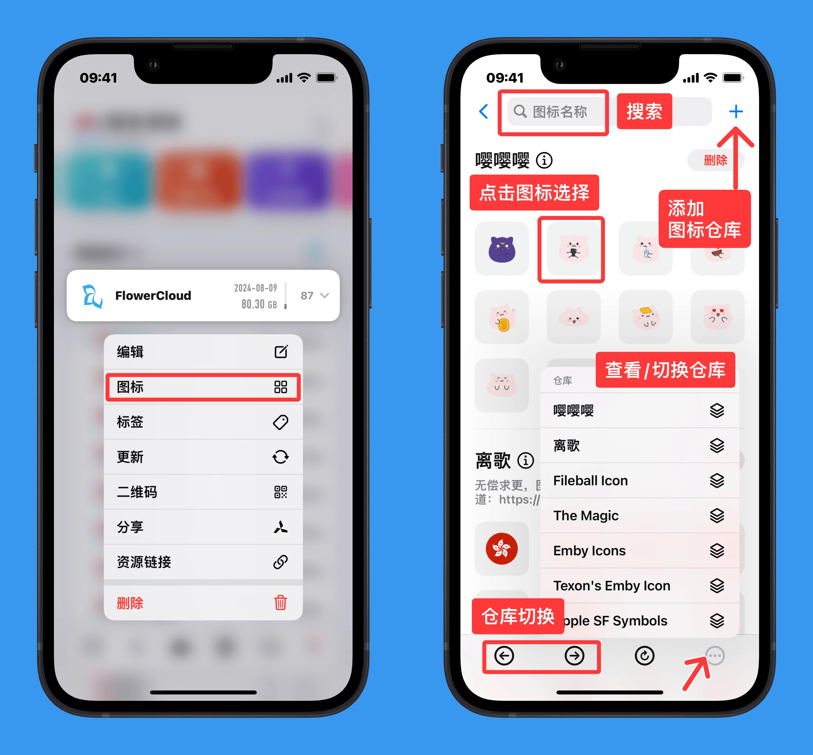

# 2. 节点订阅

<!-- prettier-ignore -->
!!! 注意
    以下主要讲的是 `[server_local]`、`[server_remote]` 或 `[general]` 区块下的内容，所以示例以 `[server_local]`、`[server_remote]` 或 `[general]`  开头表明在其之下，并不是让你每个参数字段前都加上 `[server_local]`、`[server_remote]` 或 `[general]` 。
    
    以 `;` 或 `#` 或 `//` 开头的行为注释行。


### 2.1 添加远程节点订阅

#### 2.1.1 UI添加

- 长按最上方「节点」按钮，即可进入添加机场订阅，效果和下图是一致的
- 切记不要使用一键导入，而是复制通用订阅；如果是非通用订阅，可以尝试开启资源解析器进行使用(本地转换，无泄漏风险，但不代表转换后一定可用)
- 如果你的解析器是空的，「节点页」点击左下角编辑，需要在 `[general]` 下添加：

```
resource_parser_url=https://raw.githubusercontent.com/KOP-XIAO/QuantumultX/master/Scripts/resource-parser.js 
```



#### 2.1.2 配置文件添加

```
[server_remote]
https://example.com/provider.txt, tag=机场名称, img-url=https://example.com/airport.webp, update-interval=86400, opt-parser=false, inserted-resource=false, enabled=true 
```

对应的完整参数：

`<资源路径>, <资源标签>, <资源图标>，<自动更新时间间隔>, <是否使用资源解析器>, <插入资源>, <是否启用>`

- `tag` 资源标签：相当于名称，标识这条节点订阅的作用；

- `img-url` 自定义图标参数是可选的，使用它可以更美观些，但此处不显示彩色图标

- `update-interval` 自动更新的时间间隔，单位为秒；负数表示禁用自动更新；

- `opt-parser` 是否使用资源解析器，若关闭则改为 `false`；

- `inserted-resource` 插入资源，将文件中的节点放置于本地节点之前；

- `enabled` 是否启用该节点订阅文件，若不使用可改为 `false`；

- `as-policy` 可选参数，将远程节点订阅直接作为策略组使用，如 `as-policy=static`；

- `require-devices` 可选参数，指定仅在特定设备ID上加载此订阅，多个设备用逗号分隔（设备ID可在「设置 - 其他设置 - 关于」中查找）；


### 2.2 添加本地节点

#### 2.2.1 配置文件

将节点内容复制粘贴到配置文件 `[server_local]` 下,会增加一个「已保存」

但是这样做会存在一个问题：无法在策略组中使用正则参数进行筛选，因此建议使用配置片段进行添加

{: width=1200}

#### 2.2.2 配置片段添加

使用配置片段的方式添加，类似于添加远程节点订阅，只不过引用的远程资源是本地文件

<!-- prettier-ignore -->
!!! 提示
    添加配置片段时，无需带有 `[server_local]`、`[server_remote]`、`[filter_local]`、`[filter_remote]` 等字段

{: width=900}

#### 2.2.3 节点格式

  > 参考 [官方示例配置](https://github.com/crossutility/Quantumult-X/blob/master/sample.conf) 及 [@KOP-XIAO](https://github.com/KOP-XIAO/QuantumultX/blob/4a705faac3cfed6ba0e55d6a71bc3b35036f0f96/QuantumultX_Profiles.conf#L237)

##### TLS 相关通用参数说明

Quantumult X 支持多种 TLS 相关参数，以下参数适用于所有支持 TLS 的协议类型（Shadowsocks、VMess、VLESS、Trojan、HTTP、SOCKS5、AnyTLS）：

- `obfs=over-tls`：使用标准 TLS 协议
- `obfs=wss`：使用 WebSocket over TLS
- `tls-verification`：是否验证 TLS 证书，默认值为 `false`
- `tls-cert-sha256`：使用 SHA256 证书指纹进行 SSL Pinning 验证，可使用以下命令生成：
  ```
  openssl x509 -noout -fingerprint -sha256 -inform pem -in your-cert.pem
  ```
- `tls-pubkey-sha256`：使用 SHA256 公钥指纹进行 SSL Pinning 验证（优先级高于 `tls-cert-sha256`），可使用以下命令生成：
  ```
  openssl x509 -inform pem -pubkey -noout < your-cert.pem | openssl pkey -pubin -outform der | openssl dgst -sha256
  ```
- `tls-alpn`：TLS ALPN 扩展内容的十六进制格式，例如 `02:68:32:08:68:74:74:70:2f:31:2e:31` 或 `02683208687474702f312e31` 代表 ALPN "h2" 和 "http/1.1"
- `tls-no-session-ticket`：禁用 TLS Session Ticket，默认启用（`false`）
- `tls-no-session-reuse`：禁用 TLS Session 复用，默认启用（`false`），开启后每次新连接都会执行完整的 TLS 握手
- `tls13`：已弃用（自 v1.0.26 起），TLS 1.3 始终支持

<!-- prettier-ignore -->
!!! 提示
    关于 TLS 指纹：当使用标准 TLS（`obfs=over-tls`）配置 `tls-alpn=02683208687474702f312e31`（ALPN "h2" 和 "http/1.1"）且 `tls-no-session-ticket=true` 时，将使用 [iOS 18 Safari 指纹](https://raw.githubusercontent.com/crossutility/Quantumult-X/refs/heads/master/ios18-safari-fingerprint.txt)；否则使用默认的 iOS 18 Network Framework 指纹（Session Ticket 启用）。

##### Reality TLS 相关参数说明

当 `obfs=over-tls` 或 `obfs=wss` 的节点配置中包含 `reality-base64-pubkey` 参数时，标准 TLS 将被替换为 Reality 协议：

- `reality-base64-pubkey`：Reality 公钥（Base64 编码）
- `reality-hex-shortid`：Reality Short ID（十六进制格式）
- 当 Reality 启用时，将使用 [iOS 26 Safari 指纹](https://raw.githubusercontent.com/crossutility/Quantumult-X/refs/heads/master/ios26-safari-fingerprint.txt)，且自定义 ALPN 和 Session Ticket 设置将被忽略
- 由于 iOS 26 Safari 指纹包含后量子加密 X25519MLKEM768，Client Hello 大小超过 1500 字节，因此 TCP Fast Open 对 Reality TLS 无效，请勿开启 `fast-open`

##### shadowsocks 以及 shadowsocksR 类型

支持 V2-Plugin；支持 UDP，支持 UDP-OVER-TCP

<!-- prettier-ignore -->
!!! 提示
    - 当使用 `obfs=ws` 和 `obfs=wss` 时服务端可使用 mux=0 的 v2ray-plugin 或 v2ray-core 或 trojan-go 部署。
    - Shadowsocks 的 `udp-over-tcp` 默认为 `true`（ShadowsocksR Python 服务端）支持。对于 Xray 服务端，请设置 `udp-over-tcp=sp.v1`；对于 sing-box 等 v2 支持的服务端，请设置 `udp-over-tcp=sp.v2`。
    - ShadowsocksR Python 服务端不支持 "2022-blake3-aes-128-gcm" 和 "2022-blake3-aes-256-gcm" 的 `udp-over-tcp`，如需此功能请使用 Xray 等服务端并设置 `udp-over-tcp=sp.v1` 或 `udp-over-tcp=sp.v2`。
    - `obfs=tls` 与 `obfs=over-tls` 不同：`obfs=tls` 是 shadowsocks 项目的混淆插件（TLS 协议的混淆），`obfs=over-tls` 才是真正的 TLS 协议。Quantumult X 两者都支持。
    - `obfs=tls1.2_ticket_auth` 比 `tls1.2_ticket_fastauth` 和 `obfs=tls` 多一次 RTT，建议使用 `tls1.2_ticket_fastauth`。
    - `obfs=http` 与 VMess 协议的 `obfs=http` 实现不同：如有特殊需求（如服务端由 V2Ray 部署 shadowsocks 协议 + V2Ray 内置 http 混淆），可设置 `obfs=vmess-http`；反之 VMess 协议也可设置 `obfs=shadowsocks-http`（后者极少发生）。

###### shadowsocks 2022 加密

```
; 2022-blake3-aes-128-gcm 基础配置
shadowsocks=example.com:80, method=2022-blake3-aes-128-gcm, password=BJDBGeLKx/JbEACCSN5rRg==, udp-relay=true, tag=ss2022-blake3-aes-128-gcm

; 2022-blake3-aes-256-gcm
shadowsocks=example.com:80, method=2022-blake3-aes-256-gcm, password=RBUjIfGi9eThH+rkxXI0j1EdSGAZEf1jN9x1vn+Tf04=, udp-relay=true, tag=ss2022-blake3-aes-256-gcm

; 2022 加密 + http 混淆
shadowsocks=example.com:80, method=2022-blake3-aes-128-gcm, password=BJDBGeLKx/JbEACCSN5rRg==, obfs=http, obfs-host=apple.com, obfs-uri=/resource/file, udp-relay=true, tag=ss2022-obfs-http

; 2022 加密 + tls 混淆
shadowsocks=example.com:443, method=2022-blake3-aes-128-gcm, password=BJDBGeLKx/JbEACCSN5rRg==, obfs=tls, obfs-host=apple.com, fast-open=false, udp-relay=true, tag=ss2022-obfs-tls

; 2022 加密 + over-tls
shadowsocks=example.com:443, method=2022-blake3-aes-128-gcm, password=BJDBGeLKx/JbEACCSN5rRg==, obfs=over-tls, obfs-host=your.certificate.sni.name, tls-verification=true, udp-relay=true, tag=ss2022-tls-01
```

###### shadowsocks 2022 + UDP over TCP

```
; udp-over-tcp=sp.v1 (Xray)
shadowsocks=example.com:80, method=2022-blake3-aes-128-gcm, password=BJDBGeLKx/JbEACCSN5rRg==, udp-relay=true, udp-over-tcp=sp.v1, tag=ss2022-uot

; udp-over-tcp=sp.v2 (sing-box 等)
shadowsocks=example.com:80, method=2022-blake3-aes-128-gcm, password=BJDBGeLKx/JbEACCSN5rRg==, udp-relay=true, udp-over-tcp=sp.v2, tag=ss2022-uot2

; over-tls + udp-over-tcp=sp.v1
shadowsocks=example.com:443, method=2022-blake3-aes-128-gcm, password=BJDBGeLKx/JbEACCSN5rRg==, obfs=over-tls, obfs-host=your.certificate.sni.name, tls-verification=true, udp-relay=true, udp-over-tcp=sp.v1, tag=ss2022-tls-uot

; over-tls + tls-pubkey-sha256 + udp-over-tcp
shadowsocks=example.com:443, method=2022-blake3-aes-128-gcm, password=BJDBGeLKx/JbEACCSN5rRg==, obfs=over-tls, obfs-host=your.certificate.sni.name, tls-verification=true, tls-pubkey-sha256=eb5ec6684564fd0d04975903ed75342d1b9fdc2096ea54b4cf8caf4740f4ae25, udp-relay=true, udp-over-tcp=sp.v2, tag=ss2022-tls-uot3
```

###### shadowsocks 2022 + Reality

```
; 2022 加密 + Reality TLS
shadowsocks=example.com:443, method=2022-blake3-aes-128-gcm, password=BJDBGeLKx/JbEACCSN5rRg==, obfs=over-tls, obfs-host=apple.com, reality-base64-pubkey=k4Uxez0sjl8bKaZH2Vgi8-WDFshML51QkxKFLWFIONk, reality-hex-shortid=0123456789abcdef, udp-relay=true, udp-over-tcp=sp.v2, tag=ss2022-reality-01
```

###### shadowsocks 传统加密

```
; http 混淆
shadowsocks=ss-a.example.com:80, method=chacha20, password=pwd, obfs=http, obfs-host=bing.com, obfs-uri=/resource/file, fast-open=false, udp-relay=false, server_check_url=http://www.apple.com/generate_204, tag=Sample-A

shadowsocks=ss-b.example.com:80, method=chacha20, password=pwd, obfs=http, obfs-host=bing.com, obfs-uri=/resource/file, fast-open=false, udp-relay=false, tag=Sample-B

; tls 混淆
shadowsocks=ss-c.example.com:443, method=chacha20, password=pwd, obfs=tls, obfs-host=bing.com, fast-open=false, udp-relay=false, tag=Sample-C

; SSR
shadowsocks=ssr-a.example.com:443, method=chacha20, password=pwd, ssr-protocol=auth_chain_b, ssr-protocol-param=def, obfs=tls1.2_ticket_fastauth, obfs-host=bing.com, tag=Sample-D

; over-tls
shadowsocks=example.com:443, method=chacha20, password=pwd, obfs=over-tls, obfs-host=apple.com, tls-verification=true, tls-cert-sha256=b0088370d6c8e02d6e38c443abf81be2aaf1e18f00435aaf0b39852c338f7aaa, fast-open=false, udp-relay=false, tag=ss-tls-01

; over-tls + tls-pubkey-sha256
shadowsocks=example.com:443, method=chacha20, password=pwd, obfs=over-tls, obfs-host=apple.com, tls-verification=true, tls-pubkey-sha256=eb5ec6684564fd0d04975903ed75342d1b9fdc2096ea54b4cf8caf4740f4ae25, fast-open=false, udp-relay=false, tag=ss-tls-02

; over-tls + tls-pubkey-sha256 + tls-alpn
shadowsocks=example.com:443, method=chacha20, password=pwd, obfs=over-tls, obfs-host=apple.com, tls-verification=true, tls-pubkey-sha256=eb5ec6684564fd0d04975903ed75342d1b9fdc2096ea54b4cf8caf4740f4ae25, tls-alpn=02683208687474702f312e31, fast-open=false, udp-relay=false, tag=ss-tls-03

; ws
shadowsocks=ws-a.example.com:80, method=aes-128-gcm, password=pwd, obfs=ws, fast-open=false, udp-relay=false, tag=Sample-E

; ws + obfs-uri
shadowsocks=ws-b.example.com:80, method=aes-128-gcm, password=pwd, obfs=ws, obfs-uri=/ws, fast-open=false, udp-relay=false, tag=Sample-F

; wss (ws+tls)
shadowsocks=ws-tls-a.example.com:443, method=aes-128-gcm, password=pwd, obfs=wss, obfs-uri=/ws, fast-open=false, udp-relay=false, tag=Sample-G

; udp-over-tcp
shadowsocks=ws-tls-a.example.com:80, method=chacha20, password=pwd, fast-open=false, udp-relay=true, udp-over-tcp=true, tag=Sample-H
```

##### vmess 类型

ws，wss(ws+tls)，over-tls，tcp，http，支持 UDP；也支持 Reality

vmess 类型节点默认开启 aead，关闭请用 `aead=false`（服务端 V2Ray 版本低于 v4.28 时需设置）

- tcp 类型

```
vmess=vmess-a.example.com:80, method=aes-128-gcm, password=23ad6b10-8d1a-40f7-8ad0-e3e35cd32291, fast-open=false, udp-relay=false, tag=Sample-J

vmess=vmess-b.example.com:80, method=none, password=23ad6b10-8d1a-40f7-8ad0-e3e35cd32291, fast-open=false, udp-relay=false, tag=Sample-K

; 关闭 aead（服务端低于 v4.28）
vmess=example.com:80, method=aes-128-gcm, password=23ad6b10-8d1a-40f7-8ad0-e3e35cd32291, fast-open=false, udp-relay=false, aead=false, tag=vmess-02
```

- ws 类型

```
vmess=ws-c.example.com:80, method=chacha20-ietf-poly1305, password=23ad6b10-8d1a-40f7-8ad0-e3e35cd32291, obfs-host=ws-c.example.com, obfs=ws, obfs-uri=/ws, fast-open=false, udp-relay=false, aead=false, tag=Sample-H
```

- wss(ws+tls) 类型

```
vmess=ws-tls-b.example.com:443, method=chacha20-ietf-poly1305, password=23ad6b10-8d1a-40f7-8ad0-e3e35cd32291, obfs-host=ws-tls-b.example.com, obfs=wss, obfs-uri=/ws, tls-verification=true, fast-open=false, udp-relay=false, tag=Sample-I

; wss + Reality
vmess=192.168.1.1:443, method=chacha20-poly1305, password=23ad6b10-8d1a-40f7-8ad0-e3e35cd32291, obfs=wss, obfs-host=apple.com, obfs-uri=/ws, reality-base64-pubkey=k4Uxez0sjl8bKaZH2Vgi8-WDFshML51QkxKFLWFIONk, reality-hex-shortid=0123456789abcdef, udp-relay=true, tag=vmess-wss-reality-01
```

- http 类型

```
vmess=example.com:80, method=chacha20-poly1305, password=23ad6b10-8d1a-40f7-8ad0-e3e35cd32291, obfs=http, obfs-host=bing.com, obfs-uri=/resource/file, fast-open=false, udp-relay=false, server_check_url=http://www.apple.com/generate_204, tag=vmess-http
```

- over-tls 类型

```
vmess=vmess-over-tls.example.com:443, method=none, password=23ad6b10-8d1a-40f7-8ad0-e3e35cd32291, obfs-host=vmess-over-tls.example.com, obfs=over-tls, tls-verification=true, fast-open=false, udp-relay=false, tag=Sample-L

; over-tls + Reality
vmess=192.168.1.1:443, method=none, password=23ad6b10-8d1a-40f7-8ad0-e3e35cd32291, obfs=over-tls, obfs-host=apple.com, reality-base64-pubkey=k4Uxez0sjl8bKaZH2Vgi8-WDFshML51QkxKFLWFIONk, reality-hex-shortid=0123456789abcdef, udp-relay=true, tag=vmess-tls-reality-01
```

##### vless 类型

<!-- prettier-ignore -->
!!! 注意
    需 Version ≥ 1.5.0

`method` 字段必须为 `none`。

```
; tcp
vless=example.com:80, method=none, password=23ad6b10-8d1a-40f7-8ad0-e3e35cd32291, fast-open=false, udp-relay=false, tag=vless-01

; over-tls
vless=example.com:443, method=none, password=23ad6b10-8d1a-40f7-8ad0-e3e35cd32291, obfs=over-tls, fast-open=false, udp-relay=false, tag=vless-tls-01

; http 混淆
vless=example.com:80, method=none, password=23ad6b10-8d1a-40f7-8ad0-e3e35cd32291, obfs=http, obfs-host=bing.com, obfs-uri=/resource/file, fast-open=false, udp-relay=false, server_check_url=http://www.apple.com/generate_204, tag=vless-http

; over-tls + 指定 obfs-host
vless=192.168.1.1:443, method=none, password=23ad6b10-8d1a-40f7-8ad0-e3e35cd32291, obfs=over-tls, obfs-host=example.com, fast-open=false, udp-relay=false, tag=vless-tls-02

; ws
vless=192.168.1.1:80, method=none, password=23ad6b10-8d1a-40f7-8ad0-e3e35cd32291, obfs=ws, obfs-host=example.com, obfs-uri=/ws, fast-open=false, udp-relay=false, tag=vless-ws-02

; wss
vless=example.com:443, method=none, password=23ad6b10-8d1a-40f7-8ad0-e3e35cd32291, obfs=wss, obfs-uri=/ws, fast-open=false, udp-relay=false, tag=vless-ws-tls-01

; wss + Reality
vless=192.168.1.1:443, method=none, password=23ad6b10-8d1a-40f7-8ad0-e3e35cd32291, obfs=wss, obfs-host=apple.com, obfs-uri=/ws, reality-base64-pubkey=k4Uxez0sjl8bKaZH2Vgi8-WDFshML51QkxKFLWFIONk, reality-hex-shortid=0123456789abcdef, udp-relay=true, tag=vless-wss-reality-01

; over-tls + Reality
vless=192.168.1.1:443, method=none, password=23ad6b10-8d1a-40f7-8ad0-e3e35cd32291, obfs=over-tls, obfs-host=apple.com, reality-base64-pubkey=k4Uxez0sjl8bKaZH2Vgi8-WDFshML51QkxKFLWFIONk, reality-hex-shortid=0123456789abcdef, udp-relay=true, tag=vless-tls-reality-01

; over-tls + Reality + XTLS Vision Flow
vless=192.168.1.1:443, method=none, password=23ad6b10-8d1a-40f7-8ad0-e3e35cd32291, obfs=over-tls, obfs-host=apple.com, reality-base64-pubkey=k4Uxez0sjl8bKaZH2Vgi8-WDFshML51QkxKFLWFIONk, reality-hex-shortid=0123456789abcdef, vless-flow=xtls-rprx-vision, tag=vless-tls-reality-vision-01
```

##### trojan 类型

支持 over-tls 以及 websockets，支持 UDP，也支持 Reality

<!-- prettier-ignore -->
!!! 注意
    当使用 `obfs=wss` 时，不应再设置 `over-tls` 和 `tls-host`，而应设置 `obfs=wss` 和 `obfs-host`。

```
; 基础 TLS
trojan=example.com:443, password=pwd, over-tls=true, tls-verification=true, fast-open=false, udp-relay=false, tag=trojan-tls-01

; 指定 tls-host
trojan=192.168.1.1:443, password=pwd, over-tls=true, tls-host=example.com, tls-verification=true, fast-open=false, udp-relay=false, tag=trojan-tls-03

; tls-cert-sha256 SSL Pinning
trojan=192.168.1.1:443, password=pwd, over-tls=true, tls-host=example.com, tls-verification=true, tls-cert-sha256=b0088370d6c8e02d6e38c443abf81be2aaf1e18f00435aaf0b39852c338f7aaa, tls13=true, fast-open=false, udp-relay=false, tag=trojan-tls-05

; tls-pubkey-sha256 SSL Pinning
trojan=192.168.1.1:443, password=pwd, over-tls=true, tls-host=example.com, tls-verification=true, tls-pubkey-sha256=eb5ec6684564fd0d04975903ed75342d1b9fdc2096ea54b4cf8caf4740f4ae25, tls13=true, fast-open=false, udp-relay=false, tag=trojan-tls-06

; tls-pubkey-sha256 + tls-alpn
trojan=192.168.1.1:443, password=pwd, over-tls=true, tls-host=example.com, tls-verification=true, tls-pubkey-sha256=eb5ec6684564fd0d04975903ed75342d1b9fdc2096ea54b4cf8caf4740f4ae25, tls-alpn=02683208687474702f312e31, tls13=true, fast-open=false, udp-relay=false, tag=trojan-tls-07

; over-tls + Reality
trojan=192.168.1.1:443, password=pwd, over-tls=true, tls-host=apple.com, reality-base64-pubkey=k4Uxez0sjl8bKaZH2Vgi8-WDFshML51QkxKFLWFIONk, reality-hex-shortid=0123456789abcdef, udp-relay=true, tag=trojan-tls-reality-01

; wss (WebSocket over TLS)
trojan=192.168.1.1:443, password=pwd, obfs=wss, obfs-host=example.com, obfs-uri=/path, udp-relay=true, tag=trojan-wss-05

; wss + Reality
trojan=192.168.1.1:443, password=pwd, obfs=wss, obfs-host=apple.com, reality-base64-pubkey=k4Uxez0sjl8bKaZH2Vgi8-WDFshML51QkxKFLWFIONk, reality-hex-shortid=0123456789abcdef, obfs-uri=/path, udp-relay=true, tag=trojan-wss-reality-01
```

##### anytls 类型

<!-- prettier-ignore -->
!!! 提示
    AnyTLS 原生通过 TCP 传输 UDP，无需单独设置 `udp-over-tcp`。当设置 `reality-base64-pubkey` 时标准 TLS 将被替换为 Reality TLS。

```
; 标准 TLS
anytls=example.com:443, password=pwd, over-tls=true, tls-host=apple.com, udp-relay=true, tag=anytls-standard-tls-01

; Reality TLS
anytls=example.com:443, password=pwd, over-tls=true, tls-host=apple.com, reality-base64-pubkey=k4Uxez0sjl8bKaZH2Vgi8-WDFshML51QkxKFLWFIONk, reality-hex-shortid=0123456789abcdef, udp-relay=true, tag=anytls-reality-tls-01
```

##### http(s) 类型

```
http=http.example.com:80, username=name, password=pwd, fast-open=false, udp-relay=false, tag=http

; over-tls
http=https.example.com:443, username=name, password=pwd, over-tls=true, tls-host=example.com, tls-verification=true, fast-open=false, udp-relay=false, tag=http-tls

; over-tls + tls-pubkey-sha256
http=example.com:443, username=name, password=pwd, over-tls=true, tls-host=example.com, tls-verification=true, tls-pubkey-sha256=eb5ec6684564fd0d04975903ed75342d1b9fdc2096ea54b4cf8caf4740f4ae25, fast-open=false, udp-relay=false, tag=http-tls-02

; over-tls + tls-pubkey-sha256 + tls-alpn
http=example.com:443, username=name, password=pwd, over-tls=true, tls-host=example.com, tls-verification=true, tls-pubkey-sha256=eb5ec6684564fd0d04975903ed75342d1b9fdc2096ea54b4cf8caf4740f4ae25, tls-alpn=02683208687474702f312e31, fast-open=false, udp-relay=false, tag=http-tls-03

; over-tls + Reality
http=example.com:443, username=name, password=pwd, over-tls=true, tls-host=apple.com, reality-base64-pubkey=k4Uxez0sjl8bKaZH2Vgi8-WDFshML51QkxKFLWFIONk, reality-hex-shortid=0123456789abcdef, udp-relay=false, tag=http-tls-reality-01
```

##### socks5 类型

```
socks5=example.com:80,fast-open=false, udp-relay=false, tag=socks5-01

socks5=example.com:80, username=name, password=pwd, fast-open=false, udp-relay=false, tag=socks5-02

; over-tls
socks5=example.com:443, username=name, password=pwd, over-tls=true, tls-host=example.com, tls-verification=true, fast-open=false, udp-relay=false, tag=socks5-tls-01

; over-tls + tls-pubkey-sha256
socks5=example.com:443, username=name, password=pwd, over-tls=true, tls-host=example.com, tls-verification=true, tls-pubkey-sha256=eb5ec6684564fd0d04975903ed75342d1b9fdc2096ea54b4cf8caf4740f4ae25, fast-open=false, udp-relay=false, tag=socks5-tls-02

; over-tls + tls-pubkey-sha256 + tls-alpn
socks5=example.com:443, username=name, password=pwd, over-tls=true, tls-host=example.com, tls-verification=true, tls-pubkey-sha256=eb5ec6684564fd0d04975903ed75342d1b9fdc2096ea54b4cf8caf4740f4ae25, tls-alpn=02683208687474702f312e31, fast-open=false, udp-relay=false, tag=socks5-tls-03

; over-tls + Reality
socks5=example.com:443, username=name, password=pwd, over-tls=true, tls-host=apple.com, reality-base64-pubkey=k4Uxez0sjl8bKaZH2Vgi8-WDFshML51QkxKFLWFIONk, reality-hex-shortid=0123456789abcdef, udp-relay=false, tag=socks5-tls-reality-01
```


### 2.3 节点延迟

该设置一般通过配置文件 `[general]` 下的参数进行配置

```
[general]
network_check_url = http://wifi.vivo.com.cn/generate_204
server_check_url = http://1.1.1.1/generate_204
; server_check_user_agent = Agent/1.0
server_check_timeout = 5000
```

- `network_check_url` 网络检查 URL 设置；
- `server_check_url` 代理服务器网络检查 URL 设置（如果 `[server_local]` 或 `[server_remote]` 区块中的节点有自己的 `server_check_url`，则将使用其自己的 `server_check_url`）；
- `server_check_user_agent` 代理服务器检查的 User Agent 自定义设置；
- `server_check_timeout` 测试超时设置，单位为 ms；该值仅在 ≤ 5000 时生效；此值与整个检测过程（包括 DNS 查询、TCP 握手、TLS 握手、应用层 HTTP 会话）的总持续时间进行比较；

#### 2.3.1 触发节点延迟测试

{: width=600}

- 单击节点资源图标/策略组图标，即可对该项目下的所有节点进行测试
- 节点资源(PROXY)区域,长按节点，即可对单个节点进行测试

Quantumult 使用 HEAD 方法向 `server_check_url` 发送 HTTP 请求来测试代理的状态，结果应该是两个延迟：

- 第一个是到代理服务器的 TCP 握手
- 第二个是 HTTP 延迟（Quantumult 成功接收到 HTTP 响应的时间与 Quantumult 开始向 `server_check_url` 发送 HTTP 请求的时间差）

<!-- prettier-ignore -->
!!! 注意
    由于 Trojan 协议为无响应校验协议，使得 HTTP 检测方式即使获得了 HTTP 响应，也不代表节点一定可用。


### 2.4 节点标识说明

节点后标识：

- 🅰：已开启 VMESS 的 AEAD
- 🅵：已开启 TCP Fast Open（TFO）
- 🆄：已开启 UDP 转发
- 🆆：已开启 WebSocket
- 🆂：节点使用了 TLS 或 REALITY 等基于 RFC 标准 TLS 的协议
    * TLS 配置了跳过证书验证，显示空心 🅂
    * REALITY 有自己的证书校验方式，显示实心 🆂
- 🅿：配置了证书或密钥哈希通过 SSL Pinning 来验证 TLS 连接
    * REALITY 有自己的证书校验方式，不会显示
- 🅽：配置了 TLS 的 ALPN，标准 TLS 在节点配置中指定，REALITY 强制使用 ALPN H2 HTTP1.1
- 🆅：已开启 VLESS 流控 xtls-rprx-vision
- 🆁：代表 REALITY
- 🆄/🅵 显示仅代表配置开启，不代表服务端支持
- 黑色 ⚡️ 表示 [TFO](https://zh.wikipedia.org/wiki/TCP快速打开) 触发成功

节点前标识：

- 红色 ⚠︎：标识有节点名称重复


### 2.5 节点资源图标

{: width=600}

<!-- prettier-ignore -->
!!! 提示
    QX 节点资源区域的图标只支持单色，策略组区域支持彩色；
    
    图标分辨率限制 `144x144`、`108x108`。

- 长按策略组/节点资源 → 图标，即可通过 UI 修改图标；
- 修改配置文件的 `img-url` 即可自定义图标
- 点此查看[图标集](icon.md)
