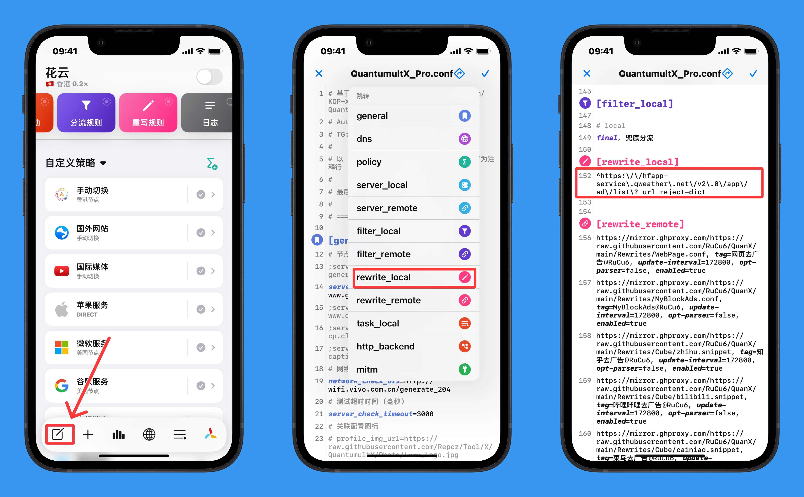
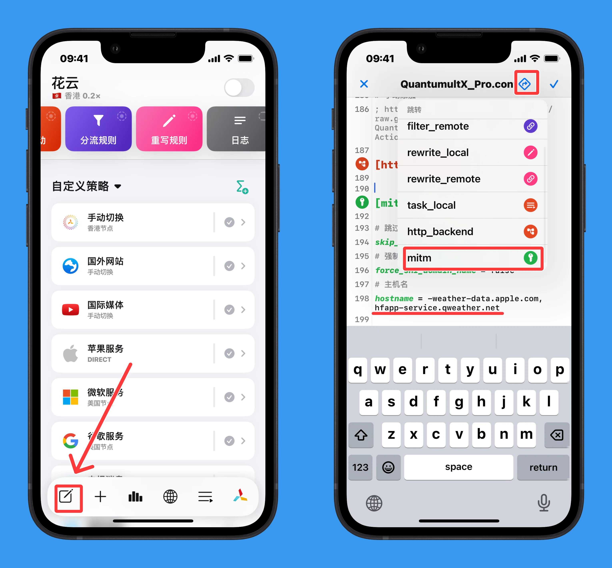
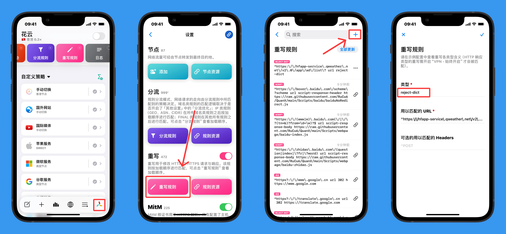
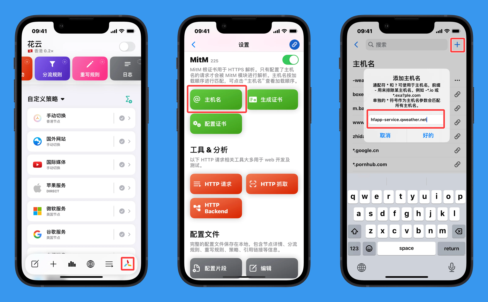
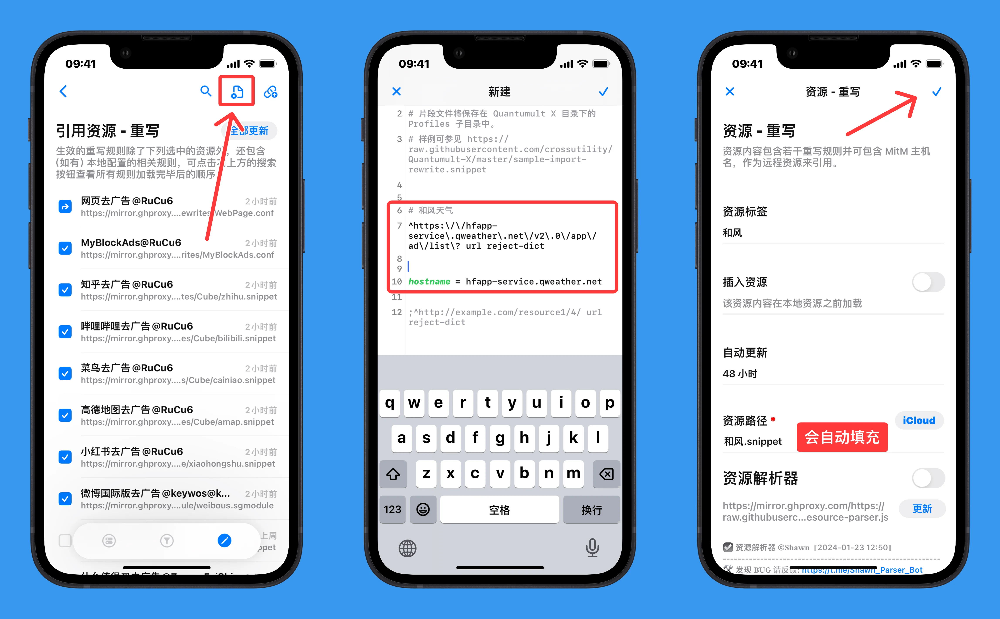
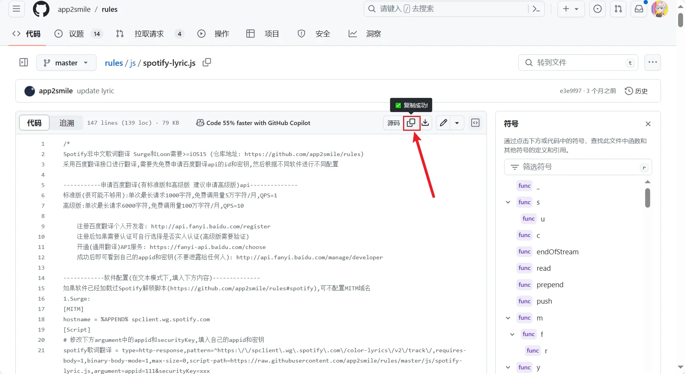
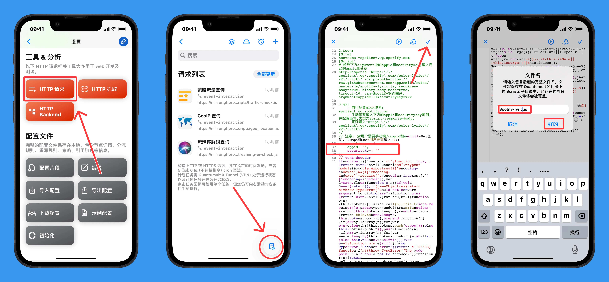
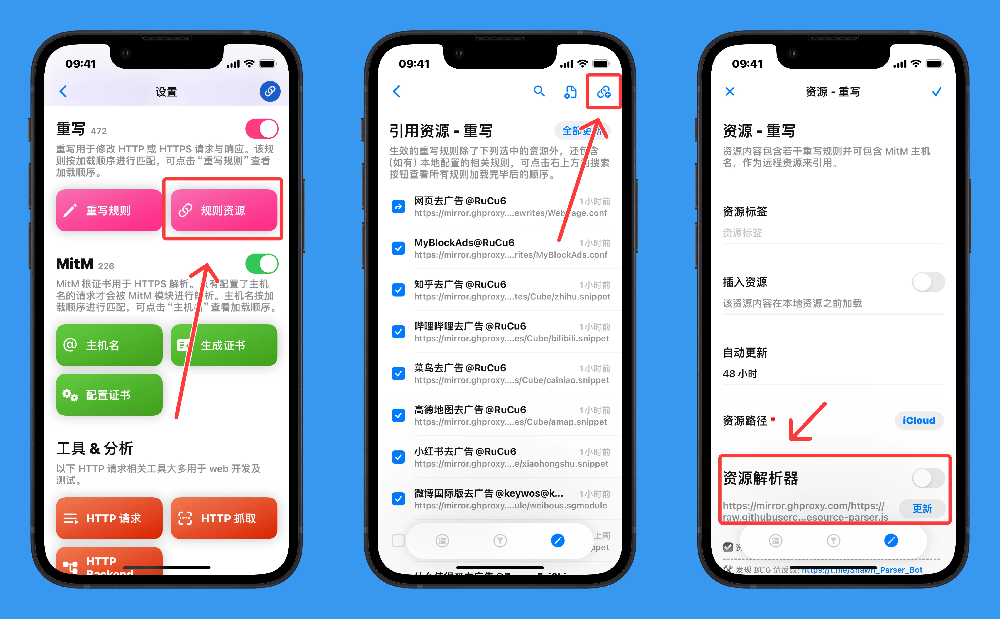
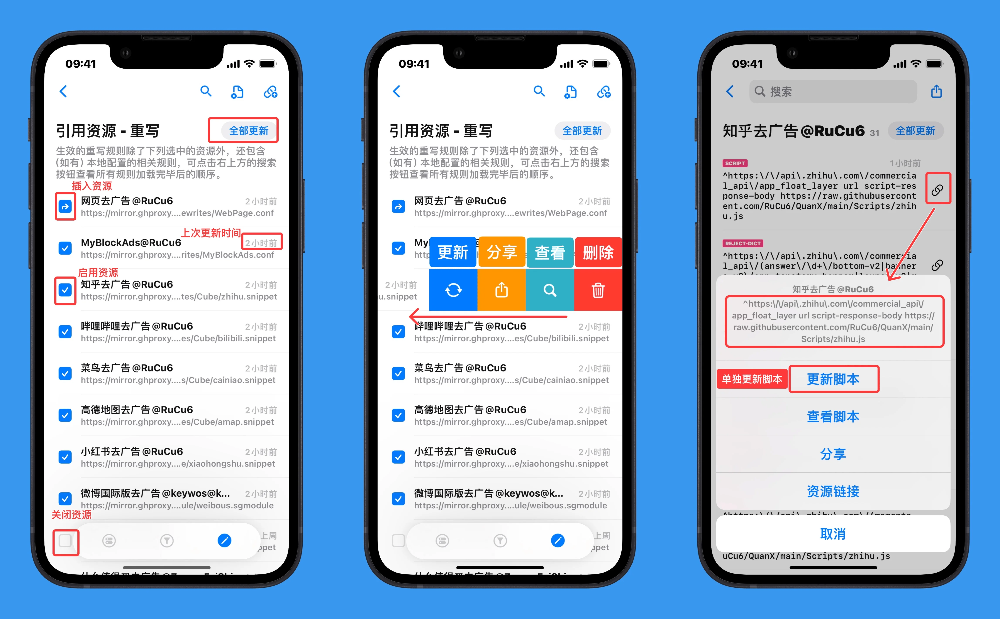

# 7. 重写`[rewrite]`

<!-- prettier-ignore -->
!!! 注意
    以下主要讲的是 `[rewrite_local]`、`[rewrite_remote]` 或 `[mitm]`  区块下的内容，所以示例都以 `[rewrite_local]`、`[rewrite_remote]` 或 `[mitm]` 开头表明在其之下，并不是让你每个参数字段前都加上 `[rewrite_local]`、`[rewrite_remote]` 或 `[mitm]`。

    以 `;` 或 `#` 或 `//` 开头的行为注释行。


### 7.1 添加本地重写

<!-- prettier-ignore -->
!!! 警告
    所有的HTTPS解密、重写(rewrite)和[中间人攻击](https://zh.wikipedia.org/wiki/%E4%B8%AD%E9%97%B4%E4%BA%BA%E6%94%BB%E5%87%BB)(MitM)，均需安装&信任根证书。


#### 7.1.1 重写类型

> 以下内容参考 [QX 官方示例配置](https://github.com/crossutility/Quantumult-X/blob/master/sample.conf)

- `reject`：返回 HTTP 状态代码 404，没有任何内容。该类型对短时间内重复的请求有动态延迟（0~5秒）响应机制：重复越少延迟越小（0），重复越多延迟越大（5）。
- `reject-200`：返回 HTTP 状态代码 200，没有内容。
- `reject-img`：返回 HTTP 状态代码 200，内容为 1px gif。
- `reject-dict`：返回 HTTP 状态代码 200，内容为空 json 对象。
- `reject-array`：返回 HTTP 状态代码 200，内容为空 json 数组。
- `request-header`：适用于所有 HTTP 标头，而不仅仅是一个标头，因此可以在一个正则表达式中匹配两个或多个标头（包括 CRLF）。
- `response-body`：正则替换响应正文内容。
- `request-body`：正则替换请求正文内容。
- `jsonjq-response-body` / `jsonjq-request-body`：使用 jsonjq 解析和处理请求正文或响应正文中的 JSON 数据。
- `echo-response`：直接返回指定内容类型的正文文件，正文文件应保存在「我的 iPhone - Quantumult X - Data」中。还可自定义响应头，如 `echo-response text/html\r\nHeader-1: value1\r\nHeader-2: value2 echo-response index.html`
- `url-and-header`：当 URL **和** 请求头两者都匹配时才触发重写。匹配的 headers 字符串包含方法、路径和 key-value 头信息。URL 先被评估，如果 URL 不匹配则不会评估 headers。
- `302` / `307`：HTTP 重定向，将请求重定向至新的 URL。
- 如果 `rewrite` 与正文相关，则与长度和编码相关的 HTTP 标头字段将由 Quantumult 自动处理，因此不应自行处理。响应正文和脚本响应正文支持的最大响应大小为 1024kB（解压缩）。
- 如果 `body` 为空，则不会执行 body 相关的重写。
- 在重写中使用 JavaScript 时，可以使用以下对象：`$request`、`$response`、`$notify(title, subtitle, message)`、`console.log(message)` 和 Quantumult 的内置对象都有前缀`$`。
- 支持：`$request.sessionIndex`、`$request.scheme`、`$request.method`、`$request.url`、`$request.path`、`$request.headers`、`$response.sessionIndex`、`$response.statusCode`、`$response.headers`、`$response.body`
- `$request.sessionIndex` 等于 `$response.sessionIndex`（当响应与请求关联时）。`sessionIndex` 与橙色「网络活动」面板中的 TCP 记录索引无关。
- 如果启用了 Quantumult 通知，`$notify(title, subtitle, message)` 将发布 iOS 通知。
- `$prefs` 用于持久存储：`$prefs.valueForKey(key)`、`$prefs.setValueForKey(value, key)`、`$prefs.removeValueForKey(key)`、`$prefs.removeAllValues()`。
- 如果日志级别为 `debug`，`console.log(message)` 会将日志输出到 Quantumult 日志文件。
- `setTimeout(function() { }, interval)` 将在 `interval`(ms) 后运行函数。
- `script-request-header`、`script-request-body`、`script-response-header`、`script-response-body`、`script-echo-response` 和 `script-analyze-echo-response` 的脚本应保存在本地「我的 iPhone - Quantumult X - Scripts」或「iCloud Drive - Quantumult X - Scripts」。
- `script-analyze-echo-response` 与 `script-echo-response` 的区别在于前者会等待请求正文。
- 示例可以在 [crossutility/Quantumult-X](https://github.com/crossutility/Quantumult-X) 找到。

#### 7.1.2 配置文件添加

以下为重写在配置文件中的写法

```
[rewrite_local]
;^http://example\.com/resource1/1/ url reject
;^http://example\.com/resource1/2/ url reject-img
;^http://example\.com/resource1/3/ url reject-200
;^http://example\.com/resource1/4/ url reject-dict
;^http://example\.com/resource1/5/ url reject-array
;^http://example\.com/resource2/ url 302 http://example.com/new-resource2/
;^http://example\.com/resource3/ url 307 http://example.com/new-resource3/
;^http://example\.com/resource4/ url jsonjq-response-body '.[0]'
;^http://example\.com/resource4/ url request-header ^GET /resource4/ HTTP/1\.1(\r\n) request-header GET /api/ HTTP/1.1$1
;^http://example\.com/resource4/ url request-header (\r\n)User-Agent:.+(\r\n) request-header $1User-Agent: Mozilla/5.0 (Macintosh; Intel Mac OS X 10_11_1) AppleWebKit/537.36 (KHTML, like Gecko) Chrome/71.0.3578.98 Safari/537.36$2
;^http://example\.com/resource5/ url request-body "info":\[.+\],"others" request-body "info":[],"others"
;^http://example\.com/resource5/ url response-body "info":\[.+\],"others" response-body "info":[],"others"
;^http://example\.com/resource5/ url echo-response text/html echo-response index.html
;^http://example\.com/resource5/ url echo-response text/html\r\nHeader-1: value1\r\nHeader-2: value2 echo-response index.html
;^http://example\.com/resource6/ url script-response-body response-body.js
;^http://example\.com/resource7/ url script-echo-response script-echo.js
;^http://example\.com/resource8/ url script-response-header response-header.js
;^http://example\.com/resource9/ url script-request-header request-header.js
;^http://example\.com/resource10/ url script-request-body request-body.js
;^http://example\.com/resource1/1/ \r\nUser-Agent: example-agent url-and-header reject
;^http://example\.com/resource1/1/ ^POST url-and-header reject

[mitm]
hostname = example.com
```


以和风天气去广告为例子:
```
[rewrite_local]
# 和风天气
^https:\/\/hfapp-service\.qweather\.net\/v2\.0\/app\/ad\/list\? url reject-dict

[mitm]
hostname = hfapp-service.qweather.net
```

可以将对应的规则复制粘贴到配置文件对应的部分：

{: width=900}

注意主机名`hostname`的部分不要重复出现：

{: width=600}

当然也可以通过UI添加：

注意：URL部分只需要填写以下部分，无需填写`url`

```
^https:\/\/hfapp-service\.qweather\.net\/v2\.0\/app\/ad\/list\?
```

{: width=1200}

{: width=900}

#### 7.1.3 配置片段添加

以和风天气为例，配置片段添加内容无需带有 `[rewrite_local]` `[mitm]`等字段

此方法即可将本地内容作为远程资源添加，只不过资源路径是在本地的文件

```
# 和风天气
^https:\/\/hfapp-service\.qweather\.net\/v2\.0\/app\/ad\/list\? url reject-dict

hostname = hfapp-service.qweather.net
```

{: width=900}


#### Tips:本地重写需配置脚本

有部分重写资源，需要自行配置重写规则所使用的脚本文件(.js)

以[Spotify翻译@app2smile](https://t.me/NobyDa/516)为例(仅做演示，Spotify翻译有跟简单的方法)：

>注册百度翻译个人开发者: http://api.fanyi.baidu.com/register
>
>注册后如果需要认证可自行选择是否实人认证(高级版需要验证)
>
>开通(通用翻译)API服务: https://fanyi-api.baidu.com/choose
>
>成功后即可看到自己的appid和密钥(不要泄露给任何人): http://api.fanyi.baidu.com/manage/developer

1.Quantumult X其他设置中，打开 iCloud云盘 ；确保已开启 `mitm` `重写` 并 信任安装了证书

2.打开[歌词翻译脚本(.js)](https://github.com/app2smile/rules/blob/master/js/spotify-lyric.js)地址，并一键复制


当然，你也可以将脚本下载到`iCloud云盘 ▸ Quantumult X ▸ Scripts`文件目录，点击脚本即可在跳转 Quantumult X 编辑

注意：建议打开「文件」的「显示所有拓展名」，防止出现 `Spotify-lyric.js.js` 这种问题

3.打开 HTTP 请求，点击右下角的脚本编辑器，将复制到的脚本内容「覆盖」


4.配置重写

注意：`Spotify-lyric.js`的名称要与上面填写的一致
```
[rewrite_local]
^https:\/\/spclient\.wg\.spotify\.com\/color-lyrics\/v2\/track\/ url script-response-body Spotify-lyric.js
[mitm]
hostname = spclient.wg.spotify.com
```


### 7.2 添加远程重写

<!-- prettier-ignore -->
!!! 警告
    所有的HTTPS解密、重写(rewrite)和[中间人攻击](https://zh.wikipedia.org/wiki/%E4%B8%AD%E9%97%B4%E4%BA%BA%E6%94%BB%E5%87%BB)(MitM)，均需安装&信任根证书。


#### 7.2.1 配置文件添加

远程重写在 配置文件`[rewrite_remote]` 下添加：

```
[rewrite_remote]
https://example.com/rewrite.conf, tag=🛡️ Block Ads, update-interval=172800, opt-parser=true, inserted-resource=true, enabled=true
```
也就是说一条完整的远程重写配置是这么组成的：

`<资源路径>, <资源标签>, <自动更新时间间隔>, <是否使用资源解析器>, <插入资源>, <是否启用>`

- `tag` 资源标签：相当于名称，标识这条远程分流文件的作用；

- `update-interval` 自动更新的时间间隔，单位为秒；

- `opt-parser` 是否使用资源解析器，若关闭则改为 `false`；

- `inserted-resource` 插入资源，将重写文件中的规则放置于本地规则之前；

- `enabled` 是否启用该重写资源文件，若不使用可改为 `false`；


远程重写通常配置好了主机名`hostname`，因此大多数是无需自行填写


#### 7.2.2 UI添加

资源路径需填写引用的远程重写规则地址（需使用 raw 格式地址）。


{: width=900}

??? note "资源路径需要使用raw地址，点击查看获取方法"
    以下方的链接举例(这是个网页，不是真正能使用的资源链接)：

    `https://github.com/blackmatrix7/ios_rule_script/blob/master/rule/QuantumultX/12306/12306.list`

    例如在末尾添加`?raw=ture`：

    `https://github.com/blackmatrix7/ios_rule_script/blob/master/rule/QuantumultX/12306/12306.list?raw=ture`

    或者直接点击`raw`或者`view`，⁠使用跳转后的链接：

    `https://raw.githubusercontent.com/blackmatrix7/ios_rule_script/master/rule/QuantumultX/12306/12306.list`


    


    或者将链接里的`blob`⁠修改为`raw`：

    `https://github.com/blackmatrix7/ios_rule_script/raw/master/rule/QuantumultX/12306/12306.list`


「资源解析器」：是对引用的资源文件内容(远程or配置片段)，进行解析/转换/修改，变成 Quantumult X 支持的内容，可用在Quantumult X 的三个主要模块：①节点 ②分流 ③重写，具体使用说明见解析器下方教程；

??? note "如果你的资源解析器是空的，点击查看添加方法"
    如果你的解析器是空的，「节点页」点击左下角的编辑按钮，需要在 `[general]` 区块下添加：

    ```
    resource_parser_url=https://raw.githubusercontent.com/KOP-XIAO/QuantumultX/master/Scripts/resource-parser.js 
    ```


当使用非标准 Quantumult X 的重写时，例如一些脚本`.js`、其他软件的模块`.sgmodule`、插件`.plugin`⁠等，这些里面都包含有重写规则，可开启解析器使其变为 Quantumult X 支持的格式；但这并不意味着上述格式的文件在开启解析器后一定可用。需要自行鉴别。

✅ Surge模块(主要内容为重写规则)：https://raw.githubusercontent.com/Keywos/rule/main/module/weibous.sgmodule

✅ 包含重写规则的脚本(.js)

  ```javascipt
  /* 

  Lento  

  # 带有重写规则和主机名
  [rewrite_local]
  https://lentoapp.com:8081/getUserMemberShipInfo url script-response-body https://raw.githubusercontent.com/Yu9191/Rewrite/main/Lento.js

  [MITM]

  hostname = lentoapp.com:8081

  */

  let obj = {
    "meta" : {
      "message" : "获取作者信息成功",
      "code" : 200
    },
    "data" : {
      "paytype" : 1,
      "expiretime" : "null"
    }
  }

  $done({ body: JSON.stringify(obj), status: 200 });
  ```

❌ 重写使用的脚本，不包含重写规则：https://raw.githubusercontent.com/RuCu6/QuanX/main/Scripts/12306.js

#### 7.2.3 远程重写资源更新与重写细则查看


- 默认自动更新时间为48小时，需打开QX才可自动更新；

- 可以更改配置文件中的`update-interval`参数，单位为秒(S)，修改为`-1`即为不更新

- 左滑重写资源可以单独更新，并查看其细则

{: width=900}

