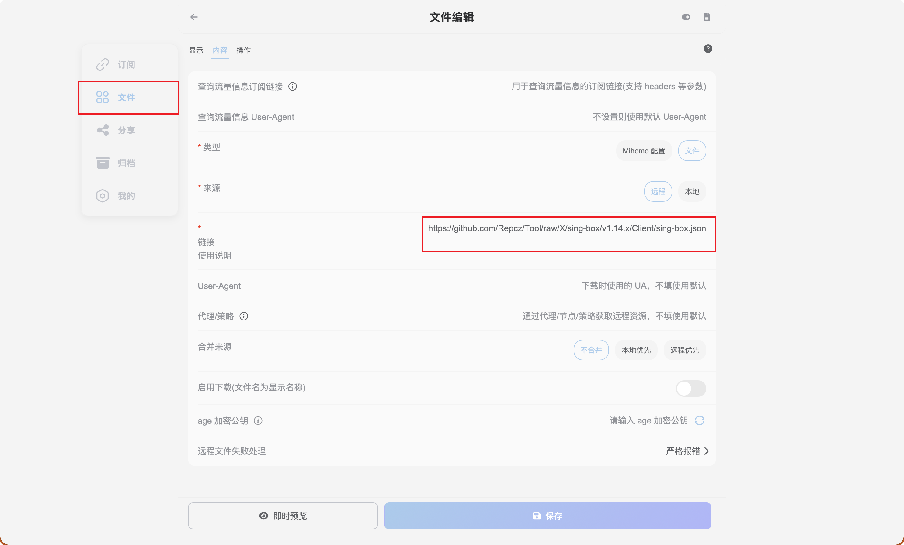
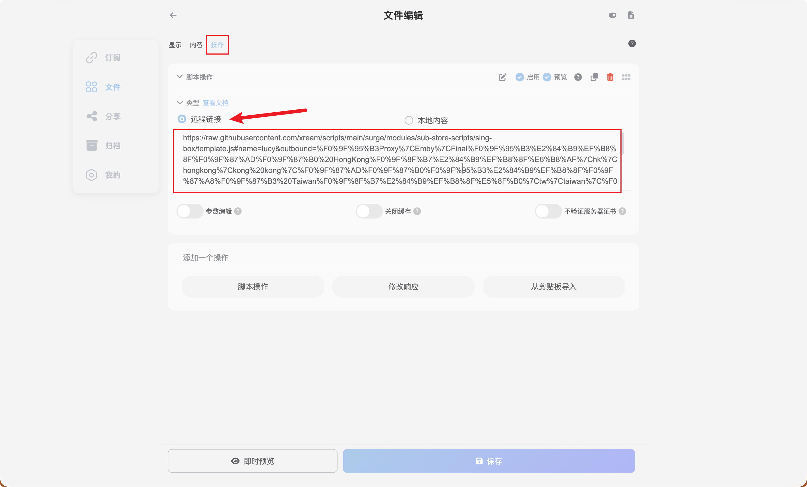

# sing-box

- [Github 仓库](https://github.com/SagerNet/sing-box)
- [使用文档](https://sing-box.sagernet.org/zh/)

## sing-box iOS/macOS

<a href="https://apps.apple.com/app/sing-box-vt/id6673731168"></a>

## 导入配置

!!! info ""
    该配置文件插入机场订阅需搭配 Sub-Store 使用。

1. 文件中添加配置模版: 

```
https://github.com/Repcz/Tool/raw/X/sing-box/v1.14.x/Client/sing-box.json
```

{: width=1000}

2. 添加脚本操作

```
https://raw.githubusercontent.com/xream/scripts/main/surge/modules/sub-store-scripts/sing-box/template.js#name=机场名称&outbound=🕳Proxy|Emby|Final🕳ℹ️🇭🇰 HongKong🏷ℹ️港|hk|hongkong|kong kong|🇭🇰🕳ℹ️🇨🇳 Taiwan🏷ℹ️台|tw|taiwan|🇹🇼🕳ℹ️🇯🇵 Japan🏷ℹ️日本|jp|japan|🇯🇵🕳ℹ️🇸🇬 Singapore🏷ℹ️^(?!.*(?:us)).*(新|sg|singapore|🇸🇬)🕳ℹ️🇺🇸 United States🏷ℹ️美|us|unitedstates|united states|🇺🇸
```

{: width=1000}

文件导出后即可作为客户端配置文件使用

更多可参考 [`脚本操作`](https://t.me/zhetengsha/1070)

## 面板

> sing-box Dashboard is a new web client for the API service, providing almost the same experience as the graphical clients. A public instance is available at http://sing-box-dashboard.sagernet.org (shortcut: dash.sing-box.app).

内核启动后可以进入 `http://sing-box-dashboard.sagernet.org`，后端填写`127.0.0.1`，端口`9091`，*`无密码`*

如需修改，可自定义以下内容对应的`listen`、`listen_port`、`secret`

```{.json linenums="118"}
"services": [
    {
        "type": "api",
        "tag": "sing-box dashboard",
        "listen": "127.0.0.1",
        "listen_port": 9091,
        "secret": "",
        "access_control_allow_origin": [
            "http://sing-box-dashboard.sagernet.org",
            "http://dash.sing-box.app"
        ],
        "access_control_allow_private_network": true
    }
],
```