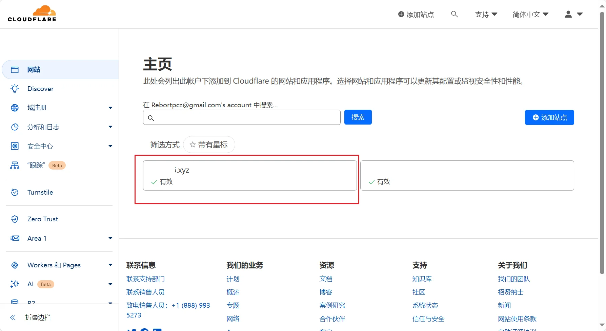
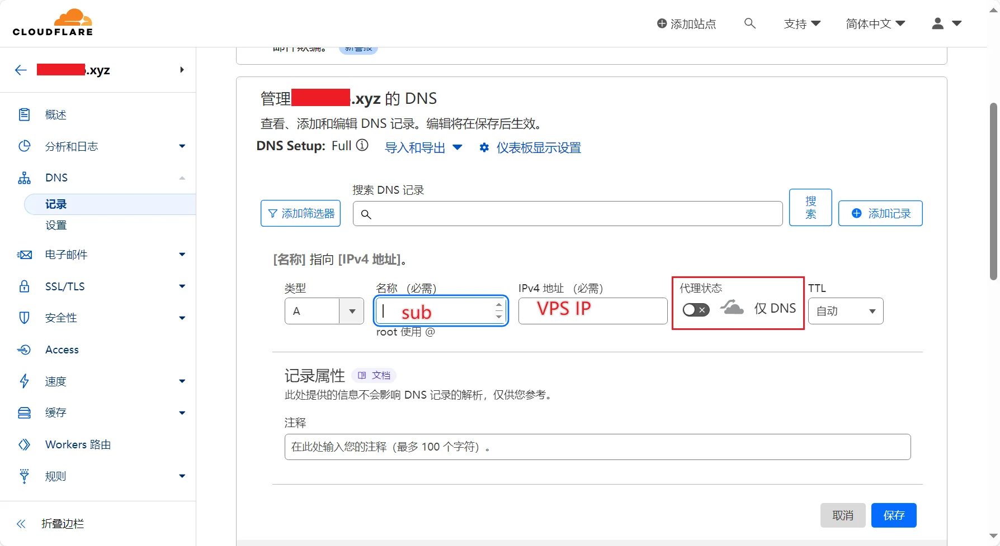
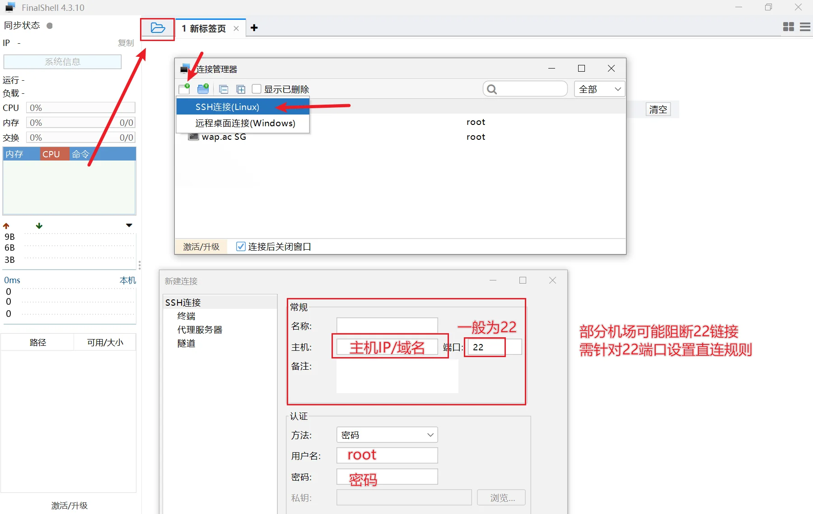
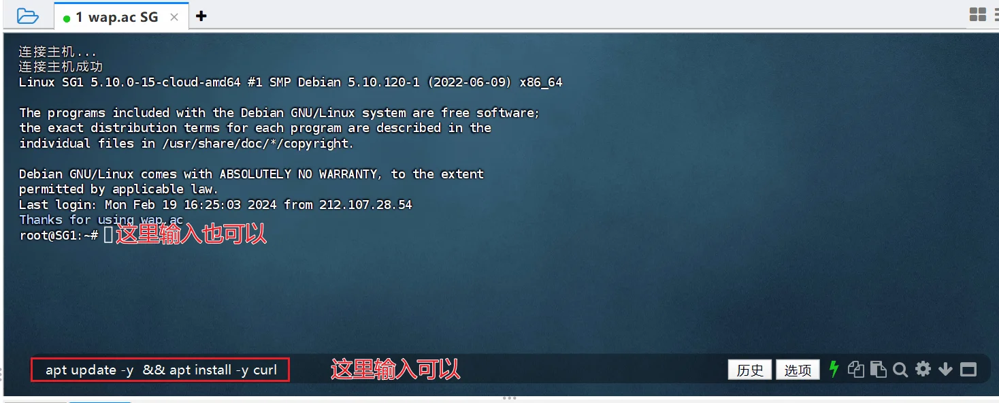
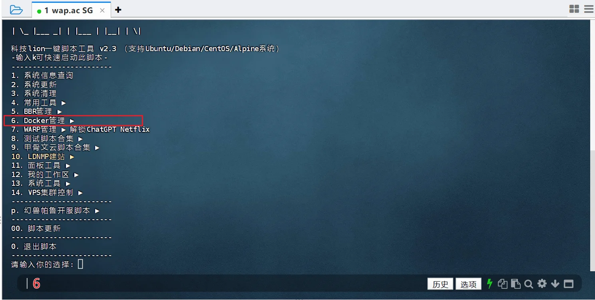
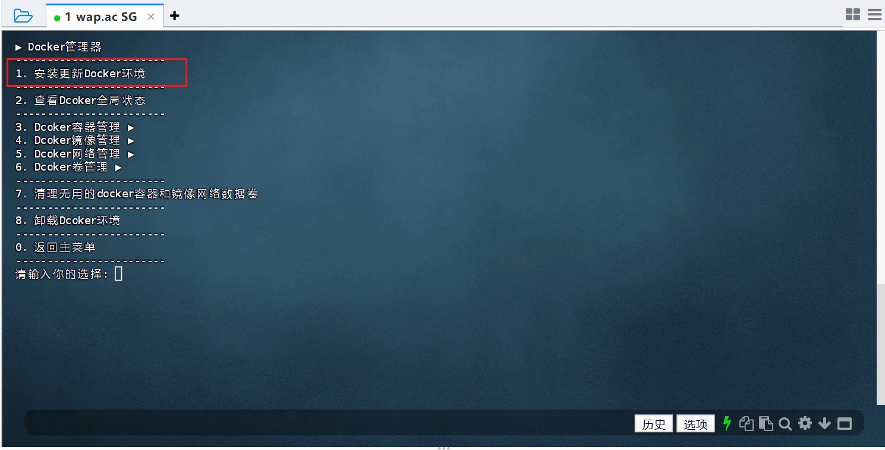
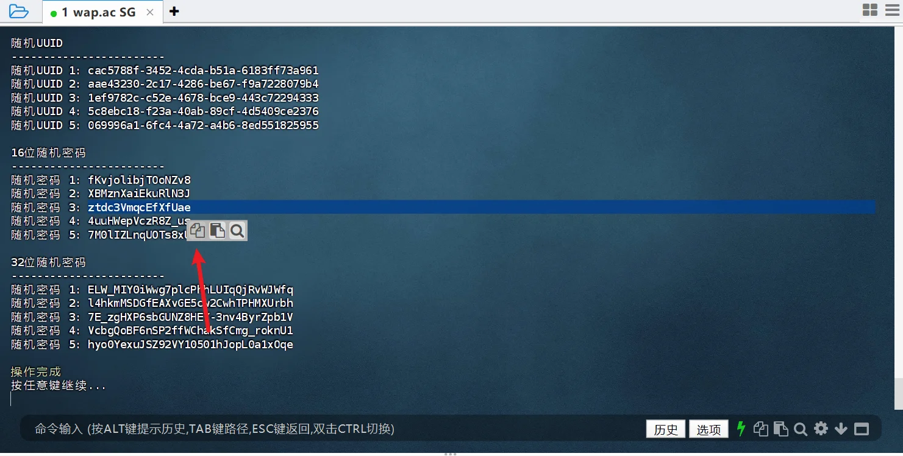

# SubStore 部署

## iOS代理软件部署


<!-- prettier-ignore -->
!!! 注意
    iOS代理软件上部署 SubStore，依赖 MitM & 重写，使用前需**安装信任根证书**，并开启相应的开关

### 安装


- Loon：[点击一键导入](https://www.nsloon.com/openloon/import?plugin=https://raw.githubusercontent.com/sub-store-org/Sub-Store/master/config/Loon.plugin)


- QX：[点击一键导入](https://quantumult.app/x/open-app/add-resource?remote-resource=%7B%0A%20%20%22rewrite_remote%22%20%3A%20%5B%0A%20%20%20%20%22https%3A%2F%2Fmirror.ghproxy.com%2Fhttps%3A%2F%2Fraw.githubusercontent.com%2FPeng-YM%2FSub-Store%2Fmaster%2Fconfig%2FQX.snippet%2C%20tag%3DSub-Store%2C%20update-interval%3D172800%2C%20opt-parser%3Dfalse%2C%20enabled%3Dtrue%22%0A%20%20%5D%0A%7D)

- Surge & Shadowrocket

安装使用模块即可。

```
https://raw.githubusercontent.com/sub-store-org/Sub-Store/master/config/Surge-ability.sgmodule
```

- Stash

启动Stash后，在 **设置** - **配置列表** 中下拉点击 **Sub-Store** 即可。

  
### 访问

浏览器打开 https://sub.store 


## VPS Docker 部署

<!-- prettier-ignore -->
!!! 注意
    以下基于 **Debain 11** 系统

需要一台 VPS

需要一个域名，并设置 DNS解析 至 VPS 的 IP 上

　
### 设置域名解析


此处以 [CloudFlare](https://dash.cloudflare.com/) 添加 `A` 记录 为例

首先需要把 域名，托管到 CloudFlare





假设你的域名为`xxxxxx.xyz`，2级域名为 `sub`，则设置的域名 `sub.xxxxxx.xyz`，解析到 VPS 对应的 IP 上；

当然，则解析过去需要一定的时间。

### SSH登录

此处 SSH 客户端为 FinalShell



独立 IP 的 VPS 一般默认 22 端口

部分机场会屏蔽 22 端口，需设置端口分流绕开此类机场

### 安装 Docker

以下将使用 [科技lion](https://kejilion.blogspot.com/2023/08/lionldnmp.html) 的脚本

```bash
curl -sS -O https://raw.githubusercontent.com/kejilion/sh/main/kejilion.sh && chmod +x kejilion.sh && ./kejilion.sh
```

1. 升级并安装 `curl`

```bash
apt update -y  && apt install -y curl
```

使用 `回车` 发送/执行 命令



2. 执行一键脚本


```bash
curl -sS -O https://raw.githubusercontent.com/kejilion/sh/main/kejilion.sh && chmod +x kejilion.sh && ./kejilion.sh
```

3. 安装 `docker`

在脚本执行界面，输入 `6`，进入 docker 管理



输入 `1`，安装 docker 




等待安装完成，输入任意字符结束操作

安装完成后，SSH 界面内(不是下面的输入框)，按住 `ctrl` + `c`(这里并不是win系统里面的复制) ，结束当前脚本。

### 部署 `SubStore`

- 全功能带推送

```bash
docker run -it -d --restart=always -e "SUB_STORE_PUSH_SERVICE=https://api.day.app/XXXXXXXXXXXX/[推送标题]/[推送内容]?group=SubStore&autoCopy=1&isArchive=1&sound=shake&level=timeSensitive&icon=https%3A%2F%2Fraw.githubusercontent.com%2F58xinian%2Ficon%2Fmaster%2FSub-Store1.png"  -e "SUB_STORE_CRON=0 0 * * *" -e SUB_STORE_FRONTEND_BACKEND_PATH=/2cXaAxRGfddmGz2yx1wA -p 127.0.0.1:3001:3001 -v /root/sub-store-data:/opt/app/data --name sub-store xream/sub-store
```

- 不带推送

```bash
docker run -it -d --restart=always -e "SUB_STORE_CRON=0 0 * * *" -e SUB_STORE_FRONTEND_BACKEND_PATH=/2cXaAxRGfddmGz2yx1wA -p 127.0.0.1:3001:3001 -v /root/sub-store-data:/opt/app/data --name sub-store xream/sub-store
```


<!-- prettier-ignore -->
!!! 注意
    `SUB_STORE_FRONTEND_BACKEND_PATH=/`后的字段(此处是`2cXaAxRGfddmGz2yx1wA`)表示 API，需自行设置并保存好；

如果不知道输入什么，可以用 科技lion 的脚本 ，13系统工具 → 14密码生成

FianlShell中，复制可以在选中后，点击按钮复制




### 反向代理

这里的方反向代理，简单来说就是让你从访问 `vps的ip:端口` 变成访问域名

Caddy反代 和 脚本反代，2选1即可

#### Caddy 反向代理

##### 部署 Caddy

参考[官方教程](https://caddy2.dengxiaolong.com/docs/install)，依次执行以下命令

```bash
sudo apt install -y debian-keyring debian-archive-keyring apt-transport-https
```

```bash
curl -1sLf 'https://dl.cloudsmith.io/public/caddy/stable/gpg.key' | sudo gpg --dearmor -o /usr/share/keyrings/caddy-stable-archive-keyring.gpg
```

```bash
curl -1sLf 'https://dl.cloudsmith.io/public/caddy/stable/debian.deb.txt' | sudo tee /etc/apt/sources.list.d/caddy-stable.list
```

```bash
sudo apt update
```

```bash
sudo apt install caddy
```

##### Caddy 添加反代配置文件

粘贴以下代码，写入反代配置

!!! info ""
    注意替换`sub.xxxxx.xyz`为你的域名

```bash
cat << EOF > /etc/caddy/Caddyfile
sub.xxxxx.xyz {
    reverse_proxy 127.0.0.1:3001
    }
EOF
```

写入进程守护

```bash
sudo systemctl enable --now caddy
```

完成后重载配置

```bash
sudo systemctl reload caddy
```


??? note "Caddy 启动、停止、重启、查看状态"
    启动

    ```bash
    sudo systemctl start caddy
    ```

    停止

    ```bash
    sudo systemctl stop caddy
    ```

    重启

    ```bash
    sudo systemctl reload caddy
    ```

    查看状态
    
    ```bash
    systemctl status caddy
    ```

#### 科技 lion 脚本反代

- 执行一键脚本

```bash
curl -sS -O https://raw.githubusercontent.com/kejilion/sh/main/kejilion.sh && chmod +x kejilion.sh && ./kejilion.sh
```

- 输入`10` → `23` 进入`站点反向代理-IP+端口`

- 安装提示依次输入对应的域名及端口即可

!!! info ""
    注意替换`sub.xxxxx.xyz`为你的域名

```
开始部署 反向代理-IP+端口
先将域名解析到本机IP: 显示你的服务器IP 
请输入你的IP或者解析过的域名: sub.xxxxx.xyz
请输入你的反代IP: 127.0.0.1
请输入你的反代端口: 3001
```


### 访问 SubStore

此时，SubStore 地址为：`https://sub.xxxxx.xyz`

其 API 为 
```
https://sub.xxxxx.xyz/2cXaAxRGfddmGz2yx1wA
```
浏览器访问 
```
https://sub.xxxxx.xyz?api=https://sub.xxxxx.xyz/2cXaAxRGfddmGz2yx1wA
```
