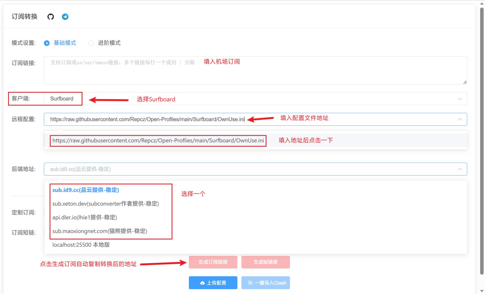

# Surfboard

## Surfboard 下载地址

<a href="https://play.google.com/store/apps/details?id=com.getsurfboard"></a> or [surfboard/releases](https://github.com/getsurfboard/surfboard/releases)


## 导入配置

### 在线订阅转换

<!-- prettier-ignore -->
!!! 警告
    在线订阅转换可能出现订阅泄露

* 1.打开[ACL4SSR](https://acl4ssr-sub.github.io/) 
* 2.填入 **机场订阅** 和 **远程配置**

**_自用 自动测速 配置_**

```
https://raw.githubusercontent.com/Repcz/Tool/X/Surfboard/Online_Full_Auto.ini
```

**_自用 多流媒体分组 自动测速 配置_**

```
https://raw.githubusercontent.com/Repcz/Tool/X/Surfboard/Online_Full_NoAuto.ini
```

* 3.修改客户端为 **Surfboard**
* 4.选择后端地址并生成订阅



* 5.复制粘贴配置到 **Surfboard**

点击 **配置** -右下角➕ - **URL** - 粘贴订阅转换后的链接

<!-- prettier-ignore -->
!!! 提示
    理论上点开 右下角➕ ，就会自动识别

### 手动添加配置

* 复制粘贴配置到 **Surfboard**


??? note "点击展开,复制配置"
    ```
    # 基于[@Coldvvater](https://github.com/Coldvvater/Mononoke/blob/master/Surfboard/Config/Surfboard-Evolve.conf)修改
    # Author:https://github.com/Repcz
    # TG:https://t.me/QVQ_Channel
    #
    # 官方文档：https://getsurfboard.com/docs/profile-format/overview
    #
    # 以 ';' 或 '#' 或 '//' 开头的配置文件行为注释行
    #
    # 最后更新时间: 2024-05-29 14:37
    #
    # ================

    [General]
    # > 日志等级
    loglevel = info
    # > DNS服务器
    dns-server = 223.5.5.5,119.29.29.29
    # > 加密的DNS服务器
    doh-server = https://dns.alidns.com/dns-query,https://doh.pub/dns-query
    # > 跳过代理
    skip-proxy = localhost, *.local, captive.apple.com, e.crashlytics.com, www.baidu.com, passenger.t3go.cn, yunbusiness.ccb.com, wxh.wo.cn, gate.lagou.com, www.abchina.com.cn, login-service.mobile-bank.psbc.com, mobile-bank.psbc.com, 10.0.0.0/8, 127.0.0.1/32, 172.16.0.0/12, 192.168.0.0/16, 192.168.122.1/32, 193.168.0.1/32, ::1/128, fe80::/10
    # >　Internet 测试 URL
    internet-test-url = http://connectivitycheck.platform.hicloud.com/generate_204
    # > 代理测速 URL
    proxy-test-url = http://latency-test.skk.moe/endpoint
    # > 连通性测试超时
    test-timeout = 3
    # > 返回真实IP
    always-real-ip = *.lan, *.direct, cable.auth.com, *.msftconnecttest.com, *.msftncsi.com, network-test.debian.org, detectportal.firefox.com, resolver1.opendns.com, *.srv.nintendo.net, *.stun.playstation.net, xbox.*.microsoft.com, *.xboxlive.com, stun.*, global.turn.twilio.com, global.stun.twilio.com, app.yinxiang.com, injections.adguard.org, local.adguard.org, cable.auth.com, localhost.*.qq.com, localhost.*.weixin.qq.com, *.logon.battlenet.com.cn, *.logon.battle.net, *.blzstatic.cn, music.163.com, *.music.163.com, *.126.net, musicapi.taihe.com, music.taihe.com, songsearch.kugou.com, trackercdn.kugou.com, *.kuwo.cn, api-jooxtt.sanook.com, api.joox.com, joox.com, y.qq.com, *.y.qq.com, streamoc.music.tc.qq.com, mobileoc.music.tc.qq.com, isure.stream.qqmusic.qq.com, dl.stream.qqmusic.qq.com, aqqmusic.tc.qq.com, amobile.music.tc.qq.com, *.xiami.com, *.music.migu.cn, music.migu.cn, proxy.golang.org, *.mcdn.bilivideo.cn, *.cmpassport.com, id6.me, open.e.189.cn, mdn.open.wo.cn, opencloud.wostore.cn, auth.wosms.cn, *.jegotrip.com.cn, *.icitymobile.mobi, *.pingan.com.cn, *.cmbchina.com, *.10099.com.cn, pool.ntp.org, *.pool.ntp.org, ntp.*.com, time.*.com, ntp?.*.com, time?.*.com, time.*.gov, time.*.edu.cn, *.ntp.org.cn, PDC._msDCS.*.*, DC._msDCS.*.*, GC._msDCS.*.*
    # > HTTP监听地址
    http-listen = 0.0.0.0:1234
    # > socks5监听地址
    socks5-listen = 127.0.0.1:1235
    # > UDP IP 防泄漏
    udp-policy-not-supported-behaviour = REJECT

    [Host]
    # > IPv6
    ip6-localhost = ::1 # IPv6 Localhost
    ip6-loopback = ::1 # IPv6 Loopback
    ip6-localnet = fe00::0 # IPv6 Link-Local
    ip6-mcastprefix = ff00::0 # IPv6 Multicast
    ip6-allnodes = ff02::1 # IPv6 All Nodes
    ip6-allrouters = ff02::2 # IPv6 All Routers
    ip6-allhosts = ff02::3 # IPv6 All Hosts
    # > Firebase Cloud Messaging
    talk.google.com = 108.177.125.188 
    mtalk.google.com = 108.177.125.188 
    alt1-mtalk.google.com = 3.3.3.3 
    alt2-mtalk.google.com = 3.3.3.3 
    alt3-mtalk.google.com = 74.125.200.188 
    alt4-mtalk.google.com = 74.125.200.188 
    alt5-mtalk.google.com = 3.3.3.3 
    alt6-mtalk.google.com = 3.3.3.3 
    alt7-mtalk.google.com = 74.125.200.188 
    alt8-mtalk.google.com = 3.3.3.3 

    [Proxy]
    # > 配置模板见：https://getsurfboard.com/docs/profile-format/proxy/

    [Proxy Group]

    # > 外部节点(在此将"http://your-service-provider"替换为你的机场订阅，推荐使用base64或者node list)
    🚀 手动切换 = select, 🇭🇰 香港节点, 🇺🇸 美国节点, 🇸🇬 狮城节点, 🇯🇵 日本节点, 🇨🇳 台湾节点, 🇪🇺 欧洲节点, DIRECT, policy-path=http://your-service-provider, interval=300, update-interval=86400

    # > 代理策略分流

    🌏 国外网站 = select, 🚀 手动切换, 🇭🇰 香港节点, 🇺🇸 美国节点, 🇸🇬 狮城节点, 🇯🇵 日本节点, 🇨🇳 台湾节点, 🇪🇺 欧洲节点, DIRECT, no-alert=0, hidden=0

    📽️ 国际媒体 = select, 🚀 手动切换, 🇭🇰 香港节点, 🇺🇸 美国节点, 🇸🇬 狮城节点, 🇯🇵 日本节点, 🇨🇳 台湾节点, 🇪🇺 欧洲节点, DIRECT, no-alert=0, hidden=0

    📽️ Emby = select, 🇭🇰 香港节点, 🇺🇸 美国节点, 🇸🇬 狮城节点, 🇯🇵 日本节点, 🇨🇳 台湾节点, 🇪🇺 欧洲节点, DIRECT, no-alert=0, hidden=0, include-other-group = "🚀 手动切换"

    🖥️ 微软服务 = select, 🚀 手动切换, 🇭🇰 香港节点, 🇺🇸 美国节点, 🇸🇬 狮城节点, 🇯🇵 日本节点, 🇨🇳 台湾节点, 🇪🇺 欧洲节点, DIRECT, no-alert=0, hidden=0

    🌌 谷歌服务 = select, 🚀 手动切换, 🇭🇰 香港节点, 🇺🇸 美国节点, 🇸🇬 狮城节点, 🇯🇵 日本节点, 🇨🇳 台湾节点, 🇪🇺 欧洲节点, DIRECT, no-alert=0, hidden=0

    📟 电报消息 = select, 🚀 手动切换, 🇭🇰 香港节点, 🇺🇸 美国节点, 🇸🇬 狮城节点, 🇯🇵 日本节点, 🇨🇳 台湾节点, 🇪🇺 欧洲节点, DIRECT, no-alert=0, hidden=0

    🐦 推特消息 = select, 🚀 手动切换, 🇭🇰 香港节点, 🇺🇸 美国节点, 🇸🇬 狮城节点, 🇯🇵 日本节点, 🇨🇳 台湾节点, 🇪🇺 欧洲节点, DIRECT, no-alert=0, hidden=0

    🤖 AI = select, 🚀 手动切换, 🇭🇰 香港节点, 🇺🇸 美国节点, 🇸🇬 狮城节点, 🇯🇵 日本节点, 🇨🇳 台湾节点, 🇪🇺 欧洲节点, DIRECT, no-alert=0, hidden=0

    🛑 广告拦截 = select, REJECT, DIRECT, no-alert=0, hidden=0

    🐟 兜底分流 = select, 🚀 手动切换, 🇭🇰 香港节点, 🇺🇸 美国节点, 🇸🇬 狮城节点, 🇯🇵 日本节点, 🇨🇳 台湾节点, 🇪🇺 欧洲节点, DIRECT, no-alert=0, hidden=0

    # > 节点地区分流

    🇭🇰 香港节点 = url-test, policy-regex-filter=(?i)🇭🇰|香港|(\b(HK|Hong)\b), interval=300, update-interval=86400, tolerance=0, no-alert=0, hidden=0, include-other-group = "🚀 手动切换"

    🇺🇸 美国节点 = url-test, policy-regex-filter=(?i)🇺🇸|美国|洛杉矶|圣何塞|(\b(US|United States)\b), interval=300, update-interval=86400, tolerance=0, no-alert=0, hidden=0, include-other-group = "🚀 手动切换"

    🇸🇬 狮城节点 = url-test, policy-regex-filter=(?i)🇸🇬|新加坡|狮|(\b(SG|Singapore)\b), interval=300, update-interval=86400, tolerance=0, no-alert=0, hidden=0, include-other-group = "🚀 手动切换"

    🇯🇵 日本节点 = url-test, policy-regex-filter=(?i)🇯🇵|日本|东京|(\b(JP|Japan)\b), interval=300, update-interval=86400, tolerance=0, no-alert=0, hidden=0, include-other-group = "🚀 手动切换"

    🇨🇳 台湾节点 = url-test, policy-regex-filter=(?i)🇨🇳|🇹🇼|台湾|(\b(TW|Tai|Taiwan)\b), interval=300, update-interval=86400, tolerance=0, no-alert=0, hidden=0, include-other-group = "🚀 手动切换"

    🇪🇺 欧洲节点 = url-test, policy-regex-filter=🇬🇧|🇫🇷|🇳🇱|🇮🇸|🇩🇪|🇺🇦|🇨🇭|🇪🇺, interval=300, update-interval=86400, tolerance=0, no-alert=0, hidden=0, include-other-group = "🚀 手动切换"

    [Rule]

    # 去广告
    RULE-SET,https://github.com/Repcz/Tool/raw/X/Shadowrocket/Rules/Ads_Dlerio.list,🛑 广告拦截

    # OpenAI
    RULE-SET,https://github.com/Repcz/Tool/raw/X/Shadowrocket/Rules/AI.list,🤖 AI

    # Telegram
    RULE-SET,https://github.com/Repcz/Tool/raw/X/Shadowrocket/Rules/Telegram.list,📟 电报消息

    # Twitter
    RULE-SET,https://github.com/Repcz/Tool/raw/X/Shadowrocket/Rules/Twitter.list,🐦 推特消息

    # 微软服务
    RULE-SET,https://github.com/Repcz/Tool/raw/X/Shadowrocket/Rules/Github.list,🖥️ 微软服务
    RULE-SET,https://github.com/Repcz/Tool/raw/X/Shadowrocket/Rules/OneDrive.list,🖥️ 微软服务
    RULE-SET,https://github.com/Repcz/Tool/raw/X/Shadowrocket/Rules/Microsoft.list,🖥️ 微软服务

    # 谷歌服务
    RULE-SET,https://github.com/Repcz/Tool/raw/X/Shadowrocket/Rules/YouTube.list,🌌 谷歌服务
    RULE-SET,https://github.com/Repcz/Tool/raw/X/Shadowrocket/Rules/Google.list,🌌 谷歌服务

    # 国际媒体
    RULE-SET,https://github.com/Repcz/Tool/raw/X/Shadowrocket/Rules/ProxyMedia.list,📽️ 国际媒体

    # Emby
    RULE-SET,https://github.com/Repcz/Tool/raw/X/Shadowrocket/Rules/Emby.list,📽️ Emby

    # 国外网站
    RULE-SET,https://github.com/Repcz/Tool/raw/X/Shadowrocket/Rules/ProxyGFW.list,🌏 国外网站

    # 局域网
    RULE-SET,https://github.com/Repcz/Tool/raw/X/Shadowrocket/Rules/Lan.list,DIRECT

    # 国内规则
    GEOIP,CN,DIRECT

    # 兜底分流
    FINAL,🐟 兜底分流

    ```

点击 Surfboard  **配置** -右下角➕ - **从零开始** -复制以下配置并粘贴


* 修改[Proxy Group]部分并保存

将[Proxy Group]中的 `http://your-service-provider` 替换为 机场订阅地址

eg：

```
...

[Proxy Group]

# > 外部节点(在此将"http://your-service-provider"替换为你的机场订阅，推荐使用base64或者node list)
🚀 手动切换 = select,  🇭🇰 香港节点, 🇺🇸 美国节点, 🇸🇬 狮城节点, 🇯🇵 日本节点, 🇨🇳 台湾节点, DIRECT, policy-path=http://your-service-provider, interval=300, update-interval=86400

...


```

* 添加第二个或更多机场至同一个配置

为第二个机场添加一个策略组：

eg：
```
...

[Proxy Group]

# > 外部节点(在此将"http://your-service-provider"替换为你的机场订阅，推荐使用base64或者node list)
🚀 手动切换 = select,  🇭🇰 香港节点, 🇺🇸 美国节点, 🇸🇬 狮城节点, 🇯🇵 日本节点, 🇨🇳 台湾节点, DIRECT, policy-path=http://your-service-provider, interval=300, update-interval=86400

...
```


👇


```
...

[Proxy Group]

🚀 手动切换 = select,  🇭🇰 香港节点, 🇺🇸 美国节点, 🇸🇬 狮城节点, 🇯🇵 日本节点, 🇨🇳 台湾节点, DIRECT, policy-path=http://your-service-provider, interval=300, update-interval=86400

机场2 = select,  🇭🇰 香港节点, 🇺🇸 美国节点, 🇸🇬 狮城节点, 🇯🇵 日本节点, 🇨🇳 台湾节点, DIRECT, policy-path=http://your-service-provider, interval=300, update-interval=86400
...
```

同时`include-other-group = "🚀 手动切换"`需要修改成`include-other-group = "🚀 手动切换, 机场2"`（这里按需修改）


eg：

```
🇭🇰 香港节点 = url-test, policy-regex-filter=^(?=.*((?i)🇭🇰|香港|(\b(HK|Hong)\b)))(?!.*((?i)回国|校园|游戏|(\b(GAME)\b))).*$, interval=600,update-interval=86400, no-alert=0, hidden=0, include-other-group = "🚀 手动切换"
```

👇

```
🇭🇰 香港节点 = url-test, policy-regex-filter=^(?=.*((?i)🇭🇰|香港|(\b(HK|Hong)\b)))(?!.*((?i)回国|校园|游戏|(\b(GAME)\b))).*$, interval=600,update-interval=86400, no-alert=0, hidden=0, include-other-group = "🚀 手动切换, 机场2"
```