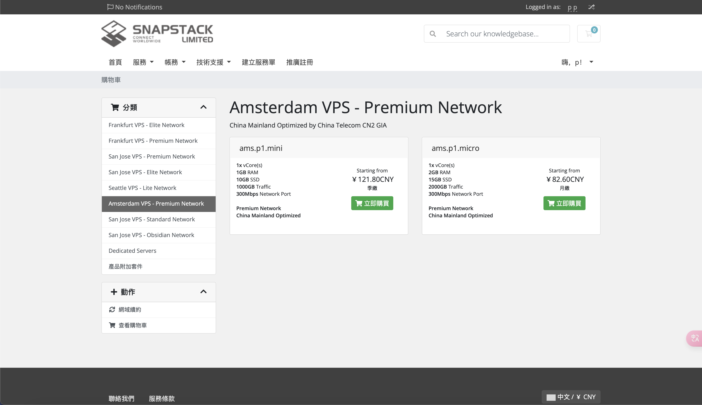

### 官网

https://portal.saltyfish.io

### 套餐详情

[Amsterdam VPS - Premium Network](https://portal.saltyfish.io/cart.php?gid=22)

此次购买的为 `Amsterdam VPS - Premium Network`中的`ams.p1.mini`季付款，售价 `￥121.80`

```
1x vCore(s)
1GB RAM
10GB SSD
1000GB Traffic
300Mbps Network Port

Premium Network
China Mainland Optimized

Looking glass https://lg.saltyfish.io/?router=ams-premium
```



### 回程测试

```
[NextTrace API] preferred API IP - 188.114.97.0 - 136.07ms - Misaka.BER
『北京 电信 163 AS4134 』
traceroute to ipv4.pek-4134.endpoint.nxtrace.org., 30 hops max, 52 byte packets
1   185.212.60.1    AS41378  [KIRINO-185]     荷兰 北荷兰省 阿姆斯特丹  as41378.net 
                                              0.11 ms / 0.13 ms / 0.11 ms
2   *
3   *
4   *
5   *
6   *
7   *
8   *
9   *
10  36.112.226.189  AS4847                    中国 北京   chinatelecom.cn 
                                              143.84 ms
    219.141.162.214 AS4847   [CHINATELECOM-BJ] 中国 北京   chinatelecom.cn 
    bj141-162-214.bjtelecom.net               137.53 ms / * ms
11  219.141.162.214 AS4847   [CHINATELECOM-BJ] 中国 北京   chinatelecom.cn 
                                              169.26 ms
    219.141.160.38  AS4847   [CHINATELECOM-BJ] 中国 北京   chinatelecom.cn 
    bj141-160-38.bjtelecom.net                142.71 ms / 176.52 ms
12  219.141.160.38  AS4847   [CHINATELECOM-BJ] 中国 北京   chinatelecom.cn 
                                              144.22 ms / * ms / * ms
13  106.37.68.27    AS4847   [CHINANET-HN]    中国 北京 北京  chinatelecom.cn 
                                              140.80 ms / 143.27 ms / * ms

『北京 联通 169 AS4837 』
traceroute to ipv4.pek-4837.endpoint.nxtrace.org., 30 hops max, 52 byte packets
1   185.212.60.1    AS41378  [KIRINO-185]     荷兰 北荷兰省 阿姆斯特丹  as41378.net 
                                              0.10 ms / 0.11 ms / 0.11 ms
2   *
3   *
4   *
5   *
6   *
7   *
8   *
9   *
10  219.158.45.121  AS4837   [CU169-BACKBONE] 中国 北京   chinaunicom.cn  联通
                                              138.67 ms / * ms
    219.158.35.141  AS4837   [CU169-BACKBONE] 中国 北京   chinaunicom.cn 
                                              131.13 ms
11  *
12  *
13  219.232.11.130  AS4808   [BGTELECOM]      中国 北京   中国联通  联通
                                              132.81 ms
    61.148.158.90   AS4808   [UNICOM-CN]      中国 北京   中国联通  联通
                                              139.14 ms
    219.232.11.206  AS4808   [BGTELECOM]      中国 北京   中国联通  联通
                                              133.27 ms
14  *
15  *
16  *
17  123.125.96.156  AS4808   [UNICOM-BJ]      中国 北京   中国联通  联通
                                              137.16 ms / 132.30 ms / 138.43 ms

『北京 移动 CMNET AS9808 』
traceroute to ipv4.pek-9808.endpoint.nxtrace.org., 30 hops max, 52 byte packets
1   185.212.60.1    AS41378  [KIRINO-185]     荷兰 北荷兰省 阿姆斯特丹  as41378.net 
                                              0.12 ms / 0.13 ms / 0.09 ms
2   *
3   *
4   *
5   *
6   *
7   *
8   *
9   *
10  *
11  *
12  *
13  *
14  211.136.63.66   AS56048  [CMNET]          中国 北京   bj.10086.cn  移动
                                              131.92 ms / * ms / * ms
15  211.136.95.226  AS56048  [CMNET]          中国 北京   bj.10086.cn  移动
                                              134.36 ms / 132.74 ms / 131.89 ms
16  211.136.95.226  AS56048  [CMNET]          中国 北京   bj.10086.cn  移动
                                              132.28 ms / 132.00 ms / 132.57 ms
17  *
18  211.136.25.153  AS56048  [CMNET]          中国 北京   bj.10086.cn  移动
                                              131.28 ms / * ms / * ms
```

### IP质量测试


- IPv4 测试结果

```
########################################################################
                      IP质量体检报告：185.212.*.*
                    bash <(curl -sL IP.Check.Place)
                   https://github.com/xykt/IPQuality
        报告时间：2024-10-28 19:05:21 CST  脚本版本：v2024-10-17
########################################################################
一、基础信息（Maxmind 数据库）
自治系统号：            AS41378
组织：                  Kirino LLC
坐标：                  4°53′51″E, 52°22′33″N
地图：                  https://check.place/52.3759,4.8975,15,cn
城市：                  北荷兰省, 阿姆斯特丹, 1012
使用地：                [NL]荷兰, [EU]欧洲
注册地：                [AU]澳大利亚
时区：                  Europe/Amsterdam
IP类型：                 广播IP 
二、IP类型属性
数据库：      IPinfo    ipregistry    ipapi     AbuseIPDB  IP2LOCATION 
使用类型：     机房        机房        机房        机房        机房    
公司类型：     机房        机房        机房    
三、风险评分
风险等级：      极低         低       中等       高         极高
SCAMALYTICS：  0|低风险
ipapi：           0.39%|低风险
AbuseIPDB：    0|低风险
IPQS：                        75|可疑IP
DB-IP：         |低风险
四、风险因子
库： IP2LOCATION ipapi ipregistry IPQS SCAMALYTICS ipdata IPinfo IPWHOIS
地区：    [NL]    [NL]    [NL]    [NL]    [NL]    [NL]    [NL]    [NL]
代理：     否      否      否      是      否      否      否      否 
Tor：      否      否      否      否      否      否      否      否 
VPN：      否      否      否      是      否      无      否      否 
服务器：   是      是      是      无      否      否      是      否 
滥用：     否      否      否      否      无      否      无      无 
机器人：   否      否      无      否      否      无      无      无 
五、流媒体及AI服务解锁检测
服务商：  TikTok   Disney+  Netflix Youtube  AmazonPV  Spotify  ChatGPT 
状态：     解锁     解锁     解锁     解锁     解锁     解锁     解锁   
地区：     [NL]     [US]     [US]     [NL]     [NL]     [NL]     [NL]   
方式：     原生     原生     原生     原生     原生     原生     原生   
六、邮局连通性及黑名单检测
本地25端口：阻断
IP地址黑名单数据库：  有效 439   正常 428   已标记 11   黑名单 0
========================================================================
今日IP检测量：674；总检测量：157303。感谢使用xy系列脚本！ 
报告链接：https://Report.Check.Place/IP/2195YDHX4.svg
```


### 融合怪测试

```
--------------------- A Bench Script By spiritlhl ----------------------
                   测评频道: https://t.me/vps_reviews                    
VPS融合怪版本：2024.09.30
Shell项目地址：https://github.com/spiritLHLS/ecs
Go项目地址：https://github.com/oneclickvirt/ecs
---------------------基础信息查询--感谢所有开源项目---------------------
 CPU 型号          : Intel Core Processor (Skylake, IBRS)
 CPU 核心数        : 1
 CPU 频率          : 3407.998 MHz
 CPU 缓存          : L1: 32.00 KB / L2: 4.00 MB / L3: 16.00 MB
 AES-NI指令集      : ✔ Enabled
 VM-x/AMD-V支持    : ✔ Enabled
 内存              : 100.62 MiB / 973.28 MiB
 Swap              : [ no swap partition or swap file detected ]
 硬盘空间          : 850.24 MiB / 9977.27 MiB
 启动盘路径        : /dev/vda1
 系统在线时间      : 0 days, 0 hour 40 min
 负载              : 0.04, 0.15, 0.16
 系统              : Debian GNU/Linux 12 (bookworm) (x86_64)
 架构              : x86_64 (64 Bit)
 内核              : 6.1.0-25-cloud-amd64
 TCP加速方式       : cubic
 虚拟化架构        : KVM
 NAT类型           : Full Cone
 IPV4 ASN          : AS41378 Kirino LLC
 IPV4 位置         : Amsterdam / North Holland / NL
----------------------CPU测试--通过sysbench测试-------------------------
 -> CPU 测试中 (Fast Mode, 1-Pass @ 5sec)
 1 线程测试(单核)得分:          1415 Scores
---------------------内存测试--感谢lemonbench开源-----------------------
 -> 内存测试 Test (Fast Mode, 1-Pass @ 5sec)
 单线程读测试:          27459.21 MB/s
 单线程写测试:          22685.08 MB/s
------------------磁盘dd读写测试--感谢lemonbench开源--------------------
 -> 磁盘IO测试中 (4K Block/1M Block, Direct Mode)
 测试操作               写速度                                  读速度
 100MB-4K Block         47.1 MB/s (11.49 IOPS, 2.23s))          47.0 MB/s (11481 IOPS, 2.23s)
 1GB-1M Block           1.2 GB/s (1140 IOPS, 0.88s)             990 MB/s (943 IOPS, 1.06s)
---------------------磁盘fio读写测试--感谢yabs开源----------------------
Block Size | 4k            (IOPS) | 64k           (IOPS)
  ------   | ---            ----  | ----           ---- 
Read       | 44.06 MB/s   (11.0k) | 492.96 MB/s   (7.7k)
Write      | 44.14 MB/s   (11.0k) | 495.55 MB/s   (7.7k)
Total      | 88.21 MB/s   (22.0k) | 988.52 MB/s  (15.4k)
           |                      |                     
Block Size | 512k          (IOPS) | 1m            (IOPS)
  ------   | ---            ----  | ----           ---- 
Read       | 202.98 MB/s    (396) | 102.77 MB/s    (100)
Write      | 213.77 MB/s    (417) | 109.62 MB/s    (107)
Total      | 416.76 MB/s    (813) | 212.40 MB/s    (207)
------------流媒体解锁--基于oneclickvirt/CommonMediaTests开源-----------
以下测试的解锁地区是准确的，但是不是完整解锁的判断可能有误，这方面仅作参考使用
----------------Netflix-----------------
[IPV4]
您的出口IP完整解锁Netflix，支持非自制剧的观看
NF所识别的IP地域信息：美国
[IPV6]
您的网络可能没有正常配置IPv6，或者没有IPv6网络接入
----------------Youtube-----------------
[IPV4]
连接方式: Youtube Video Server
视频缓存节点地域: 荷兰阿姆斯特丹(AMS15S45)
[IPV6]
Youtube在您的出口IP所在的国家不提供服务
---------------DisneyPlus---------------
[IPV4]
当前出口所在地区解锁DisneyPlus
区域：NL 区
[IPV6]
DisneyPlus在您的出口IP所在的国家不提供服务
解锁Netflix，Youtube，DisneyPlus上面和下面进行比较，不同之处自行判断
----------------流媒体解锁--感谢RegionRestrictionCheck开源--------------
 以下为IPV4网络测试，若无IPV4网络则无输出
============[ Multination ]============
 Dazn:                                  Yes (Region: NL)
 Disney+:                               Yes (Region: US)
 Netflix:                               Yes (Region: US)
 YouTube Premium:                       Yes (Region: NL)
 Amazon Prime Video:                    Yes (Region: NL)
 TVBAnywhere+:                          Yes
 Spotify Registration:                  Yes (Region: NL)
 Instagram Licensed Audio:              No
 OneTrust Region:                       NL [North Holland]
 iQyi Oversea Region:                   INTL
 Bing Region:                           NL
 YouTube CDN:                           Amsterdam
 Netflix Preferred CDN:                 Amsterdam
 ChatGPT:                               Yes
 Google Gemini:                         No
 Wikipedia Editability:                 No
 Google Search CAPTCHA Free:            Yes
 Steam Currency:                        EUR
 ---Forum---
 Reddit:                                Yes
=======================================
 以下为IPV6网络测试，若无IPV6网络则无输出
---------------TikTok解锁--感谢lmc999的源脚本及fscarmen PR--------------
 Tiktok Region:         Failed
-------------IP质量检测--基于oneclickvirt/securityCheck使用-------------
数据仅作参考，不代表100%准确，如果和实际情况不一致请手动查询多个数据库比对
以下为各数据库编号，输出结果后将自带数据库来源对应的编号
ipinfo数据库  [0] | scamalytics数据库 [1] | virustotal数据库   [2] | abuseipdb数据库   [3] | ip2location数据库    [4]
ip-api数据库  [5] | ipwhois数据库     [6] | ipregistry数据库   [7] | ipdata数据库      [8] | db-ip数据库          [9]
ipapiis数据库 [A] | ipapicom数据库    [B] | bigdatacloud数据库 [C] | cheervision数据库 [D] | ipqualityscore数据库 [E]
IPV4:
安全得分:
声誉(越高越好): 0 [2] 
信任得分(越高越好): 2 [8] 
VPN得分(越低越好): 95 [8] 
代理得分(越低越好): 100 [8] 
社区投票-无害: 0 [2] 
社区投票-恶意: 0 [2] 
威胁得分(越低越好): 99 [8] 
欺诈得分(越低越好): 0 [1] 
滥用得分(越低越好): 0 [3] 
ASN滥用得分(越低越好): 0.0033 (Low) [A] 
公司滥用得分(越低越好): 0.0039 (Low) [A] 
威胁级别: low [9 B] 
黑名单记录统计:(有多少黑名单网站有记录):
无害记录数: 0 [2]  恶意记录数: 0 [2]  可疑记录数: 0 [2]  无记录数: 94 [2] 
安全信息:
使用类型: business [8] corporate [9] hosting [0 7 A] hosting - high probability [C] DataCenter/WebHosting/Transit [3]
公司类型: hosting [0 7 A] 
是否云提供商: Yes [7 D] 
是否数据中心: Yes [0 1 A C] No [5 6 8]
是否移动设备: No [5 A C] 
是否代理: No [0 1 4 5 6 7 8 9 A B C D] 
是否VPN: No [0 1 6 7 A C D] 
是否Tor: No [0 1 3 6 7 8 A B C D] 
是否Tor出口: No [1 7 D] 
是否网络爬虫: No [9 A B] 
是否匿名: No [1 6 7 8 D]
是否攻击者: No [7 8 D] 
是否滥用者: No [7 8 A C D] 
是否威胁: No [7 8 C D] 
是否中继: No [0 7 8 C D] 
是否Bogon: No [7 8 A C D] 
DNS-黑名单: 313(Total_Check) 0(Clean) 6(Blacklisted) 16(Other) 
Google搜索可行性：YES
-------------邮件端口检测--基于oneclickvirt/portchecker开源-------------
Platform  SMTP  SMTPS POP3  POP3S IMAP  IMAPS
LocalPort ✔     ✔     ✔     ✔     ✔     ✔    
QQ        ✔     ✔     ✔     ✘     ✔     ✘    
163       ✔     ✔     ✔     ✘     ✔     ✘    
Sohu      ✔     ✔     ✘     ✘     ✔     ✘    
Yandex    ✔     ✔     ✔     ✘     ✔     ✘    
Gmail     ✔     ✔     ✘     ✘     ✘     ✘    
Outlook   ✔     ✘     ✔     ✘     ✔     ✘    
Office365 ✔     ✘     ✔     ✘     ✔     ✘    
Yahoo     ✔     ✔     ✘     ✘     ✘     ✘    
MailCOM   ✔     ✔     ✔     ✘     ✔     ✘    
MailRU    ✔     ✔     ✘     ✘     ✔     ✘    
AOL       ✔     ✔     ✘     ✘     ✘     ✘    
GMX       ✔     ✘     ✔     ✘     ✔     ✘    
Sina      ✔     ✘     ✔     ✘     ✔     ✘    
----------------三网回程--基于oneclickvirt/backtrace开源----------------
北京电信 219.141.140.10  检测不到回程路由节点的IP地址
北京联通 202.106.195.68  检测不到回程路由节点的IP地址
北京移动 221.179.155.161 检测不到回程路由节点的IP地址
上海电信 202.96.209.133  检测不到回程路由节点的IP地址
上海联通 210.22.97.1     检测不到回程路由节点的IP地址
上海移动 211.136.112.200 检测不到回程路由节点的IP地址
广州电信 58.60.188.222   检测不到回程路由节点的IP地址
广州联通 210.21.196.6    联通4837   [普通线路] 
广州移动 120.196.165.24  检测不到回程路由节点的IP地址
成都电信 61.139.2.69     检测不到回程路由节点的IP地址
成都联通 119.6.6.6       检测不到回程路由节点的IP地址
成都移动 211.137.96.205  检测不到回程路由节点的IP地址
准确线路自行查看详细路由，本测试结果仅作参考
同一目标地址多个线路时，可能检测已越过汇聚层，除了第一个线路外，后续信息可能无效
---------------------回程路由--感谢fscarmen开源及PR---------------------
依次测试电信/联通/移动经过的地区及线路，核心程序来自ipip.net或nexttrace，请知悉!
广州电信 58.60.188.222
0.14 ms         AS41378 [KIRINO-185] 荷兰 北荷兰省 阿姆斯特丹 as41378.net
181.65 ms       AS4134 中国 广东 佛山市 www.chinatelecom.com.cn 电信
172.91 ms       AS4134 中国 广东 深圳 福田区 www.chinatelecom.com.cn 电信
广州联通 210.21.196.6
0.15 ms         AS41378 [KIRINO-185] 荷兰 北荷兰省 阿姆斯特丹 as41378.net
170.13 ms       AS4837 [CU169-BACKBONE] 中国 广东 广州 chinaunicom.cn
167.43 ms       AS17816 [APNIC-AP] 中国 广东 深圳 chinaunicom.cn 联通
177.99 ms       AS17623 [APNIC-AP] 中国 广东 深圳 chinaunicom.cn 联通
166.42 ms       AS17623 [APNIC-AP] 中国 广东 深圳 宝安区 chinaunicom.cn 联通
广州移动 120.196.165.24
0.15 ms         AS41378 [KIRINO-185] 荷兰 北荷兰省 阿姆斯特丹 as41378.net
166.73 ms       AS9808 [CMNET] 中国 广东 广州 chinamobileltd.com 移动
166.56 ms       AS56040 [APNIC-AP] 中国 广东 深圳 gd.10086.cn 移动
--------------------自动更新测速节点列表--本脚本原创--------------------
位置             上传速度        下载速度        延迟     丢包率
--------------------自动更新测速节点列表--本脚本原创--------------------
位置             上传速度        下载速度        延迟     丢包率
------------------------------------------------------------------------
 总共花费      : 3 分 22 秒
 时间          : Mon Oct 28 12:12:05 CET 2024
------------------------------------------------------------------------
  短链:
    https://paste.spiritlhl.net/u/hXFeYQ.txt
    https://paste.spiritlhl.net/u/hXFeYQ.txt
```