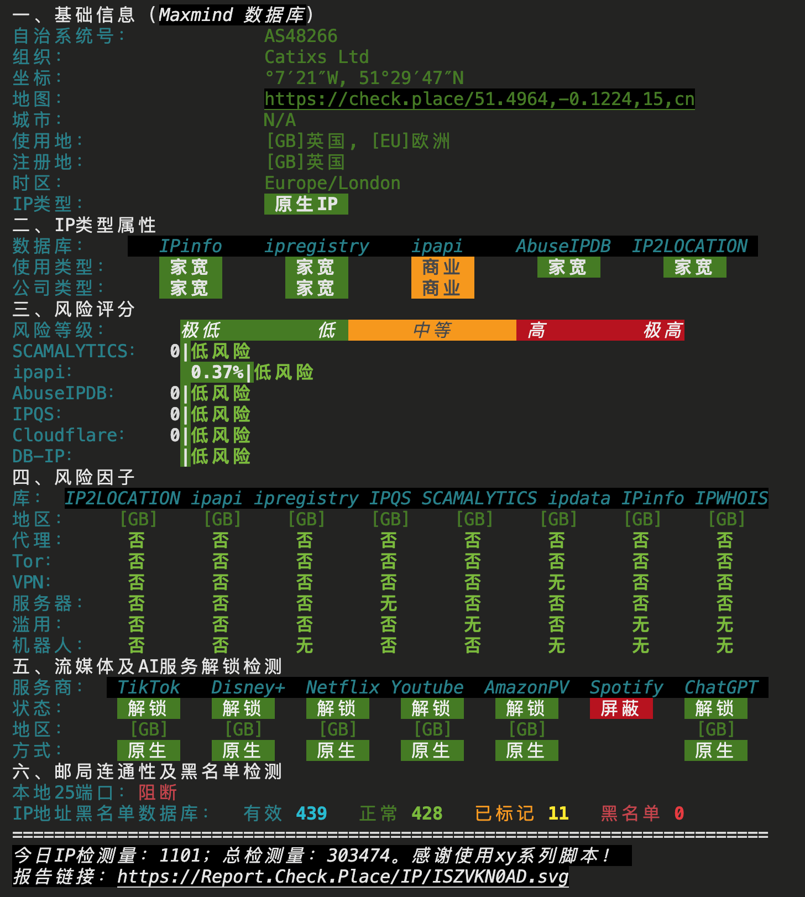

### 官网

www.coalcloud.net


### 套餐详情

[UK BGP Pro NewYearPlan](https://www.coalcloud.net/store/uk-bgp-proispipv4)

此次购买的为 `英国 UK BGP PRO(双ISP住宅原生) IPV4 NewYearPlan`，售价 `180 CNY`

```
1 Core(s) (Fair Share)
1GB RAM
10GB SSD
1 IPv4 Addresses
800GB @200Mbps
KVM Virtualization
```


### IP质量测试





### 融合怪测试


```
--------------------- A Bench Script By spiritlhl ----------------------
                   测评频道: https://t.me/vps_reviews                    
VPS融合怪版本：2024.11.08
Shell项目地址：https://github.com/spiritLHLS/ecs
Go项目地址：https://github.com/oneclickvirt/ecs
---------------------基础信息查询--感谢所有开源项目---------------------
 CPU 型号          : AMD EPYC 7542 32-Core Processor
 CPU 核心数        : 1
 CPU 频率          : 2894.562 MHz
 CPU 缓存          : L1: 128.00 KB / L2: 512.00 KB / L3: 16.00 MB
 AES-NI指令集      : ✔ Enabled
 VM-x/AMD-V支持    : ✔ Enabled
 内存              : 114.79 MiB / 976.59 MiB
 Swap              : [ no swap partition or swap file detected ]
 硬盘空间          : 1.51 GiB / 9.76 GiB
 启动盘路径        : /dev/vda1
 系统在线时间      : 0 days, 0 hour 21 min
 负载              : 0.98, 0.25, 0.09
 系统              : Debian GNU/Linux 11 (bullseye) (x86_64)
 架构              : x86_64 (64 Bit)
 内核              : 5.10.0-18-amd64
 TCP加速方式       : bbr
 虚拟化架构        : KVM
 NAT类型           : Full Cone
 IPV4 ASN          : AS48266 Catixs Ltd
 IPV4 位置         : London / England / GB
----------------------CPU测试--通过sysbench测试-------------------------
 -> CPU 测试中 (Fast Mode, 1-Pass @ 5sec)
 1 线程测试(单核)得分:          1666 Scores
---------------------内存测试--感谢lemonbench开源-----------------------
 -> 内存测试 Test (Fast Mode, 1-Pass @ 5sec)
 单线程读测试:          45245.13 MB/s
 单线程写测试:          19995.80 MB/s
------------------磁盘dd读写测试--感谢lemonbench开源--------------------
 -> 磁盘IO测试中 (4K Block/1M Block, Direct Mode)
 测试操作               写速度                                  读速度
 100MB-4K Block         51.4 MB/s (12.55 IOPS, 2.04s))          77.6 MB/s (18953 IOPS, 1.35s)
 1GB-1M Block           559 MB/s (533 IOPS, 1.88s)              5.3 GB/s (5033 IOPS, 0.20s)
---------------------磁盘fio读写测试--感谢yabs开源----------------------
Block Size | 4k            (IOPS) | 64k           (IOPS)
  ------   | ---            ----  | ----           ---- 
Read       | 284.52 MB/s  (71.1k) | 3.05 GB/s    (47.7k)
Write      | 285.27 MB/s  (71.3k) | 3.06 GB/s    (47.9k)
Total      | 569.79 MB/s (142.4k) | 6.12 GB/s    (95.6k)
           |                      |                     
Block Size | 512k          (IOPS) | 1m            (IOPS)
  ------   | ---            ----  | ----           ---- 
Read       | 9.03 GB/s    (17.6k) | 8.42 GB/s     (8.2k)
Write      | 9.51 GB/s    (18.5k) | 8.98 GB/s     (8.7k)
Total      | 18.55 GB/s   (36.2k) | 17.40 GB/s   (16.9k)
------------流媒体解锁--基于oneclickvirt/CommonMediaTests开源-----------
以下测试的解锁地区是准确的，但是不是完整解锁的判断可能有误，这方面仅作参考使用
----------------Netflix-----------------
[IPV4]
您的出口IP完整解锁Netflix，支持非自制剧的观看
NF所识别的IP地域信息：英国
[IPV6]
您的网络可能没有正常配置IPv6，或者没有IPv6网络接入
----------------Youtube-----------------
[IPV4]
连接方式: Youtube Video Server
视频缓存节点地域: LHR(LHR25S37)
[IPV6]
Youtube在您的出口IP所在的国家不提供服务
---------------DisneyPlus---------------
[IPV4]
当前出口所在地区解锁DisneyPlus
区域：GB 区
[IPV6]
DisneyPlus在您的出口IP所在的国家不提供服务
解锁Netflix，Youtube，DisneyPlus上面和下面进行比较，不同之处自行判断
----------------流媒体解锁--感谢RegionRestrictionCheck开源--------------
 以下为IPV4网络测试，若无IPV4网络则无输出
============[ Multination ]============
 Dazn:                                  Yes (Region: GB)
 Disney+:                               Yes (Region: GB)
 Netflix:                               Yes (Region: GB)
 YouTube Premium:                       Yes (Region: GB)
 Amazon Prime Video:                    Yes (Region: GB)
 TVBAnywhere+:                          Yes
 Spotify Registration:                  No
 OneTrust Region:                       GB [Unknown]
 iQyi Oversea Region:                   GB
 Bing Region:                           GB
 YouTube CDN:                           London
 Netflix Preferred CDN:                 London
 ChatGPT:                               Yes
 Google Gemini:                         No
 Wikipedia Editability:                 Yes
 Google Play Store:                     United Kingdom 
 Google Search CAPTCHA Free:            Yes
 Steam Currency:                        GBP
 ---Forum---
 Reddit:                                Yes
=======================================
 以下为IPV6网络测试，若无IPV6网络则无输出
---------------TikTok解锁--感谢lmc999的源脚本及fscarmen PR--------------
 Tiktok Region:         【GB】
-------------IP质量检测--基于oneclickvirt/securityCheck使用-------------
数据仅作参考，不代表100%准确，如果和实际情况不一致请手动查询多个数据库比对
以下为各数据库编号，输出结果后将自带数据库来源对应的编号
ipinfo数据库  [0] | scamalytics数据库 [1] | virustotal数据库   [2] | abuseipdb数据库   [3] | ip2location数据库    [4]
ip-api数据库  [5] | ipwhois数据库     [6] | ipregistry数据库   [7] | ipdata数据库      [8] | db-ip数据库          [9]
ipapiis数据库 [A] | ipapicom数据库    [B] | bigdatacloud数据库 [C] | cheervision数据库 [D] | ipqualityscore数据库 [E]
IPV4:
安全得分:
声誉(越高越好): 0 [2] 
信任得分(越高越好): 46 [8]
VPN得分(越低越好): 9 [8] 
代理得分(越低越好): 98 [8] 
社区投票-无害: 0 [2] 
社区投票-恶意: 0 [2] 
威胁得分(越低越好): 54 [8] 
欺诈得分(越低越好): 0 [1] 
滥用得分(越低越好): 0 [3] 
ASN滥用得分(越低越好): 0.0023 (Low) [A] 
公司滥用得分(越低越好): 0.0037 (Low) [A] 
威胁级别: low [9 B] 
黑名单记录统计:(有多少黑名单网站有记录):
无害记录数: 0 [2]  恶意记录数: 0 [2]  可疑记录数: 0 [2]  无记录数: 94 [2]  
安全信息:
使用类型: hosting ASN [C] business [A] corporate [9] isp [0 7] FixedLineISP [3]
公司类型: isp [0 7 A] 
是否云提供商: Yes [D] No [7]
是否数据中心: Yes [C] No [0 1 5 6 8 A]
是否移动设备: No [5 A C] 
是否代理: No [0 1 4 5 6 7 8 9 A B C D] 
是否VPN: Yes [D] No [0 1 6 7 A C]
是否Tor: No [0 1 3 6 7 8 A B C D] 
是否Tor出口: No [1 7 D] 
是否网络爬虫: No [9 A B] 
是否匿名: Yes [D] No [1 6 7 8]
是否攻击者: No [7 8 D] 
是否滥用者: No [7 8 A C D] 
是否威胁: No [7 8 C D] 
是否中继: No [0 7 8 C D] 
是否Bogon: No [7 8 A C D] 
DNS-黑名单: 314(Total_Check) 0(Clean) 7(Blacklisted) 17(Other) 
Google搜索可行性：YES
-------------邮件端口检测--基于oneclickvirt/portchecker开源-------------
Platform  SMTP  SMTPS POP3  POP3S IMAP  IMAPS
LocalPort ✔     ✔     ✔     ✔     ✔     ✔    
QQ        ✔     ✔     ✔     ✘     ✔     ✘    
163       ✔     ✔     ✔     ✘     ✔     ✘    
Sohu      ✔     ✔     ✔     ✘     ✔     ✘    
Yandex    ✔     ✔     ✔     ✘     ✔     ✘    
Gmail     ✔     ✔     ✘     ✘     ✘     ✘    
Outlook   ✔     ✘     ✔     ✘     ✔     ✘    
Office365 ✔     ✘     ✔     ✘     ✔     ✘    
Yahoo     ✔     ✔     ✘     ✘     ✘     ✘    
MailCOM   ✔     ✔     ✔     ✘     ✔     ✘    
MailRU    ✔     ✔     ✘     ✘     ✔     ✘    
AOL       ✔     ✔     ✘     ✘     ✘     ✘    
GMX       ✔     ✘     ✔     ✘     ✔     ✘    
Sina      ✔     ✔     ✔     ✘     ✔     ✘    
----------------三网回程--基于oneclickvirt/backtrace开源----------------
北京电信 219.141.140.10  检测不到回程路由节点的IP地址
北京联通 202.106.195.68  联通4837   [普通线路] 
北京移动 221.179.155.161 联通4837   [普通线路] 
上海电信 202.96.209.133  联通9929   [优质线路] 电信163    [普通线路] 
上海联通 210.22.97.1     联通9929   [优质线路] 联通4837   [普通线路] 
上海移动 211.136.112.200 联通9929   [优质线路] 联通4837   [普通线路] 
广州电信 58.60.188.222   联通9929   [优质线路] 
广州联通 210.21.196.6    联通9929   [优质线路] 
广州移动 120.196.165.24  联通9929   [优质线路] 联通4837   [普通线路] 
成都电信 61.139.2.69     检测不到回程路由节点的IP地址
成都联通 119.6.6.6       联通4837   [普通线路] 
成都移动 211.137.96.205  联通4837   [普通线路] 
准确线路自行查看详细路由，本测试结果仅作参考
同一目标地址多个线路时，可能检测已越过汇聚层，除了第一个线路外，后续信息可能无效
---------------------回程路由--感谢fscarmen开源及PR---------------------
依次测试电信/联通/移动经过的地区及线路，核心程序来自ipip.net或nexttrace，请知悉!
广州电信 58.60.188.222
10.17 ms        AS48266 英国 catixs.com
1.81 ms         AS10099 [CUG-BACKBONE] 英国 英格兰 伦敦 chinaunicomglobal.com
12.74 ms        AS10099 [CUG-BACKBONE] 德国 黑森 美因河畔法兰克福 chinaunicomglobal.com 联通
170.55 ms       AS10099 [CUG-BACKBONE] 中国 北京 chinaunicomglobal.com 联通
157.07 ms       * [CNC-BACKBONE] 中国 北京 chinaunicom.cn 联通 CUII
187.06 ms       AS9929 [CNC-BACKBONE] 中国 广东 广州 chinaunicom.cn 联通 CUII
189.74 ms       * [CNC-BACKBONE] 中国 广东 广州
205.36 ms       AS4134 [CHINANET-BB] 中国 广东 广州 www.chinatelecom.com.cn 电信
254.55 ms       AS4134 [CHINANET-GD] 中国 广东 深圳 www.chinatelecom.com.cn 电信
196.11 ms       AS4134 中国 广东 深圳 福田区 www.chinatelecom.com.cn 电信
广州联通 210.21.196.6
1.56 ms         AS48266 英国 catixs.com
2.03 ms         AS10099 [CUG-BACKBONE] 英国 英格兰 伦敦 chinaunicomglobal.com
12.57 ms        AS10099 [CUG-BACKBONE] 德国 黑森 美因河畔法兰克福 chinaunicomglobal.com 联通
170.53 ms       AS10099 [CUG-BACKBONE] 中国 北京 chinaunicomglobal.com 联通
157.17 ms       * [CNC-BACKBONE] 中国 北京 chinaunicom.cn 联通 CUII
187.05 ms       AS9929 [CNC-BACKBONE] 中国 广东 广州 chinaunicom.cn 联通 CUII
188.18 ms       * [CNC-BACKBONE] 中国 广东 广州
238.25 ms       AS4837 [CU169-BACKBONE] 中国 广东 广州 chinaunicom.cn
190.86 ms       AS17816 [UNICOM-GD] 中国 广东 广州 chinaunicom.cn
203.77 ms       AS17623 [APNIC-AP] 中国 广东 深圳 chinaunicom.cn 联通
191.15 ms       AS17623 中国 广东 深圳 宝安区 chinaunicom.cn 联通
广州移动 120.196.165.24
7.39 ms         AS48266 英国 catixs.com
1.99 ms         AS10099 [CUG-BACKBONE] 英国 英格兰 伦敦 chinaunicomglobal.com
12.50 ms        AS10099 [CUG-BACKBONE] 德国 黑森 美因河畔法兰克福 chinaunicomglobal.com 联通
170.59 ms       AS10099 [CUG-BACKBONE] 中国 北京 chinaunicomglobal.com 联通
156.59 ms       * [CNC-BACKBONE] 中国 北京 chinaunicom.cn 联通 CUII
201.26 ms       AS9929 [CNC-BACKBONE] 中国 广东 广州 chinaunicom.cn 联通 CUII
191.59 ms       * [CNC-BACKBONE] 中国 广东 广州
276.97 ms       AS9808 [CMNET] 中国 广东 广州 chinamobileltd.com 移动
268.78 ms       AS9808 [CMNET] 中国 广东 广州 chinamobileltd.com 移动
263.63 ms       AS56040 [APNIC-AP] 中国 广东 深圳 gd.10086.cn 移动
--------------------自动更新测速节点列表--本脚本原创--------------------
位置             上传速度        下载速度        延迟     丢包率
Speedtest.net    143.95 Mbps     200.84 Mbps     0.41     NULL
法兰克福         205.51 Mbps     202.32 Mbps     15.13    0.0%
洛杉矶           196.84 Mbps     196.85 Mbps     132.96   0.0%
联通WuXi         209.84 Mbps     212.08 Mbps     182.93   0.0%
联通上海5G       199.45 Mbps     173.95 Mbps     180.29   0.3%
电信Zhenjiang5G  183.90 Mbps     205.09 Mbps     178.48   NULL
电信浙江         179.01 Mbps     200.44 Mbps     189.55   NULL
------------------------------------------------------------------------
 总共花费      : 5 分 46 秒
 时间          : Tue Dec 31 18:42:42 CST 2024
------------------------------------------------------------------------
  短链:
    https://paste.spiritlhl.net/u/BIPcXI.txt
    https://paste.spiritlhl.net/u/BIPcXI.txt
```